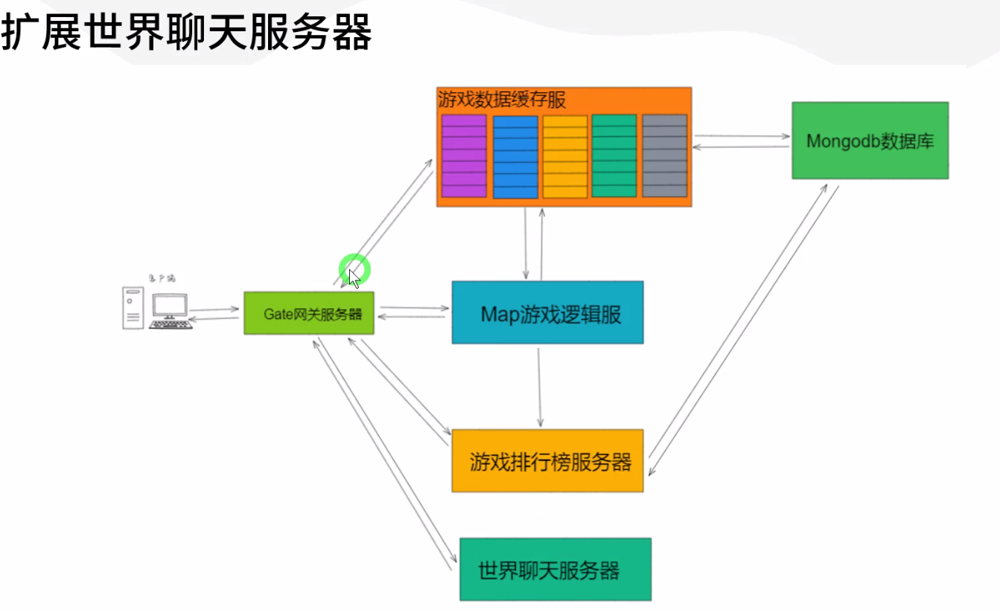

<!-- markdownlint-disable MD033 -->
<!-- markdownlint-disable MD024 -->
# ET_字母哥_2期教程笔记

## 服务器结构



## 顶号/二次登录状态处理

* `C2G_EnterGameHandler` 用 `player.InstanceId` 替换了 `session.InstanceId`

  ```c#
  //unit.AddComponent<UnitGateComponent, long>(session.InstanceId);
  unit.AddComponent<UnitGateComponent, long>(player.InstanceId);
  ```

* `SessionPlayerComponent.isLoginAgain` 顶号/二次登录状态
* `L2G_DisconnectGateUnitHandler`

  ```c#
  Session gateSession = player.ClientSession; //用于保存原有的 gateSession
  if ( gateSession!= null && !gateSession.IsDisposed)
  {
      if (gateSession.GetComponent<SessionPlayerComponent>() != null)
      {
          gateSession.GetComponent<SessionPlayerComponent>().isLoginAgain = true;// 顶号/二次登录状态
      }
      
      gateSession.Send(new A2C_Disconnect() { Error = ErrorCode.ERR_OtherAccountLogin});
      gateSession?.Disconnect().Coroutine();
  }
  ```

## 角色数值属性

### 数值组件

1. ET6中的数值组件更新事件通知逻辑: `NumericNoticeComponent`
1. 数值更新协议: `M2C_NoticeUnitNumeric`
1. `UnitFactory.Create` 创建Unit时如果类型为 `Player` 将初始化添加 `PlayerNumericConfig` 配置表中的数值属性

### 数据定时回写组件逻辑

UnitDBSaveComponentSystem

## 挂机战斗逻辑

### 放置闯关系统

* 放置闯关系统(四,五)

  `AdventureComponent` 放置挂机战斗组件

  `TimerType.BattleRound` 战斗定时器类型

  `AdventureBattleRound` 战斗攻击回合事件

  `AdventureBattleRoundView` 战斗攻击回合表现事件

  `AdventureBattleRoundEvent_CalculateDamage` 处理攻击逻辑

  `AdventureBattleRoundView_PlayAnimation` 处理攻击动画播放逻辑

  `AdventureCheckComponentSystem.SimulationBattle` 服务端战斗结果模拟

  `SRandom` 伪随机逻辑(线性同余)

* 红点系统(血条飘血) -- 放置闯关系统(六)
  
  `EventType.ShowAdventureHpBar` 处理血条显示事件

  `FlyDamageValueViewComponent` 飘血组件

  `AfterCreateZoneScene_AddComponent` 处理战斗场景创建添加相关组件

  `RedDotHelper` 红点帮助类

## 背包

### 关注 AwakeSystem;DestroySystem;DeserializeSystem

* `AwakeSystem` 初始化操作(随机属性/生成新物品等逻辑)
* `DestroySystem` 销毁回收操作(清理数据/回收内存)
* `DeserializeSystem` 反序列化操作(将 Children 数据填充到对应的业务字段中)

### 背包系统(一二三) 同步数据

* `BagComponent` 背包组件
  
  `Item` 数据的存储逻辑:

  1. `Item` 实现 `ISerializeToEntity` 接口
  1. `Item` 以 `Entity.AddChild()` 的方式添加到 `BagComponent` 组件 `Children` 中
  1. `BagComponent` 下的字段虽然都标记成 `[BsonIgnore]` , 但是 `Item` 回被作为 `Entity.childrenDB` 中的内容被保存到DB中
  1. `BagComponent` 还实现了 `IDeserialize` 接口, 用于对反序列化操作, 其中会把 `Entity.childrenDB` 映射到相关`BagComponent`的业务字段中

      ```c#
      public class BagComponentDeserializeSystem: DeserializeSystem<BagComponent>
      {
          public override void Deserialize(BagComponent self)
          {
              foreach (Entity entity in self.Children.Values)
              {
                  self.AddContainer(entity as Item);
              }
          }
      }
      ```

* `Item` 物品实体
  1. `ItemFactory.Create` Item 实体的创建逻辑;随机物品品质,增加相关组件等
  1. `M2C_ItemUpdateOpInfo` 更新单个物品消息  
     1. `ItemHelper.RandomQuality` 随机生成物品品质
     2. `ItemUpdateNoticeHelper.SyncAddItem` 通知 `Client` 添加物品消息 -> `M2C_ItemUpdateOpInfo`
  1. `M2C_AllItemsList` 同步所以道具信息
     1. `ItemUpdateNoticeHelper.SyncAllBagItems` 同步全部背包物品信息
     1. `ItemUpdateNoticeHelper.SyncAllEquipItems` 同步全部角色装备信息
  1. `Server.ItemSystem.ToMessage` 将 `Item` 实体数据转换成 `Protobuf` 消息体
  1. `Unity.ItemSystem.FromMessage` 将 `Protobuf` 消息体转换成 `Item` 实体数据

* `ItemContainerType` 物品容器类型

  ```c#
  public enum ItemContainerType
  {
      Bag = 0,  //背包容器
      RoleInfo = 1, //游戏角色装配容器
  }
  ```

### 背包系统(四) 卖出/移除

* `C2M_SellItem` 售卖道具协议

  ```pb
  //ResponseType M2C_SellItem
  message C2M_SellItem // IActorLocationRequest
  {
    int32 RpcId = 1;
    int64 ItemUid = 2;
  }
  ```

* `Unity.ItemApplyHelper.SellBagItem` 客户端发起卖出道具操作
* `C2M_SellItemHandler` 服务端移除道具
* `M2C_ItemUpdateOpInfoHandler` 客户端接收移除道具返回数据

### 背包系统(五六) 装备

* `EquipInfoComponent` 装备信息组件; 也实现了 `ISerializeToEntity` 接口, 也会被序列化保存到数据库中
* `AttributeEntry` 属性词条; 也实现了 `ISerializeToEntity` 接口 ;关联方式 `EquipInfoComponent.AddChild<AttributeEntry>()`
  
  `AttributeEntry.Key` 对应 `NumericType`

* `EquipInfoComponentSystem.CreateEntry` 生成装备词条属性
  
  ```c#
  ///创建词条
  public static void CreateEntry(this EquipInfoComponent self)
  {
    xxx
    //创建普通词条
    EntryConfig entryConfig       = EntryConfigCategory.Instance.GetRandomEntryConfigByLevel((int)EntryType.Common,entryRandomConfig.EntryLevel);
    if (entryConfig == null)
    {
        continue;
    }
    //AddChild添加到EquipInfoComponent组件中
    AttributeEntry attributeEntry = self.AddChild<AttributeEntry>();
    //词条类型:普通
    attributeEntry.Type           = EntryType.Common;
    //词条属性类型
    attributeEntry.Key            = entryConfig.AttributeType;
    //词条随机值
    attributeEntry.Value          = RandomHelper.RandomNumber(entryConfig.AttributeMinValue, entryConfig.AttributeMaxValue + self.GetParent<Item>().Quality);
    self.EntryList.Add(attributeEntry);
  }
  ```

* 装备信息的Proto消息转换

  `Server.EquipInfoComponentSystem.ToMessage` Entity -> ProtoMessage

  `Unity.EquipInfoComponentSystem.FromMessage` ProtoMessage -> Entity

### 背包系统(七) 穿戴装备

* `C2M_EquipItem` 请求穿戴装备协议
  
  ```pb
  //ResponseType M2C_EquipItem
  message C2M_EquipItem // IActorLocationRequest
  {
    int32 RpcId = 1;
    int64 ItemUid = 2;
  }
  ```

* `EquipmentsComponentSystem.EquipItem` 穿戴装备道具
* `EquipmentsComponent` 玩家穿戴装备的信息
  
  `EquipPosition` 装备装配部位枚举

  ```c#
  //对应装备位置上的装备道具信息
  public Dictionary<int, Item> EquipItems = new Dictionary<int, Item>();
  ```

### 背包系统(八) 卸下装备

* `C2M_UnloadEquipItem` 请求卸下装备协议
  
  ```pb
  //ResponseType M2C_UnloadEquipItem
  message C2M_UnloadEquipItem // IActorLocationRequest
  {
    int32 RpcId = 1;
    int32 EquipPosition = 2;
  }
  ```

* `EquipmentsComponentSystem.UnloadEquipItemByPosition` 卸下对应位置的装备道具
* `ChangeEquipItem` 穿戴/卸下装备事件

  `ChangeEquipItemEvent_ChangeNumeric` 对应事件监听,处理玩家 穿戴/卸下装备 后属性的变化

## 打造系统

* `C2M_StartProduction` 开始打造协议
* `C2M_ReceiveProduction` 领取打造好的物品
* `M2C_AllProductionList` 主动推送所有打造物品信息

### 打造系统前端

* `ForgeComponent` 打造组件
  
  ```c#
  //生成信息id vs 定时器id
  public Dictionary<long, long> ProductionTimerDict = new Dictionary<long, long>();
  //生产队列
  public List<Production> ProductionsList = new List<Production>();
  ```

* `Production` 打造信息
  
  ```c#
  public long StartTime       = 0;
  public long TargetTime      = 0;
  public int  ConfigId        = 0;
  public int  ProductionState = 0;
  ```

* `DlgForgeSystem` UI逻辑
* `Unity.ForgeHelper.StartProduction` 前端发起打造物品
* `MakeQueueOver` 抛出打造事件,用于现实红点信息

  `Unity.ForgeComponentSystem.IsExistMakeQueueOver` 用于判断是否拥有已经打造完的物品(显示红点)
* `DlgForgeSystem.RefreshMakeQueue` 每秒刷新一次ui状态,直到打造完成
* `Unity.ProductionSystem.GetRemainTimeValue` 计算打造物品的剩余进度条
* `Unity.ProductionSystem.GetRemainingTimeStr` 计算打造物品的剩余时间
* `ES_MakeQueueSystem.Refresh` 生成队列的刷新逻辑
* `ForgeHelper.ReceivedProductionItem` 领取打造好的物品

### 打造系统后端

* `ProductionState` 打造状态
  
  ```c#
  public enum ProductionState
  {
      Received    = 0, //已领取
      Making     = 1, //正在制造
  }
  ```

* `Server.ForgeComponentSystem.StartProduction` 后端开始打造物品

  填充 `Production` 打造数据
* `C2M_ReceiveProductionHandler`  领取打造好的物品
* `MakeProdutionOver` 打造完成事件
* `Server.ForgeHelper.SyncAllProduction` 主动下发所有打造信息

## 任务系统

* `M2C_UpdateTaskInfo` 更新任务数据

  ```pb
  message TaskInfoProto
  {
    int32 ConfigId  = 1;

    int32 TaskState = 2;

    int32 TaskPogress = 3;
  }

  message M2C_UpdateTaskInfo // IActorMessage
  {
    TaskInfoProto TaskInfoProto = 1;
  }
  message M2C_AllTaskInfoList // IActorMessage
  {
    repeated TaskInfoProto TaskInfoProtoList = 1;
  }
  ```

* `C2M_ReceiveTaskReward` 领取任务奖励

  ```c#
  //ResponseType M2C_ReceiveTaskReward
  message C2M_ReceiveTaskReward // IActorLocationRequest
  {
    int32 RpcId        = 1;
    int32 TaskConfigId = 2;
  }
  ```

### 前端

* `TasksComponent`
  
  ```c#
  public SortedDictionary<int,TaskInfo> TaskInfoDict = new SortedDictionary<int, TaskInfo>();

  public List<TaskInfo> TaskInfoList = new List<TaskInfo>(); //进行中的任务列表
  ```

* `UpdateTaskInfoEvent_ShowRedDot` 任务红点逻辑
* `TaskHelper.GetTaskReward` 领取任务奖励

### 后端

* `TaskComponent`
  
  ```c#
  //任务列表数据(包含已完成任务数据) 有序字典
  public SortedDictionary<int,TaskInfo> TaskInfoDict = new SortedDictionary<int, TaskInfo>();
  //进行中的任务列表
  public HashSet<int> CurrentTaskSet = new HashSet<int>();
  public M2C_UpdateTaskInfo M2CUpdateTaskInfo = new M2C_UpdateTaskInfo();
  ```
  
* `TasksComponentSystem.UpdateAfterTaskInfo` 更新后续任务信息
  
  任务状态

  ```c#
  public enum TaskState
  {
      None       = -1,
      Doing      = 0,  //正在进行的状态
      Complete   = 1,  //任务完成的状态
      Received   = 2,  //已领取奖励的状态
  }
  ```

* `TasksComponentSystem.GetTaskInitProgressCount` 初始化任务进度
* `TasksComponentSystem.AddOrUpdateTaskInfo` 添加/更新任务进度信息

  `TaskInfoSystem.UpdateProgress` 更新任务进度
  
  任务进度逻辑类型;对应配置表 `TaskActionConfig`

  ```c#
  public enum TaskProgressType
  {
      Add          = 1, //增加
      Sub          = 2, //减少
      Update       = 3, //赋值
  }
  ```

  `TaskInfoSystem.TryCompleteTask` 判断任务进度是否完成

  `TaskNoticeHelper.SyncTaskInfo` 同步单个任务信息到前端

  `TaskNoticeHelper.SyncAllTaskInfo` 同步全部任务信息到前端

* `Server.TasksComponentSystem.TriggerTaskAction` 触发任务行为

  ```c#
  public enum TaskActionType
  {
      UpLevel      = 1, //升级
      MakeItem     = 2, //打造物品
      Adverture    = 3, //冒险通关
  }
  ```
  
  触发任务更新的相关事件:

  `BattleWinEvent_TaskUpdate` 战斗胜利
  
  `MakeProdutionOverEvent_TaskUpdate` 打造完成
  
  `NumericWatcher_UpLevel` 玩家升级
  
  ```c#
  //相关调用逻辑
  unit.GetComponent<TasksComponent>().TriggerTaskAction(TaskActionType.UpLevel,(int)args.New);
  args.Unit.GetComponent<TasksComponent>().TriggerTaskAction(TaskActionType.MakeItem,count:1,targetId : args.ProductionConfigId);
  args.Unit.GetComponent<TasksComponent>().TriggerTaskAction(TaskActionType.Adverture,count:1, targetId : args.LevelId);
  ```

* `TaskNoticeHelper.SyncTaskInfo` 同步任务信息
* `Server.TasksComponentSystem.TryReceiveTaskReward` 领奖任务条件判断
* `Server.TasksComponentSystem.ReceiveTaskRewardState` 领取任务奖励
* 任务配置表说明
  
  |任务目标Id|
  |-|
  |TaskTargetId|
  |int|
  |用于匹配 物品id/关卡id 等对应的目标条件配置|
* `TaskConfigCategory` 处理任务配置表前置任务列表
  
  `TaskConfigCategory.BeforeTaskConfigDictionary` 前置任务关联列表: `<前置任务ID:后置任务List>`

  `TaskConfigCategory.GetAfterTaskIdListByBeforeId` 获取对应的前置任务列表

### 共享

* `TaskInfo`

  ```c#
  public int ConfigId    = 0;

  public int TaskState   = 0; //任务状态

  public int TaskPogress = 0; //任务进度
  ```

## 排行榜

* 排行榜协议 `IActorRankInfoRequest`
  
  ```c#
  message RankInfoProto
  {
    int64 Id      = 1;
    int64 UnitId  = 2;
    string Name   = 4;
    int32  Count  = 5;
  }
  //ResponseType Rank2C_GetRanksInfo
  message C2Rank_GetRanksInfo // IActorRankInfoRequest
  {
    int32 RpcId        = 1;
  }
  message Rank2C_GetRanksInfo // IActorRankInfoResponse
  {
    int32 RpcId    = 90;
    int32 Error    = 91;
    string Message = 92;
    repeated RankInfoProto RankInfoProtoList = 1;
  }
  ```

* `Map2Rank_AddOrUpdateRankInfo` 更新排行榜数据

  ```c#
  message Map2Rank_AddOrUpdateRankInfo //IActorMessage
  {
    int32 RpcId = 90;
    RankInfo RankInfo = 1;
  }
  ```

### 前端

* `RankHelper.GetRankInfo` 获取排行榜数据

### Gate

* `SessionStreamDispatcherServerOuter.DispatchAsync`

  分发排行榜节点消息

  ```c#
  case IActorRankInfoRequest actorRankInfoRequest:
  {
      //拿到 Rank 节点信息
      long rankInstanceId = StartSceneConfigCategory.Instance.GetBySceneName(session.DomainZone(), "Rank").InstanceId;
      int rpcId           = actorRankInfoRequest.RpcId;
      long instanceId     = session.InstanceId;
      IResponse response  = await ActorMessageSenderComponent.Instance.Call(rankInstanceId, actorRankInfoRequest);
      response.RpcId = rpcId;
      // session可能已经断开了，所以这里需要判断
      if (session.InstanceId == instanceId)
      {
          session.Reply(response);
      }
      break;
  }
  ```

### Map

* `RankHelper.AddOrUpdateLevelRank` 向 Rank 节点发送更新排行榜数据信息

### Rank

* `RankInfosComponentSystem.LoadRankInfo` 从数据库加载出排行榜数据
* `C2Rank_GetRanksInfoHandler` 排行榜协议逻辑
* `RankInfosComponent` 排行榜信息
  
  ```c#
  //排行榜有序队列
  [BsonIgnore]
  public SortedList<RankInfo, long> SortedRankInfoList  = new SortedList<RankInfo, long>(new RankInfoCompare());
  [BsonIgnore]
  public Dictionary<long, RankInfo> RankInfosDictionary = new Dictionary<long, RankInfo>();

  //排行榜排序规则
  public class RankInfoCompare : IComparer<RankInfo>
  {
    xxxx
  }
  ```

* `Map2Rank_AddOrUpdateRankInfoHandler` 服务器节点直接更新排行榜数据
* `RankInfosComponentSystem.AddOrUpdate` 更新排行榜数据

### 共享

* `RankInfo` 排行榜信息

## 聊天系统

* `Chat2C_SendChatInfo` 发送聊天消息
  
  ```c#
  //ResponseType Chat2C_SendChatInfo
  message C2Chat_SendChatInfo // IActorChatInfoRequest
  {
    int32 RpcId         = 1;
    string ChatMessage  = 2;
  }
  ```

* `Chat2G_EnterChat` 进入聊天服(服务端内网协议)
  
  ```c#
  //ResponseType Chat2G_EnterChat
  message G2Chat_EnterChat // IActorRequest
  {
      int32 RpcId = 90;
    string Name  = 1;
    int64 UnitId = 2;
    int64 GateSessionActorId = 3;
    
  }
  ```

* `G2Chat_RequestExitChat` 离开聊天服(服务端内网协议)
  
  ```c#
  //ResponseType Chat2G_RequestExitChat
  message G2Chat_RequestExitChat // IActorRequest
  {
      int32 RpcId = 90;
  }
  ```

* `Chat2C_NoticeChatInfo` 广播聊天信息
  
  ```c#
  message Chat2C_NoticeChatInfo // IActorMessage
  {
    string Name = 1;
    string ChatMessage = 2;
  }
  ```

### 前端

* `ChatHelper.SendMessage` 发送聊天信息
* `Chat2C_NoticeChatInfoHandler` 处理接收到的聊天信息
* `UpdateChatInfo` 更新聊天信息事件
* `DlgChatSystem.Refresh` 刷新聊天UI信息

### Gate

* `ChatInfoUnitsComponent` 聊天组件
* `C2G_EnterGameHandler.EnterWorldChatServer` 玩家进入聊天服

### ChatInfo

* `G2Chat_EnterChatHandler` 登录聊天服逻辑
* `C2Chat_SendChatInfoHandler` 处理聊天逻辑;并广播聊天消息
* `ChatInfoUnitsComponent` 聊天服组件, 管理所有聊天服玩家信息

  ```c#
  public class ChatInfoUnitsComponent : Entity,IAwake,IDestroy
  {
      public  Dictionary<long, ChatInfoUnit> ChatInfoUnitsDict = new Dictionary<long, ChatInfoUnit>();
  }
  ```

* `ChatInfoUnit` 聊天服Unit信息

  ```c#
  public class ChatInfoUnit : Entity,IAwake,IDestroy
  {
      public long GateSessionActorId;//用于聊天消息的广播
      public string Name;
  }
  ```

* `G2Chat_RequestExitChatHandler` 玩家离线退出聊天服逻辑

  `DisconnectHelper.KickPlayer` 由玩家离线逻辑触发

  ```c#
  //通知聊天服下线聊天Unit
  var chat2GRequestExitChat = (Chat2G_RequestExitChat)await MessageHelper.CallActor(player.ChatInfoInstanceId,new G2Chat_RequestExitChat());
  ```

### IActorChatInfoRequest

* `C->ChatInfo` 的过程
* `SessionStreamDispatcherServerOuter.DispatchAsync` 添加 `IActorChatInfoRequest` 和 `IActorChatInfoMessage` 的协议分发逻辑
  
  ```c#
  case IActorChatInfoRequest actorChatInfoRequest:
  {
      xxx
      int rpcId          = actorChatInfoRequest.RpcId; // 这里要保存客户端的rpcId
      long instanceId    = session.InstanceId;
      IResponse response = await ActorMessageSenderComponent.Instance.Call(player.ChatInfoInstanceId, actorChatInfoRequest);
      response.RpcId     = rpcId;
      // session可能已经断开了，所以这里需要判断
      if (session.InstanceId == instanceId)
      {
          session.Reply(response);
      }
      break;
  }
  case IActorChatInfoMessage actorChatInfoMessage:
  {
      Player player = Game.EventSystem.Get(session.GetComponent<SessionPlayerComponent>().PlayerInstanceId) as Player;
      if (player == null || player.IsDisposed || player.ChatInfoInstanceId == 0)
      {
          break;
      }                    
      ActorMessageSenderComponent.Instance.Send(player.ChatInfoInstanceId, actorChatInfoMessage);
      break;
  }
  ```

> 排行榜是基于进程级别的协议转发;而聊天逻辑是基于 玩家`Entity` 级别的协议转发

## Actor消息的转发

* ET6中的 `SessionStreamDispatcherServerInner` 逻辑对应到 ET7的 `NetInnerComponentOnReadEvent` -> `ActorHandleHelper`
* ET6中的 `SessionStreamDispatcherServerOuter`对应 ET7的 `NetServerComponentOnReadEvent`

## 设计范式

### Unit不要挂继承ISerializeToEntity的组件

[Unit不要挂孩子，Unit上的组件才能挂孩子](https://et-framework.cn/d/448-20cnyiserializetoentity)
