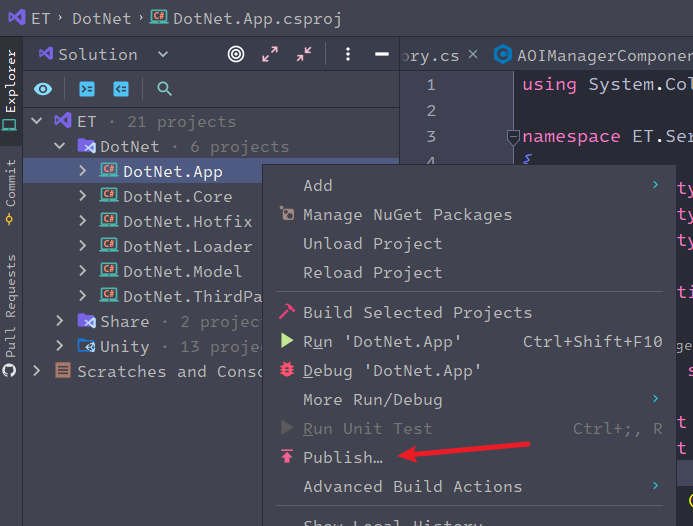

<!-- markdownlint-disable MD033 -->
<!-- markdownlint-disable MD024 -->
# ET_字母哥_3期教程笔记

## 服务端应用程序的发布

* 发布指令: `dotnet publish -r linux-x64 --no-self-contained --no-dependencies -c Release`

  将 `linux-x64` 替换成 `win-x64` 即可发布windows 应用程序
* `Rdier` 打包发布
  
  

  

## ET框架多进程部署

### 相关配置

* `StartMachineConfig` 机器内网/外网地址/守护进程端口(多机器配置)
* `StartProcessConfig` 进程ID配置/部署机器包含的进程配置
  
  需要添加 :
  |程序名|
  |-|
  |AppName|
  |string|

* `StartSceneConfig` Gate/Map 等场景配置对应进程配置
* `StartZoneConfig` 区服ID/数据库配置

### 监听进程

 Watcher 监控本机其他进程是否奔溃报错邮件/重启等操作

### 正式部署时关闭输出流(Console)日志选项

关闭对命令行的日志输出 `NLog.config`:

`<logger ruleName="ErrorConsole" name="Server" minlevel="Warn" maxlevel="Error" writeTo="ErrorConsole" enabled="false"/>`

## 热重载

### ET7 C2R_ReLoadDllHandler

```c#
xxx Run()
{
  await Game.WaitFrameFinish(); //加上这一行,确保 Hotfix 层的热更逻辑能正确执行
  CodeLoader.Instance.LoadHotfix();                    
  EventSystem.Instance.Load();
}
```