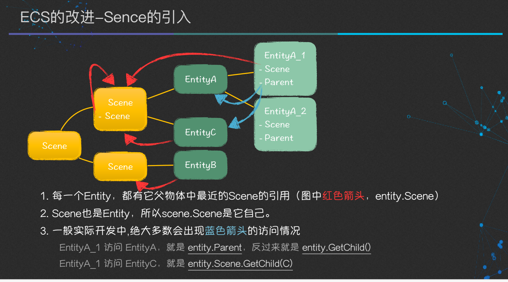

<!-- markdownlint-disable MD033 -->
# ET框架中的ECS范式

## ECS模式

### ECS模式速览

* 实体与组件的定义方式: _实体即组件,组件即实体_
  1. 添加/初始化实体组件 `Server\Hotfix\AppStart_Init.cs`

      ```c#
      // 这里类似OOP中的子类扩展父类
      Computer computer = Game.Scene.AddChild<Computer>(); //AddChild内部创建了Computer实体并返回,
      computer.AddComponent<PCCaseComponent>();        //添加组件 扩展实体功能
      computer.AddComponent<MonitorsComponent>();
      computer.AddComponent<MouseComponent>();
      computer.AddComponent<KeyboardComponent>();
      
      computer.Start();
      ```

  1. Entity实体定义 `Unity/Codes/Model/Demo/Computer/Computer.cs`
  
      ```c#
      namespace ET
      {
        public class Computer:Entity,IAwake,IUpdate,IDestroy //这里必须继承Entity,实现IAwake 等生命周期接口
        {        
        }
      }
      ```

  1. Component组件定义 `Unity/Codes/Model/Demo/Computer/PCCaseComponent.cs`

      ```c#
      namespace ET
      {
        [ComponentOf(typeof(Computer))] //关联组件挂载的实体
        public class PCCaseComponent:Entity,IAwake //定义组件和实体一样都需要继承Entity,实现IAwake
        {        
        }
      }
      namespace ET
      {
        [ComponentOf(typeof(Computer))] //关联组件挂载的实体
        public class MonitorsComponent:Entity,IAwake
        {
          
        }
      }
      ...
      ```

* System定义

  ComputerSystem 的定义:`Unity/Codes/Hotfix/Demo/Computer/ComputerSystem.cs`
  
  ```c#
  namespace ET
  {
    public static class ComputerSystem
    {
      public static void Start(this Computer self) //静态扩展 Computer添加 Start 启动方法
      {
        Log.Info("Computer Start =======");
        self.GetComponent<PCCaseComponent>().StartPower(); //调用子组件功能
        self.GetComponent<MonitorsComponent>().Display(); //调用子组件功能
      }
    }
    /// <summary>
    /// 生命周期Awake
    /// </summary>
    public class ComputerAwakSystem: AwakeSystem<Computer>
    {
      public override void Awake(Computer self) //实体初始化之后调用到Awake
      {
        Log.Debug("Computer Awake ====");
      }
    }

    /// <summary>
    /// 生命周期Update
    /// </summary>
    public class ComputerUpdateSystem: UpdateSystem<Computer>
    {
      public override void Update(Computer self)
      {
        // Log.Debug("Computer Update ===");
      }
    }

    /// <summary>
    /// 生命周期Destroy
    /// </summary>
    public class ComputerDestorySystem: DestroySystem<Computer>
    {
      public override void Destroy(Computer self)
      {
        Log.Debug("Computer Destory ====");      
      }
    }
  }
  ```

  * [参考生命周期](#lifeCycle)

  其他system的定义:`Unity/Codes/Hotfix/Demo/Computer/PCCaseComponentSystem.cs`

  ```c#
  namespace ET
  {
    public static class PCCaseComponentSystem
    {
      public static void StartPower(this PCCaseComponent self) //静态扩展 PCCaseComponent 添加 StartPower 启动方法
      {
        Log.Info("PCCaseComponent start =======");
      }
    }
  }
  ```

### [ECS模式设计思路](https://www.yuque.com/et-xd/docs/num22w)

ECS最重要的设计是逻辑跟数据的完全分离。即EC(Entity,Component)是纯数据，S(System)为逻辑。

ET没有抛弃OOP，只是抛弃了继承跟多态，一旦使用继承跟多态，逻辑必然跟数据绑在一起，无法适应快速变化的游戏逻辑

`Game.Scene.AddChild<Computer>()` 就是类似OOP中子类扩展父类能力的实现方式

* 概念:
  1. `Entity` 是对游戏中事物的抽象

     如: 一个玩家, 一个怪物, 一个道具, 一个技能, 一个Buff, 一个可交互的建筑等
  1. `Component` 是 `Entity` 身上的数据, 或者是`Entity`的容器/集合
  
     比如玩家和怪物都有武器, Buff,技能等管理组件, 但玩家还有养成模块等其他更多组件, 怪物却没有.
  1. `System` 系统指对应的所有功能逻辑
  
     ET里一般指的是 `Component` 的生命周期
     * `AwakeSystem` : 在 `AddComponent` 时触发
     * `DestroySystem` : 在 `Dispose` 时触发
     通常情况下ET中的 `Entity`在`Dispose`会遍历调用附属的`Component.Dispose`, 从而实现生命周期的自动化
* Entity 图解

   
* Scene 的引入

   

### 生命周期 <a id="lifeCycle"></a>

1. LoadSystem：热重载时调用
1. AwakeSystem：entity在Addcomponent/AddChild时调用
1. DeserializeSystem：entity反序列话后调用
1. UpdateSystem：同unity的Update一样每帧调用
1. LateUpdateSystem：同unity的LateUpdate一样每帧调用（比Update晚）
1. DestroySystem：entity触发Dispose时调用

## Attribute 标签

* [Attribute -- 代码分析器介绍](https://www.yuque.com/u28961999/yms0nt)

### ChildType 父类约束子类

[分析器参考](https://www.yuque.com/u28961999/yms0nt/ldyyhn)

**用组合的方式替代继承** ,在ET中使用 `AddChild、AddChildWithId` 方法对父实体添加子实体时，要求父实体必须含有 `ChildType` 标签

1. 无类型:  `[ChildType]`

   此种方式适合Scene Session等需要添加多种子实体类型的特殊情况，可以对父实体添加任意类型的子实体.
1. 唯一类型：`[ChildType(typeof(typeA))]`

   此种方式适合只拥有唯一子实体类型的实体类，只能添加标记类型的子实体。建议没有多种子实体需求的情况都使用唯一类型标记

使用示例:

```c#
[ChildType] //这样Session可以添加任意类似的子实体
public sealed class Session: Entity, IAwake<AService>, IDestroy
```

### FriendClass 可直接访问对应实体组件的字段

[分析器参考](https://www.yuque.com/u28961999/yms0nt/awksvs)

ET基于ECS思想设计，实体的字段成员需要使用 `public` 关键字，这导致实体成员可以被任意访问。
`FriendClass` 标签则相当于ET定义的实体字段访问权限，能够帮助开发者维护不同组件间的字段访问规范

使用示例:

```c#
[FriendClass(typeof(Account))] //Handler访问实体字段
public class C2A_LoginAccountHandler : AMRpcHandler<C2A_LoginAccount, A2C_LoginAccount>
...
account = session.AddChild<Account>();
account.AccountName = requestAccountName.Trim(); //这样访问Account中的字段才不会报错

[FriendClass(typeof (TokenComponent))]  //System访问实体字段
public static class TokenComponentSystem
```

### ComponentOf 约束组件可挂载的父类

[分析器参考](https://www.yuque.com/u28961999/yms0nt/ds0sq8)

实体类添加或获取组件需要对组件添加 `ComponentOf` 标签,表明该组件的父实体类型

1. 无类型:  `[ComponentOf]`

   此种方式适合组件需要添加到多种父实体类型的情况。
1. 唯一类型：`[ComponentOf(typeof(typeA))]`

   此种方式适合只拥有唯一父实体类型的组件，大多数业务组件都建议使用此种标记。

使用示例:

```c#
[ComponentOf(typeof(Scene))] //关联实体组件挂载的父实体
[ChildType(typeof(DBComponent))] //指定实体组件可添加的子实体类型
public class DBManagerComponent: Entity, IAwake, IDestroy
```

### Timer 定时器

```c#
//Awake初始化阶段定义一个Timer任务
public class AccountCheckOutTimeComponentAwakeSystem:AwakeSystem<AccountCheckOutTimeComponent,long>
{
  public override void Awake(AccountCheckOutTimeComponent self, long accountId)
  {
    self.AccountId = accountId;
    TimerComponent timerComponent = TimerComponent.Instance;
    timerComponent.Remove(ref self.Timer); //移除旧定时器(可能存在)
    //创建新定时任务,并获取TimerId
    self.Timer = timerComponent.NewOnceTimer(TimeHelper.ServerNow() + 10 * 60 * 1000, TimerType.AccountSessionCheckOutTime, self);
  }
}
//Timer标签用于标识执行的类型
[Timer(TimerType.AccountSessionCheckOutTime)] //关联定时器类型
public class AccountSessionCheckOutTimer :ATimer<AccountCheckOutTimeComponent>
{
  public override void Run(AccountCheckOutTimeComponent self)
  {
    ...
      self.DeleteSession(); //执行具体的定时任务
    ...
  }
}
```

