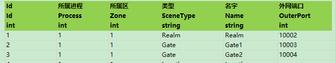

<!-- markdownlint-disable MD033 -->
# ET模块代码编写笔记

## 网络

### ET项目中Demo的登陆流程


### Protobuf 消息类型

||普通消息|Actor|ActorLocation|
|-|:-|-|-|
|消息|单向发送:<br/>IMessage<br/>请求与响应:<br/>IRequest<br/>IResponse |单向发送:<br/>IActorMessage<br/>请求与响应:<br/>IActorRequest<br/>IActorResponse|单向发送:<br/>IActorLocationMessage<br/>请求与响应:<br/>IActorLocationRequest<br/>IActorLocationResponse|
|用途|客户端与服务端对外节点的(Gate,Realm等)协议消息通信|服务器内网 Scene 之间协议消息通信|服务器内网 Unit (游戏实体)之间的协议消息通信|

* 协议缩写含义

  `C -> Client`

  `R -> Realm` 负载服务

  `G -> Gate`

  `M -> Map` 场景服务

### IMessage 简易通讯协议的编写

* `OuterMessage.proto` 文件路径: `Proto\OuterMessage.proto`
  
  示例协议内容:

  ```pb  
  //ResponseType R2C_LoginTest                //定义返回的消息类型 关联:R2C_LoginTest
  message C2R_LoginTest // IRequest           //请求协议类型
  {
    int32 RpcId = 90;                         //RpcId 必须要定义, 因为有对应的响应消息返回, 需要对上下文进行关联
    string Account = 1;
    string Password = 2;
  }

  message R2C_LoginTest // IResponse          //响应协议类型
  {
    int32 RpcId = 90;                         //RpcId 必须要定义, 因为有对应的响应消息返回, 需要对上下文进行关联
    int32 Error = 91;
    string Message = 92;
    string GateAddress = 1;
    string Key = 2;
  }

  message C2R_SayHello // IMessage            //IMessage单向协议, 客户端直连服务, 不需要通过Gate转发协议, 不关心返回协议, 不用定义 RpcId
  {
    string TestMsg = 1;
  }

  message R2C_SayGoodBye // IMessage          //IMessage单向协议, 客户端直连服务, 不需要通过Gate转发协议, 不关心返回协议, 不用定义 RpcId
  {
    string GoodBye = 1;
  }
  ```

  * `RpcId` 因该是用于协议消息上下文的处理

* 服务端协议Handler

  `Server\Server.Hotfix\Demo\Login\C2R_LoginTestHandler.cs` 处理有请求和响应协议逻辑: 接收`C2R_LoginTest` 返回 `R2C_LoginTest`

  ```c#
  namespace ET
  {
    [MessageHandler] //标记为消息处理器, Handler子类可以不用添加
    public class C2R_LoginTestHandler :AMRpcHandler<C2R_LoginTest,R2C_LoginTest> //接收 C2R_LoginTest, 返回 R2C_LoginTest
    {
      protected override async ETTask Run(Session session, C2R_LoginTest request, R2C_LoginTest response, Action reply)
      {
        Log.Debug($"C2R_LoginTest recvice:{request.Account}"); //接收到 C2R_LoginTest 协议
        response.Key = "999999";
        response.Message = "TestMsg";
        reply();//返回消息 最终调用:session.Reply(response);
        await ETTask.CompletedTask; //配合 async ETTask 使用
      }
    }
  }
  ```

  `Server\Server.Hotfix\Demo\Login\C2R_SayHelloHandler.cs` 处理单项协议逻辑, 只接收指定协议

  ```c#
  namespace ET
  {
    [MessageHandler] //标记为消息处理器, Handler子类可以不用添加
    public class C2R_SayHelloHandler : AMHandler<C2R_SayHello> //接收 C2R_SayHello 消息
    {
      protected override void Run(Session session, C2R_SayHello message)
      {
        Log.Debug($"C2R_SayHello:{message.TestMsg}");//处理接收数据
        session.Send(new R2C_SayGoodBye(){GoodBye = "byby"}); //服务端主动推送数据, 只要能拿到session对象, 理论上可以再任意模块中推送消息, 和 C2R_SayHelloHandler 没有强绑定关系
      }
    }
  }
  ```

* 客户端协议Handler

  `Client\Unity.Hotfix\Codes\Hotfix\Demo\Login\LoginHelper.cs` HotfixView显示层 UI 调用,向服务端发送协议逻辑

  ```c#
  public static async ETTask LoginTest(Scene zoneScene, string address)
  {
      try
      {
          Session session = null;
          R2C_LoginTest r2CLoginTest = null;
          try
          {
              //创建以session, 建立与server的连接
              session = zoneScene.GetComponent<NetKcpComponent>().Create(NetworkHelper.ToIPEndPoint(address));
              {
                  r2CLoginTest = (R2C_LoginTest)await session.Call(new C2R_LoginTest() { Account = "yoyo", Password = "" }); //创建 C2R_LoginTest 消息, 并发送, await等待返回数据
                  //因为使用了 await 异步等待响应的形式, 所以没有定义 R2C_LoginTest 对应的 Handler
                  Log.Debug($"R2C_LoginTest key:{r2CLoginTest.Key} msg:{r2CLoginTest.Error}"); //打印返回数据
                  session.Send(new C2R_SayHello(){TestMsg = "kkk"}); //推送 C2R_SayHello 到服务端, 没有返回数据
                  await TimerComponent.Instance.WaitAsync(100); //这里是为了等待服务端推送 R2C_SayGoodBye协议的返回
              }
          }
          finally
          {
              session?.Dispose();//?. Null条件运算符, 关闭连接
          }
      }
      catch (Exception ex)
      {
          Log.Error(ex.ToString());
      }
  }
  ```
  
  `Client\Unity.Hotfix\Codes\Hotfix\Demo\Login\R2C_SayGoodByeHandler.cs` 接收服务端主动推送 R2C_SayGoodBye 消息

  ```c#
  namespace ET
  {
    [MessageHandler] //标记为消息处理器
    public class R2C_SayGoodByeHandler:AMHandler<R2C_SayGoodBye> //接收 R2C_SayGoodBye 消息
    {
      protected override void Run(Session session, R2C_SayGoodBye message)
      {
        Log.Debug($"receive:{message.GoodBye}"); //打印接收的消息
      }
    }
  }
  ```

### IActorMessage Actor之间的协议消息

* `InnerMessage.proto` 文件路径: `Proto\InnerMessage.proto`
  
  示例协议内容:

  ```pb
  //ResponseType G2R_GetLoginKey             //定义返回的消息类型 关联:G2R_GetLoginKey
  message R2G_GetLoginKey // IActorRequest   //请求协议类型
  {
    int32 RpcId = 90;                        //RpcId 必须要定义, 因为有对应的响应消息返回, 需要对上下文进行关联 
    string Account = 1;
  }

  message G2R_GetLoginKey // IActorResponse  //响应协议类型
  {
    int32 RpcId = 90;                        //RpcId 必须要定义, 因为有对应的响应消息返回, 需要对上下文进行关联
    int32 Error = 91;                        //错误码
    string Message = 92;                     //消息

    int64 Key = 1;
    int64 GateId = 2;
  }
  ```

  `OuterMessage.proto` 文件路径: `Proto\OuterMessage.proto`

  ```pb
  message M2C_Stop // IActorMessage  //主动推送 不关联返回协议
  {
    int32 Error = 1;

    int64 Id = 2;
    float X = 3;
    float Y = 4;
    float Z = 5;

    float A = 6;
    float B = 7;
    float C = 8;
    float W = 9;
  }

  message R2C_Login // IResponse
  {
    int32 RpcId = 90;
    int32 Error = 91;
    string Message = 92;
    string Address = 1;
    int64 Key = 2;
    int64 GateId = 3;
  }

  //ResponseType M2C_TestActorLocationResponse
  message C2M_TestActorLocationRequest // IActorLocationRequest
  {    
    int32 RpcId = 90;  //需要回复的消息必须定义RpcId
    string Content = 1;
  }

  message M2C_TestActorLocationResponse // IActorLocationResponse
  {
    int32 RpcId = 90;  //需要回复的消息必须定义RpcId
    int32 Error = 91;
    string Message = 92;
    string Content = 1;
  }

  //因为跨越了Client->Gate->Map 需要定义RpcId
  message C2M_TestActorLocationMessage // IActorLocationMessage
  {
    int32 RpcId = 90;   
    string Content = 1;
  }

  //Map->Client 主动下推消息
  message M2C_TestActorMessage // IActorMessage
  {
    string Content = 1; //测试消息注释
  }
  ```

* 服务端协议Handler

  Game.Scene配置文件:

  

  服务端登陆流程:
  1. Client -> Realm : <C2R_Login> : 随机一个Gate
  1. Realm <-> Gate : <R2G_GetLoginKey,G2R_GetLoginKey> 获取连接端口, GateSessionKey等信息
  1. Realm -> Client : <R2C_Login> : 将获取Gate信息返回给Client
  
  `Realm 负载服务` `Server\Server.Hotfix\Demo\C2R_LoginHandler.cs`

  ```c#
    [MessageHandler]
    public class C2R_LoginHandler : AMRpcHandler<C2R_Login, R2C_Login> //登陆协议
    {
      protected override async ETTask Run(Session session, C2R_Login request, R2C_Login response, Action reply)
      {
        // 随机分配一个Gate
        StartSceneConfig config = RealmGateAddressHelper.GetGate(session.DomainZone());
        Log.Debug($"gate address: {MongoHelper.ToJson(config)}");
        
        // 向gate请求一个key,客户端可以拿着这个key连接gate
        G2R_GetLoginKey g2RGetLoginKey = (G2R_GetLoginKey) await ActorMessageSenderComponent.Instance.Call(
          config.InstanceId, new R2G_GetLoginKey() {Account = request.Account}); //Realm 向 Gate申请一个 SessionKey
        //拿到 Gate 连接端口等信息 , 填充 R2C_Login 并返回数据
        response.Address = config.OuterIPPort.ToString(); 
        response.Key = g2RGetLoginKey.Key;
        response.GateId = g2RGetLoginKey.GateId;
        reply(); //Realm <-> Client
      }
    }
  ```

  `Gate 网关服务` `Server\Server.Hotfix\Demo\R2G_GetLoginKeyHandler.cs`

  ```c#
  namespace ET
  {
    [ActorMessageHandler] //标记为Actor消息处理器, Handler子类可以不用添加
    public class R2G_GetLoginKeyHandler : AMActorRpcHandler<Scene, R2G_GetLoginKey, G2R_GetLoginKey>
    {
      protected override async ETTask Run(Scene scene, R2G_GetLoginKey request, G2R_GetLoginKey response, Action reply)
      {
        long key = RandomHelper.RandInt64();
        scene.GetComponent<GateSessionKeyComponent>().Add(key, request.Account);
        response.Key = key;
        response.GateId = scene.Id;
        reply(); //Gate <-> Realm
        await ETTask.CompletedTask;
      }
    }
  }
  ```

* 客户端相关代码

  客户端登陆流程两个操作:
  1. Client <-> Realm : <C2R_Login,R2C_Login> : Client从Realm获取Gate连接信息
  1. Client <-> Gate : <C2G_LoginGate,G2C_LoginGate> : Client登陆到Gate
  
  `LoginHelper` 客户端发起登陆请求逻辑代码:`Unity.Hotfix\Codes\Hotfix\Demo\Login\LoginHelper.cs`

  ```c#
  // 创建一个ETModel层的Session
  R2C_Login r2CLogin;
  Session session = null;
  try
  {
      session = zoneScene.GetComponent<NetKcpComponent>().Create(NetworkHelper.ToIPEndPoint(address));
      {
          r2CLogin = (R2C_Login) await session.Call(new C2R_Login() { Account = account, Password = password }); //Client <-> Realm
      }
  }
  finally
  {
      session?.Dispose(); //关闭与 Realm 的连接
  }
  // 创建一个gate Session,并且保存到SessionComponent中
  Session gateSession = zoneScene.GetComponent<NetKcpComponent>().Create(NetworkHelper.ToIPEndPoint(r2CLogin.Address));
  gateSession.AddComponent<PingComponent>();
  zoneScene.AddComponent<SessionComponent>().Session = gateSession;

  G2C_LoginGate g2CLoginGate = (G2C_LoginGate)await gateSession.Call(
      new C2G_LoginGate() { Key = r2CLogin.Key, GateId = r2CLogin.GateId}); //Client <-> Gate
  Log.Debug("登陆gate成功!");
  ...  
  ```
