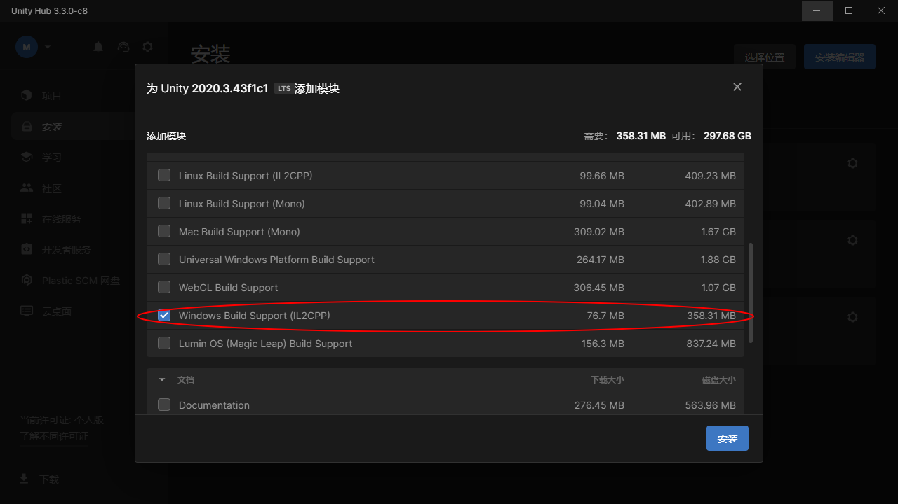
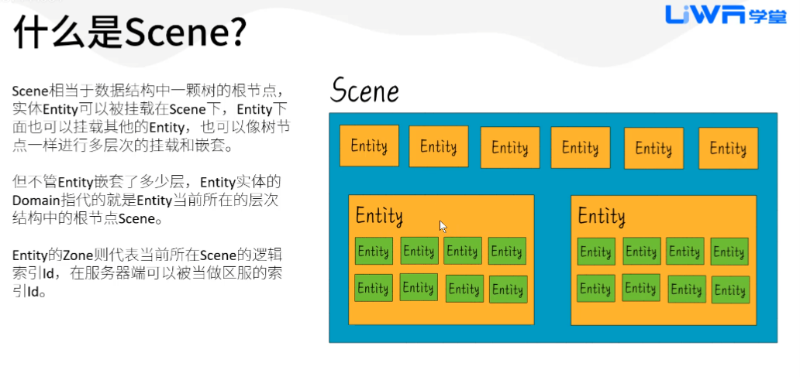
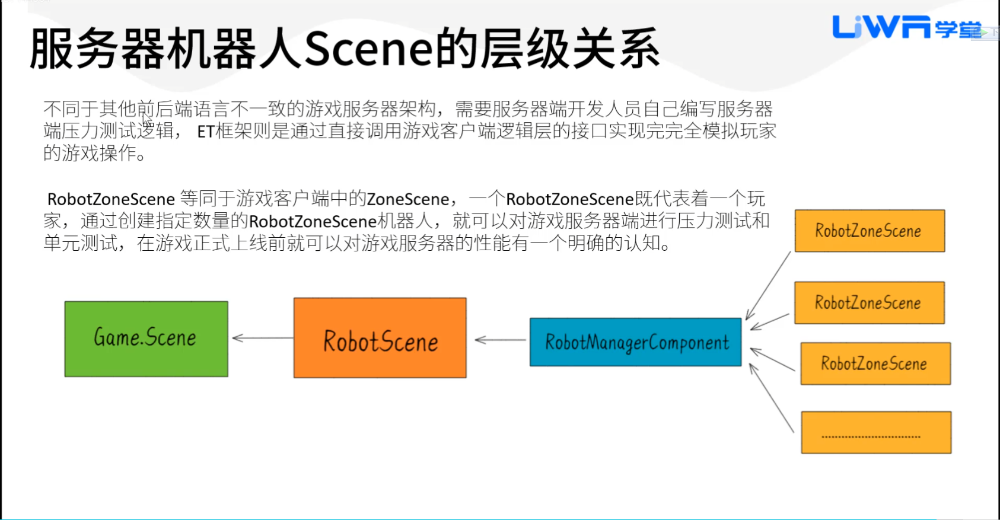
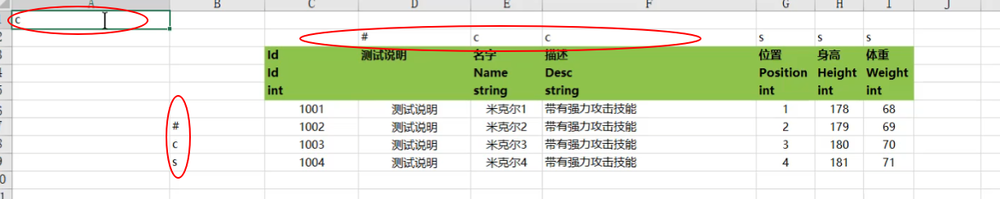
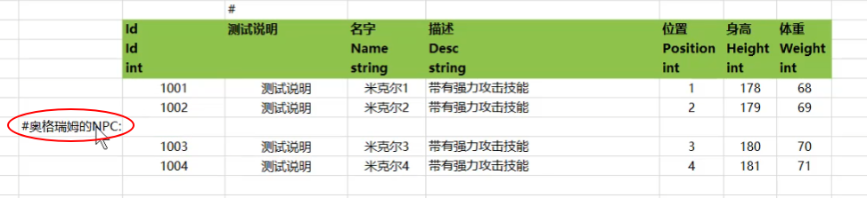
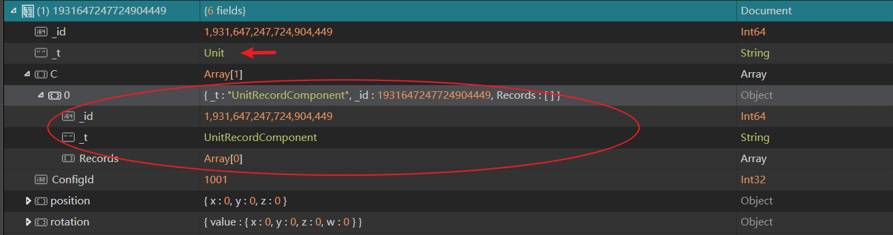
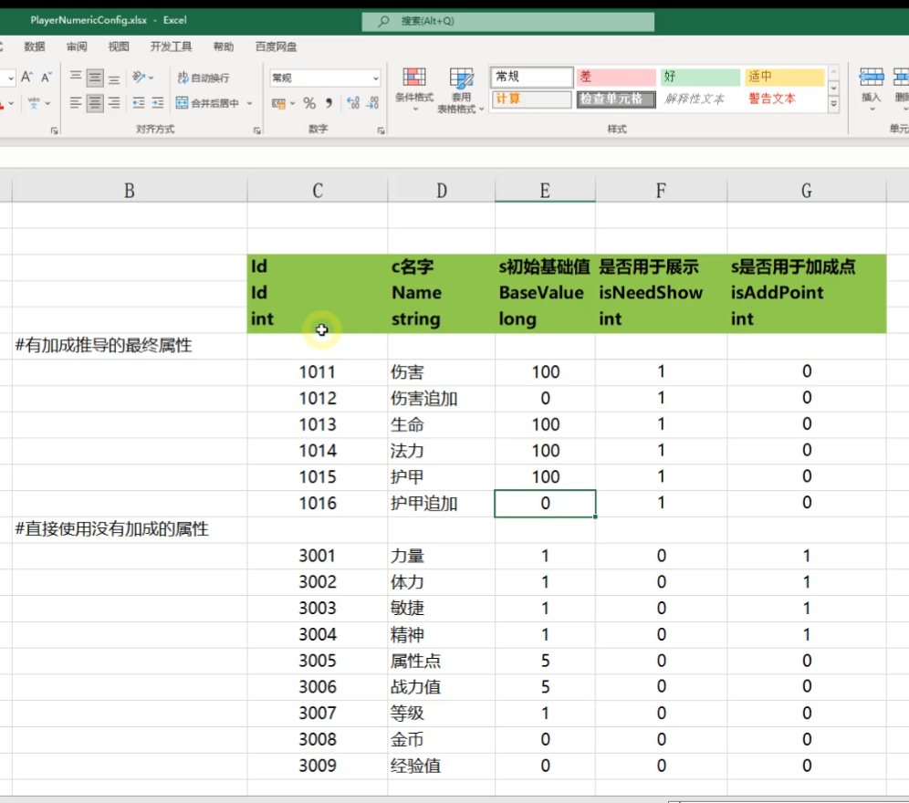

<!-- markdownlint-disable MD033 -->
# ET学习笔记

单线程, 多进程

> ETTask就是ET的灵魂！整个ET架构在ETTask跟协程锁上。
## 异常问题

### HttpListener拒绝访问异常

* 启动提示: `请现在cmd中运行: netsh http add urlacl url=http://*:你的address中的端口/ user=Everyone, address: http://+:30300/`

* [C#Http服务器报HttpListener拒绝访问异常解决方法](https://et-framework.cn/d/1062-netsh-http-add-urlacl-urlhttpaddress-usereveryone)
* 解决方式:

  ```sh
  netsh http add urlacl url=http://+:30300/ user=Everyone
  ```

* 其他`netsh`指令
  
  ```sh
  netsh http show urlacl #显示列表
  netsh http delete urlacl url=http://+:10006/ #移除指定url
  ```

* [Netsh http 命令](https://learn.microsoft.com/zh-cn/windows-server/networking/technologies/netsh/netsh-http)
* [ET7请求Route信息 返回:`HTTP Error 503. The service is unavailable`](https://et-framework.cn/d/1218-et72win11http503)
  1. 先把+号和*号都删掉

      ```bat
      netsh http delete urlacl url=http://*:30300/
      netsh http delete urlacl url=http://+:30300/
      ```

  1. 然后重新启动服务端，根据报错提示选择使用+号或*号

### StreamingAssets

* 打包提示:Unity/Assets目录下缺一个目录StreamingAssets
* 解决方式: [手工添加目录StreamingAssets](https://et-framework.cn/d/593-unityassetsstreamingassets)

### il2cpp is not installed

* 打包提示 `il2cpp` 没有安装: Unity 错误:currently selected scripting backend(il2cpp) is not installed
* 解决方式: 在安装器中添加`il2cpp`模块 [参考CSDN](https://blog.csdn.net/qq_39342142/article/details/100661184)
  
  

## 框架概念

### 工程目录结构 (ET6)

* 目录结构:

  ```js
  //客户端
  Unity.Hotfix     //逻辑层, 可热更代码, 主要存放system操作的定义
  Unity.HotfixView //显示层,有调用Unity相关API 可热更
  Unity.Model      //逻辑层, 主要存放 entity和component类型的定义
  Unity.ModelView  //显示层

  //服务端
  Server.Hotfix //可热更
  Server.Model

  //Robot
  Robot.Hotfix //可热更
  Robot.Model
  ```

  区分了逻辑层与显示层代码,以便于服务端和机器人的代码公用

  显示层可以引用逻辑层代码, 但逻辑层无法引用显示层代码, 逻辑层->显示层 *只能通过事件做交互*

### ECS

* **E就是Entity，C就是Component，S是System**
* ECS最重要的设计是 **逻辑** 跟 **数据** 的完全分离。即EC(Entity与Component)是纯数据，System实际上就是逻辑，由数据驱动逻辑。
* Entity :实体是指存在游戏世界中的一个独特物体,是一系列组件的集合
* Component: 组件是一堆数据的集合,组件没有方法,即不存在任何的行为,只用来存储状态
* System: 系统就是对拥有一个或者多个 相同组件的实体集合进行 **操作的工具**,它只有行为,没有状态,即不存在任何数据
* ET框架中的ECS编程原则
  1. 实体即组件,组件即实体
  2. 编写一个新的实体或者组件,绝不继承除Entity之外的任何父类
  3. 绝不使用任何的虚函数,使用逻辑分发替代
  4. Model和ModelView只存放实体和组件的数据字段声明,非必要绝不放任何逻辑函数
  5. Hotfix和HotfixView中只保留纯逻辑函数,也就是使用静态类和扩展方法编写的System,且绝不允许存在任何数据字段
  6. Model和Hotfix中绝不允许出现跟Unity3D引擎相关的游戏对象类和相关API函数调用
  7. 如实体或组件有数据字段声明,**必须编写相关生命周期函数**,以防实体对象池回收再利用导致逻辑错误.

### 组件式设计

* 组件模式的特点:
  1. 高度模块化, 一个组件就是一份数据 + 一段逻辑
  1. 组件可热插拔, 需要就加上, 不需要就删除  
  1. 类型之间依赖极少, 任何类型增加或删除组件不会影响到其他类型

### 生命周期

1. LoadSystem：热重载时调用
1. AwakeSystem：entity在Addcomponent/AddChild时调用
1. DeserializeSystem：entity反序列话后调用
1. UpdateSystem：同unity的Update一样每帧调用
1. LateUpdateSystem：同unity的LateUpdate一样每帧调用（比Update晚）
1. DestroySystem：entity触发Dispose时调用

### Scene层级说明

服务端完整的结构从外往里依次为

1. Zone：一个大区，可以包含多个物理服务器
1. Process：一个进程，一个物理服务器可以包含多个进程，可以直接对位计算机操作系统的进程概念
1. Scene：一个功能组件，一个进程可以包含多个Scene

* Scene 概念
  
  
* 进程 Scene 组件之间关系
  
  
* 客户端

  
* 服务端
  
  
* 机器人

  

  RobotZoneScene等同于客户端中的ZoneScene, 即代表一个玩家
* Scene相关代码
  1. `Unity/Codes/Model/Core/Entity/SceneType.cs` 类型
  1. `Server/Server.Hotfix/Demo/Scene/SceneFactory.cs` 服务端scene工厂
* Scene相关配置
  
  `StartSceneConfig@s.xlsx`
* 代码中获取Scene

   ```c#
   //var domain = self.Domain(); //不推荐直接调用Domain()
   //推荐使用下面两种方式获取 currentScene
   self.ZoneScene();
   self.DomainScene();
   ```

### ET异步操作

* 同步操作, 即常见的线性的执行代码逻辑
* 异步操作, 即大部分逻辑是在调用之后才完成的 适用场景: IO操作, CPU密集型操作
* ETTask的存在主要是为了抹除回调,增加代码可读性
* 理解ETTask切入点相关资料:
  1. [C#异步编程](https://www.yuque.com/et-xd/docs/sqrvhi)
  1. [ETTask](https://www.yuque.com/et-xd/docs/wyr682)
  1. [C#与C++的发展历程第三 - C#5.0异步编程巅峰](https://www.cnblogs.com/lsxqw2004/p/4922374.html)
  1. [协程锁](https://www.yuque.com/et-xd/docs/mmn01k)
* ETTask是一个轻量级单线程的Task，相比Task性能更强。
  1. 跨线程都是把委托投递到一个队列，主线程不停从队列中取出委托执行
  1. 不要用任何微软提供的Task创建方法，多线程会把你搞死搞残，用ET不要自己去搞多线程，除非自己对线程把控力非常强。
  1. 用ETTask就根本没有线程切换的代价
  1. await并不会开启多线程，await具体用没用多线程完全取决与具体的实现

### EventSystem 事件机制

### Actor

* ET采用的是:单线程,多进程的架构
* ET中，Actor是Entity对象，**Entity挂上一个`MailboxComponent`组件就是一个Actor了**
* 处理Send的消息, 需要继承`AMActorHandler`抽象类
* 处理Rpc消息, 需要继承`AMActorRpcHandler`抽象类

### Actor Location

* 用于跨进程访问/调用Actor

### Demo 项目包含模块

服务器类型:

  1. Realm 负载均衡
  1. Gate
  1. Map 场景
  1. Location 定位Actor所在进程

### ET6 Demo启动入口

* 客户端
  
  `Client/Unity.HotfixView/Codes/HotfixView/Demo/UI/UILogin/AppStartInitFinish_CreateLoginUI.cs`
* 服务端
  
  `Server/Server.Hotfix/AppStart_Init.cs`

  启动可选项: `Robot/Robot.Model/Core/Options.cs`
  * `--Develop` : 0正式 1开发 2压测
  * `--LogLevel` : 日志级别
  * `--Console` : 控制台

### 登录地址端口常量

`ET.ConstValue.LoginAddress`

`public const string LoginAddress = "127.0.0.1:10002";`

### 备忘代码块

* ET框架内的 wait 调用方式
  
  `await TimeComponent.Instance.WaitAsync(3000); //等待3秒`

### NLog 日志配置

[NLog 官方配置教程](https://github.com/NLog/NLog/wiki/Tutorial)

[服务器控制台Log不显示内容](https://et-framework.cn/d/15-log)

```config
<!-- 默认日志输出级别为Warn 控制台输出内容比较少 -->
<!-- <logger ruleName="ErrorConsole" name="Server" minlevel="Warn" maxlevel="Error" writeTo="ErrorConsole" /> -->
<!-- 开发环境可以设置成Debug -->
<logger ruleName="ErrorConsole" name="Server" minlevel="Debug" maxlevel="Error" writeTo="ErrorConsole" />
```

NLog 支持的日志级别:

* Trace - very detailed logs，包含大量的信息，例如 protocol payloads。该级别一般仅在开发环境中启用。
* Debug - debugging information, 比 Trance 级别稍微粗略，一般在生产环境中不启用。
* Info - information messages，一般在生产环境中启用。
* Warn - warning messages，一般用于可恢复或临时性错误的非关键问题。
* Error - error messages，一般是异常信息。
* Fatal - 非常严重的错误！

## 相关工具

### 表格名称规则

`ET/Excel` 配置文件所在目录, 文件名中带有@符号，后跟小写的 c/s/cs  
`StartMachineConfig@s.xlsx`
决定这张表格导给哪个端

1. 后缀必须是.xlsx
1. 包含#或以~$开头，表示该表不导出
1. @c，表示只导出到客户端
  a. 服务端因为机器人的存在必须包含客户端所有配置，所以单独的c字段没有意义,单独的c就表示cs
1. @s，表示只导出到服务端
  a. ClientServer模式下要导出服务端Excel给客户端使用。
1. 默认@cs导出两端（不写也可以）

### [Excel 导出工具](https://www.yuque.com/et-xd/docs/wcwbl01gr9wgvmaq)

1. 执行配置导出程序脚本: `ET/Excel/win_startExcelExport.bat`
1. 在工程内启动导表工具的方式:

   Tools.APP 启动项中添加参数:`--AppType=ExcelExporter`

   
1. `Tools/App/Apps/ExcelExporter/ExcelExporter.cs` 导出工具代码
1. 生成配置类型文件目录:

   客户端:`ET/Unity/Codes/Model/Generate/Config`

   服务端:`ET/Server/Model/Generate/Config/`
1. ET配置表导出工具执行前,务必先执行工程build操作

1. 导出规则:配置表头带 `#` 表示不用导出的字段, `c` 表示只导出到客户端, `s` 表示只导出到服务端
   * 第二行,控制整列数据导出规则  
   * 第二列,控制整行数据导出规则
   * 如果在表第一行,第一列填写,则控制整个配置表导出规则
  
     

   * 可以添加空行以便配置数据的分类, 示例如下:

     

   * 如果配置表中有多个表单, 也可以在表单名加相关前缀:

     

1. Excel配置生成文件对应目录:

     1. `ET/Excel/Json` //人工可读txt文件分别在 c, s 目录
  
     1. `ET/Unity/Assets/Bundles/Config` //生成bytebuff文件目录
  
     1. `ET/Unity/Codes/Model/Generate/Config` //客户端生成映射对象结构
  
     1. `ET/Server/Model/Generate/Config` //服务端生成的对象结构

1. 调用代码

   配置文件会生成对应的 `XXXConfig` 和 `XXXCategory` 代码, `XXXCategory` 可以理解成对应配置类型的管理容器

   对应生成的代码模板文件:`Tools/App/Template.txt`

   ```c#
   UnitConfig config = UnitConfigCategory.Instance.Get(1001); //使用Id获取Unit类型配置
   Log.Debug(config.Name);
   var allUnitConfigs = UnitConfigCategory.Instance.GetAll(); //获取所有Unit类型配置
   foreach (var unitConfig in allUnitConfigs.Values)
   {
    Log.Debug(unitConfig.Name);
   }
   ```

1. 扩展配置类型

   `Config` 和 `Category` 都是使用 `partial`(分部类型),也就是说可以支持逻辑的拆分扩展, 示例:

   ```c#
   public partial class UnitConfig
   {
    //扩展Config
     public string _Name()
     {
       return "UnitConfig:" + this.Name;
     }
   }
   public partial class UnitConfigCategory
   {
     //扩展Category
     public UnitConfig GetUnitConfigByHeight(int height)
     {
       UnitConfig unitConfig = null;
       foreach (var info in this.dict.Values)
       {
         if(info.Height == height)
         {
           unitConfig = info;
           break;
         }
       }
       return unitConfig;
     }
   }
   ```

1. 已支持的配置类型参考: `Tools/Tools.App/Apps/ExcelExporter/ExcelExporter.Convert` 函数

### Protobuf导出工具

1. 执行配置导出程序脚本: `ET/Proto/win_startProtoExport.bat`
1. 在工程内启动导表工具的方式:

   Tools.APP 启动项中添加参数:`--AppType=Proto2CS`

   
1. `Tools/Tools.App/Apps/Proto2CS/Proto2CS.cs` 导出工具代码
1. 生成协议类文件目录:

   客户端:`ET/Unity/Codes/Model/Generate/Message/`

   服务端:`ET/Server/Model/Generate/Message/`

   1. `OuterOpcode.cs` 协议码
   1. `OuterMessage.cs` 协议类型

* [Protobuf消息字段唯一编号 1-15使用一个字节编码,16到2047范围内的字段号占用两个字节](https://protobuf.dev/programming-guides/proto3/#assigning-field-numbers)

## 其他

### 论坛资料

* [ETTask](https://et-framework.cn/d/46-ettask)
* [ET中的Actor机制](https://et-framework.cn/d/47-actor)
* [服务器命名 及消息类的端到端的命名方式](https://et-framework.cn/d/51)

  `SceneType` 中的各种类型的场景的作用

  `Process` 用于确认所属进程

  `Zone` 用于确认所属区服(如果是大区服设计 `zoneId` 应该相同), 这样同一区服业务逻辑对应的 数据库,地图场景 等逻辑是一致的
* [如何添加Config的Partial类的做法](https://et-framework.cn/d/1257-configpartial)
  
  [Excel配置文件扩展类在切换CodeMode时的问题](https://et-framework.cn/d/1643-excelcodemode)
* [Rider中 去掉C#10的 File-Scoped Namespaces 命名空间作用域的设置](https://et-framework.cn/d/1676-ridercsunity)
* [ObjectWait -- 就是对ETTask的一种包装](https://et-framework.cn/d/351-objectwaitentity/3)
  
  [解析ET6框架的ObjectWait组件](https://blog.csdn.net/m0_46712616/article/details/122690539?spm=1001.2014.3001.5501)
* [ET7 中先执行Reply 再进行其他操作的方式](https://et-framework.cn/d/1108-masterrpc-replay)

  ET7中已经取消了Reply的RPC调用返回方式, 请参考 `TransferHelper.TransferAtFrameFinish` -> `await Game.WaitFrameFinish();`
* [Static字段需要添加StaticField标签的作用是什么？](https://et-framework.cn/d/758-staticstaticfield)

  这个是为了 `domain reload` 域重新加载

### 设计范式

* [用ISerializeToEntity接口让组件跟随传送相关设计问题](https://et-framework.cn/d/448-20cnyiserializetoentity)

  设计方面的总结：

  Unit不要挂继承 `ISerializeToEntity` 的组件, 因为添加了 `ISerializeToEntity` 接口以后,就会跟随父级做序列化,如下:

  

  补充：Unit不要挂孩子，Unit上的组件才能挂孩子

* 数值配置表设计

  结合 `NumericType` 数值类型设计数值配置表 `PlayerNumericConfig`

  

### Rider 使用技巧

* 快速预览 `csproj` 文件

  选中对应解决方案,按快捷键 `F4`

    
