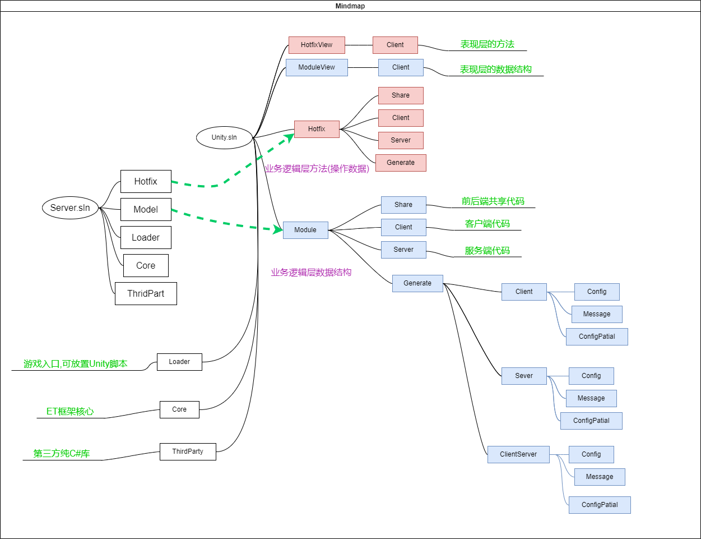

<!-- markdownlint-disable MD033 -->
# 网络游戏架构设计 笔记一

## ET7 目录结构



客户端服务端不热更不共享的组件可以写到Loader中，比如表现层需要一个组件不需要热更，可以写在Loader中，这样性能更高。

如果客户端跟服务端共享的并且不需要热更的的组件可以写在Core中

## All In One

可以将所有Scene类型整合到一个进程启动

* 各类服务器合并:
  
  1. 发布部署简单,配置资源方便,多种服务公用进程
  1. 结构调整容易,如两种或者多种服务要合并或拆分
  1. 无线增加Scene类型,千古风流有几十种SceneType

* Server跟机器人合并的问题

  `ET.Server` `ET.Client` 命名空间解决代码类重名的问题

  `ET` 命名空间的代码则双端可用

  事件区分服务端 `[Event(SceneType.Map)]` 和客户端 `[Event(SceneType.Current)]`

  > `Unit` 对应一个玩家
* 前端跟后端合并

  不需要单独器服务端, 前后端代码共享更加方便

  后端可以更方便做Unity可视化工具, 可视化树 ENABLE_VIEW

  更方便的插件机制 Excel和Protobuf工具等

  竞技游戏 推图游戏 MMO(陪玩机器人) MOBA(陪玩机器人) 状态同步 帧同步(防作弊,预测回滚) `对前后端代码共享的必要性`
* 前后端合并细节
  
  如何区分编译前后端代码, 还有双端编译

  配置要区分前后端, 以及双端, config Partial 的处理

  协议消息区分前后端, 以及双端

## 单间(单例)管理器

### 为什么使用Game.AddSingleton创建单例

```c#
Game.AddSingleton<TimerComponent>();// 加载并管理单例

//单例的申明
public class TimerComponent: Singleton<TimerComponent>, ISingletonUpdate{}
```

* 代码可读性, 明确单例初始化的地方
* 明确知道初始化顺序, 方便调整
* 好释放, 相反的顺序释放 因为使用了栈结构`Game.Stack<ISingleton> singletons`
* 类似组件的使用方式

相关接口

```c#
public interface ISingleton: IDisposable
{
    void Register();
    void Destroy();
    bool IsDisposed();
}
```

## 多线程与Task,再到ETTask

`Task` `协程` 都是为了解决回调地狱

`async/await`组合是一种扁平替换回调方式

* 回调的方式执行异步任务调用

  ```c#
  public static void StartTask()
  {
    FindPath(SendMessage); //常见的回调方式
  }
  public static void FindPath(Action callback)
  {
    ThreaPool.QueueUserWorkItem((_)=>{
      Console.WriteLine("FindPath run!");
      callback.Invoke();
    });
  }
  public static void SendMessage()
  {
    XXXXX
  }
  ```

* async/await 组合替换回调方式

  ```c#
  public static async StartTask()
  {
    await FindPath(); //执行逻辑
    SendMessage(); //扁平的回调
  }
  public static async ETTask FindPath(Action callback)
  {
    TaskCompletionSource tcs = new();
    ThreaPool.QueueUserWorkItem((_)=>{
      Console.WriteLine("FindPath run!");
      tcs.SetResult();
    });
    await tcs.Task;
  }

  ```

### ETTask的优点

* 生成代码简单, 去除了多线程的支持, 性能较好
* 对象池消除了Task GC
* 去掉了ETVoid, 统一使用 ETTask

### `ETCancellationToken` 替换 `CancellationTokenSource`

`ETCancellationToken` 异步调用时需要将取消器传递下去

### `CoroutineHelper` 扩展 `AsyncOperation` 使用`ETTask`进行封装Unity yield调用

这样一来前端也可以使用 `async/await` 的方式编写代码

## ETTask源码分析

1. `ETTask` -> `ETAsyncTaskMethodBuilder` 是一个 `struct` 它内部包含了一个 `ETTask`
1. `ETVoid` -> `ETAsyncVoidMethodBuilder` 无返回值, 不能直接使用
1. `ETTaskCompleted` -> `ETAsyncTaskCompletedMethodBuilder` 默认直接返回完成

```c#
public static ETAsyncTaskMethodBuilder Create()
{
    ETAsyncTaskMethodBuilder builder = new ETAsyncTaskMethodBuilder() { tcs = ETTask.Create(true) };
    return builder;
}
```

### `ETAsyncTaskMethodBuilder` 调用状态机 `MoveNext`

```c#
        // 5. AwaitOnCompleted
        [DebuggerHidden]
        public void AwaitOnCompleted<TAwaiter, TStateMachine>(ref TAwaiter awaiter, ref TStateMachine stateMachine) where TAwaiter : INotifyCompletion where TStateMachine : IAsyncStateMachine
        {
            awaiter.OnCompleted(stateMachine.MoveNext);
        }

        // 6. AwaitUnsafeOnCompleted
        [DebuggerHidden]
        [SecuritySafeCritical]
        public void AwaitUnsafeOnCompleted<TAwaiter, TStateMachine>(ref TAwaiter awaiter, ref TStateMachine stateMachine) where TAwaiter : ICriticalNotifyCompletion where TStateMachine : IAsyncStateMachine
        {
            awaiter.OnCompleted(stateMachine.MoveNext);
        }

        // 7. Start
        [DebuggerHidden]
        public void Start<TStateMachine>(ref TStateMachine stateMachine) where TStateMachine : IAsyncStateMachine
        {
            stateMachine.MoveNext();
        }
```

### ETTask 示例:

  编译前代码:

  ```c#
  public class TestETTask4
  {
    public static void Run()
    {
      AAAAA().Coroutine();
    }

    private static async ETTask AAAAA()
    {
      Console.WriteLine("AAAAA start");
      await ETTask.CompletedTask;
      Console.WriteLine("AAAAA finish"); //这里就类似对异步调用后的回调操作
    }
  }
  ```  

### ETTask 编译后实现状态机

  ```c#
  public class TestETTask4_f
  {
    
    [StructLayout(LayoutKind.Auto)]
    [CompilerGenerated]
    private struct AAAAA_d__1 : IAsyncStateMachine
    {
    public int p__state;

    public ETAsyncTaskMethodBuilder p__builder;

    private ETTaskCompleted p__1;

    //状态机主要逻辑都在MoveNext中
    private void MoveNext()
    {
      int num = p__state;
      try
      {
        ETTaskCompleted awaiter;
        if (num != 0)
        {
          Console.WriteLine("AAAAA start");
          awaiter = ETTask.CompletedTask.GetAwaiter();
          if (!awaiter.IsCompleted)
          {
            num = (p__state = 0);
            p__1 = awaiter;
            p__builder.AwaitUnsafeOnCompleted(ref awaiter, ref this); //进入挂起状态,等待回调执行
            return;
          }
        }
        else
        {
          awaiter = p__1;
              p__1 = default(ETTaskCompleted);
          num = (p__state = -1);
        }
        awaiter.GetResult(); //状态机处于完成, 执行回调
        Console.WriteLine("AAAAA finish");
      }
      catch (Exception exception)
      {
        p__state = -2;
            p__builder.SetException(exception);
        return;
      }
      p__state = -2;
          p__builder.SetResult();
    }

    void IAsyncStateMachine.MoveNext()
    {
      //ILSpy generated this explicit interface implementation from .override directive in MoveNext
      this.MoveNext();
    }

    [DebuggerHidden]
    private void SetStateMachine(IAsyncStateMachine stateMachine)
    {
      p__builder.SetStateMachine(stateMachine);
    }

    void IAsyncStateMachine.SetStateMachine( IAsyncStateMachine stateMachine)
    {
      //ILSpy generated this explicit interface implementation from .override directive in SetStateMachine
      this.SetStateMachine(stateMachine);
    }
  }

  public static void Run()
  {
    AAAAA().Coroutine();
  }

  [AsyncStateMachine(typeof(AAAAA_d__1))]
  private static ETTask AAAAA()
  {
    AAAAA_d__1 stateMachine = default(AAAAA_d__1);
    stateMachine.p__builder = ETAsyncTaskMethodBuilder.Create();
    stateMachine.p__state = -1;
    stateMachine.p__builder.Start(ref stateMachine); //启动状态机
    return stateMachine.p__builder.Task;
  }
  }
  ```

### 协程的使用

```c#
int result = await OpenBox(); //UI按钮点击
await MoveTo(); //移动
await ChangeScene(); //场景切换
await CastSpell(); //释放技能
//大世界寻路
```

## 定时器

### 定时器使用场景

* UI倒计时
* 网络超时
* 技能释放
* buff超时删除,定时事件
* `NewFrameTimer` 服务端为100ms执行一次 防止逻辑帧太频繁执行
  
  ```c#
  public long NewFrameTimer(int type, object args)
  {
  #if DOTNET
      return this.NewRepeatedTimerInner(100, type, args);
  #else
      return this.NewRepeatedTimerInner(0, type, args);
  #endif
  }
  ```

### C#中 `Task.Delay`的问题

* 它是跨线程的,回调线程切换了
* 如果要回到主线程,需要定义 `SynchronizationContext` 性能消耗大
* `CancellationTokenSource` 取消操作会抛异常 性能消耗大
* 基于`Task`实现 GC比较高

### `TimerComponent` 的API

* `public async ETTask WaitAsync(long time, ETCancellationToken cancellationToken = null)`

  等待相对时间后执行: `await TimerComponent.Instance.WaitAsync(1000);` 
  
  **适合等待时间短,串联调用, 不能热更**
* `public async ETTask WaitTillAsync(long tillTime, ETCancellationToken cancellationToken = null)`

  基于绝对时间执行,不会产生累积误差
  
  **wait时间短并且逻辑需要连贯的建议WaitTillAsync,不能热更，优点是逻辑连贯。**
* `public long NewOnceTimer(long tillTime, int type, object args)`

  基于绝对时间执行,不会产生累积误差 ,以回调的形式调用
  
  **wait时间长不需要逻辑连贯的建议用NewOnceTimer**

### `TimerComponent`数据结构

`MultiMap<long, long> TimeId`

`MultiMap<T, K>: SortedDictionary<T, List<K>>` 有序字典, 储存的内容为:`tillTime, List[timer.Id]`

```c#
private void AddTimer(TimerAction timer)
{
    long tillTime = timer.StartTime + timer.Time;
    this.TimeId.Add(tillTime, timer.Id); //tillTime, List[timer.Id]
    this.timerActions.Add(timer.Id, timer);
    if (tillTime < this.minTime) 
    {
        this.minTime = tillTime; //更新最小执行时间, 用于优化Update逻辑
    }
}
```

### `TimerComponent.Update` 解读

```c#
public void Update()
{
  if (this.TimeId.Count == 0)
  {
      return;
  }
  long timeNow = GetNow(); //当前系统时间
  if (timeNow < this.minTime) //判断最小执行时间是否过期
  {
      return;
  }
  foreach (KeyValuePair<long, List<long>> kv in this.TimeId)
  {
      long k = kv.Key;
      if (k > timeNow)
      {
          this.minTime = k; //还没到执行时间,则更新最小执行时间
          break;
      }
      this.timeOutTime.Enqueue(k); //当前时间对应的定时任务列表,有可能多个组Id
      //这里不直接执行定时任务是防止TimerAction中还有新的AddTimer操作,避免迭代中操作容器的行为
  }
  while (this.timeOutTime.Count > 0)
  {
      long time = this.timeOutTime.Dequeue(); //遍历超时组
      var list = this.TimeId[time];
      for (int i = 0; i < list.Count; ++i)
      {
          long timerId = list[i];
          this.timeOutTimerIds.Enqueue(timerId); //添加到执行队列
      }
      this.TimeId.Remove(time); //从等待容器中移除
  }
  while (this.timeOutTimerIds.Count > 0)
  {
      long timerId = this.timeOutTimerIds.Dequeue();
      if (!this.timerActions.Remove(timerId, out TimerAction timerAction))
      {
          continue;
      }
      
      this.Run(timerAction); //执行定时逻辑
  }
}
```

### `TimerComponent.Run` 解读

```c#
private void Run(TimerAction timerAction)
{
  switch (timerAction.TimerClass)
  {
    case TimerClass.OnceTimer: //对应 NewOnceTimer
    {
        EventSystem.Instance.Invoke(timerAction.Type, new TimerCallback() { Args = timerAction.Object });
        timerAction.Recycle();
        break;
    }
    case TimerClass.OnceWaitTimer: //对应 WaitAsync
    {
        ETTask tcs = timerAction.Object as ETTask;
        tcs.SetResult();
        timerAction.Recycle();
        break;
    }
    case TimerClass.RepeatedTimer: //对应 NewRepeatedTimer
    {                    
        long timeNow = GetNow();
        timerAction.StartTime = timeNow;
        this.AddTimer(timerAction); //重复执行任务,每次执行前再次把当前任务添加到等待容器中
        EventSystem.Instance.Invoke(timerAction.Type, new TimerCallback() { Args = timerAction.Object });
        break;
        }
    }
}
```

### `TimerComponent.Remove` 解读

```c#
private bool Remove(long id)
{
    if (id == 0)
    {
        return false;
    }
    if (!this.timerActions.Remove(id, out TimerAction timerAction)) //这里只针对timerActions做移除操作
    //TimeId不直接操作remove,避免在update中产生太多消耗
    {
        return false;
    }
    timerAction.Recycle();
    return true;
}
```

## 协程锁

### 使用场景

* 协程竞争, 类似线程竞争
* unity资源加载(客户端), MMO游戏场景AOI异步加载可视区玩家, 防止异步加载同一资源
* 服务端加载某个玩家mail数据(避免重复加载)
* unit(玩家)消息队列, 上下线(避免重复消息操作)
* 数据库中心服, 数据库操作队列, 防止并发过多

### 示例

`using (await CoroutineLockComponent.Instance.Wait(CoroutineLockType.Mailbox,id,1000))` 定义协程锁类型,Id和超时时间

默认协程锁超时时间:60秒, 建议协程锁都加超时时间

```c#
private static void Test1()
{
  //加上协程锁,可以确保协程逻辑线性执行
  CoroutineLock1().Coroutine();
  CoroutineLock2().Coroutine();
}
private static async ETTask CoroutineLock1()
{
  using (await CoroutineLockComponent.Instance.Wait(CoroutineLockType.Mailbox,1,10000))
  {
    Console.WriteLine("CoroutineLock 1 start");
    await TimerComponent.Instance.WaitAsync(5000);
    Console.WriteLine("CoroutineLock 1 finish");
  }
}

private static async ETTask CoroutineLock2()
{
  using (await CoroutineLockComponent.Instance.Wait(CoroutineLockType.Mailbox,1,10000))
  {
    Console.WriteLine("CoroutineLock 2 start");
    await TimerComponent.Instance.WaitAsync(5000);
    Console.WriteLine("CoroutineLock 2 finish");
  }
}
```

### 协程锁死锁

* 协程锁中再次获取同一类型锁资源

协程锁死锁异常信息:`System.Exception: coroutine is timeout!`

```c#
private static async ETTask TestCoroutineLockDead()
{
  using (await CoroutineLockComponent.Instance.Wait(CoroutineLockType.Mailbox,1,10000)) //先后都使用None类型加锁
  {
    Console.WriteLine("CoroutineLock a start");
    using (await CoroutineLockComponent.Instance.Wait(CoroutineLockType.Mailbox,1,10000)) //这里将一直等待获取协程锁资源,则产生死锁
    {
      Console.WriteLine("CoroutineLock b start");
      await TimerComponent.Instance.WaitAsync(1000);
      Console.WriteLine("CoroutineLock b finish");
    }
    Console.WriteLine("CoroutineLock a finish");
  }
}
```

* A B 相互等待, 不同节点之间 相关逻辑相互依赖对方的锁资源

### 协程锁源码解读


* 申请协程锁

  `using (await CoroutineLockComponent.Instance.Wait(CoroutineLockType.None,1,10000))`

  `CoroutineLockComponent.Wait`

  ```c#
  //协程锁类型队列
  private readonly List<CoroutineLockQueueType> list = new List<CoroutineLockQueueType>(CoroutineLockType.Max);

  //协程锁类型,id,超时时间
  public async ETTask<CoroutineLock> Wait(int coroutineLockType, long key, int time = 60000) //默认协程锁超时时间60秒
  {
      CoroutineLockQueueType coroutineLockQueueType = this.list[coroutineLockType]; //获取锁类型队列
      return await coroutineLockQueueType.Wait(key, time);
  }
  ```

  `CoroutineLockQueueType.Wait`

  ```c#
  public async ETTask<CoroutineLock> Wait(long key, int time)
  {
      CoroutineLockQueue queue = this.Get(key) ?? this.New(key); //通过id获取队列,或者创建新队列
      return await queue.Wait(time);
  }
  ```

  `CoroutineLockQueue.Wait`

  ```c#
  public async ETTask<CoroutineLock> Wait(int time)
  {
      //第一个进入的,申请锁资源,队列为空
      if (this.currentCoroutineLock == null) 
      {
          this.currentCoroutineLock = CoroutineLock.Create(type, key, 1);
          return this.currentCoroutineLock; //直接返回
      }
      //到这里说明锁资源被占用,需要等待执行
      WaitCoroutineLock waitCoroutineLock = WaitCoroutineLock.Create(); 
      this.queue.Enqueue(waitCoroutineLock);
      if (time > 0)
      {
        long tillTime = TimeHelper.ClientFrameTime() + time;
        //创建定时器判断超时逻辑
        TimerComponent.Instance.NewOnceTimer(tillTime, TimerCoreInvokeType.CoroutineTimeout, waitCoroutineLock);
        }
      this.currentCoroutineLock = await waitCoroutineLock.Wait(); //进入等待, 获取锁之后将继续执行
      return this.currentCoroutineLock;
  }
  ```

### 协程锁释放源码

  `using (await CoroutineLockComponent.Instance.Wait(CoroutineLockType.None,1,10000)){...}`

  在using执行完以后将调用 `CoroutineLock.Dispose`
  
  `CoroutineLock.level` 判断同一时刻是否有太多针对同一协程锁资源的申请,超过100个将有警告日志输出

  ```c#
  public void Dispose()
  {
      //添加对应锁类型执行完毕的记录
      CoroutineLockComponent.Instance.RunNextCoroutine(this.type, this.key, this.level + 1);
      
      this.type = CoroutineLockType.None;
      this.key = 0;
      this.level = 0;
      
      ObjectPool.Instance.Recycle(this);
  }
  ```

  `CoroutineLockComponent.RunNextCoroutine /Update /Notify`

  ```c#
  public void RunNextCoroutine(int coroutineLockType, long key, int level)
  {
      // 一个协程队列一帧处理超过100个,说明比较多了,打个warning,检查一下是否够正常
      if (level == 100)
      {
          Log.Warning($"too much coroutine level: {coroutineLockType} {key}");
      }
      this.nextFrameRun.Enqueue((coroutineLockType, key, level)); //添加到执行队列
  }

  public void Update()
  {
      // 循环过程中会有对象继续加入队列
      while (this.nextFrameRun.Count > 0)
      {
          (int coroutineLockType, long key, int count) = this.nextFrameRun.Dequeue();
          this.Notify(coroutineLockType, key, count); //取出可执行锁类型,并通知
      }
  }

  private void Notify(int coroutineLockType, long key, int level)
  {
      CoroutineLockQueueType coroutineLockQueueType = this.list[coroutineLockType];
      coroutineLockQueueType.Notify(key, level);
  }
  ```

  `CoroutineLockQueueType.Notify`

  ```c#
  public void Notify(long key, int level)
  {
      CoroutineLockQueue queue = this.Get(key);
      if (queue == null)
      {
          return;
      }
      
      if (queue.Count == 0)
      {
          this.Remove(key); //这个锁等待队列为空
      }
      queue.Notify(level); //通知下一个协程
  }
  ```

  `CoroutineLockQueue.Notify` 通知唤醒下一个协程

  ```c#
  //通知唤醒下一个协程
  public void Notify(int level)
  {
      // 有可能WaitCoroutineLock已经超时抛出异常，所以要找到一个未处理的WaitCoroutineLock
      while (this.queue.Count > 0)
      {
          WaitCoroutineLock waitCoroutineLock = queue.Dequeue();
          if (waitCoroutineLock.IsDisposed()) //判断是否超时了
          {
              continue; //超时则直接跳过
          }
          CoroutineLock coroutineLock = CoroutineLock.Create(type, key, level);
          waitCoroutineLock.SetResult(coroutineLock); //释放锁资源 跳转到 CoroutineLockQueue.Wait最后等待的逻辑
          break;
      }
  }
  ```

### 协程锁超时定时器源码

  创建定时器判断超时逻辑:
  
  ```c#
  TimerComponent.Instance.NewOnceTimer(tillTime, TimerCoreInvokeType.CoroutineTimeout, waitCoroutineLock);
  ```

  `WaitCoroutineLockTimer`

  ```c#
  public class WaitCoroutineLockTimer: ATimer<WaitCoroutineLock>
  {
      protected override void Run(WaitCoroutineLock waitCoroutineLock)
      {
          if (waitCoroutineLock.IsDisposed()) //判断this.tcs是否为空,避免已获得锁还跑错
          {
              return;
          }
          waitCoroutineLock.SetException(new Exception("coroutine is timeout!")); //抛出协程锁超时异常
      }
  }
  ```

  `WaitCoroutineLock.SetResult / SetException`

  ```c#
  public void SetResult(CoroutineLock coroutineLock)
  {
      if (this.tcs == null)
      {
          throw new NullReferenceException("SetResult tcs is null");
      }
      var t = this.tcs;
      this.tcs = null;
      t.SetResult(coroutineLock);
  }
  public void SetException(Exception exception)
  {
      if (this.tcs == null)
      {
          throw new NullReferenceException("SetException tcs is null");
      }
      var t = this.tcs;
      this.tcs = null; //置空this.tcs
      t.SetException(exception);
  }
  ```

## 协程同步(并行)

主协程阻塞, 等待ETTask子协程执行完

* 使用场景
  1. 资源加载并发
  1. 机器人登录并发模拟
* 实际应用
  `ResourcesComponentSystem.LoadBundleAsync`

### 等待子协程任务

`await ETTaskHelper.WaitAll(list);` 等待所有子协程执行完毕, 再执行主协程

`await ETTaskHelper.WaitAny(list);` 等待任意一个子协程执行完毕, 就执行主协程

```c#
private static async ETTask TestWaitAllHandler()
{
  long         time = TimeHelper.ServerFrameTime();
  List<ETTask> list            = new();
  for (int i = 1; i <= 5; i++)
  {
    list.Add(RandomWaitTask(i, RandomGenerator.RandomNumber(1, 5) * 1000));
  }
  await ETTaskHelper.WaitAll(list); //主协程等待子协程全部执行完毕
  Console.WriteLine($"WaitAll main Corountine finish! time:{TimeHelper.ServerFrameTime() - time}");
}
//模拟子协程逻辑
private static async ETTask RandomWaitTask(int index,int time)
{
  Console.WriteLine($"index:{index} wait time:{time}");
  await TimerComponent.Instance.WaitAsync(time);
  Console.WriteLine($"index:{index} finish");
}
```

### `ETTaskHelper` 源码解读

```c#
public static async ETTask WaitAll(List<ETTask> tasks)
{
    if (tasks.Count == 0) //如果没有子协程,就直接退出
    {
        return;
    }
    CoroutineBlocker coroutineBlocker = new CoroutineBlocker(tasks.Count); //设定子协程数量
    foreach (ETTask task in tasks)
    {
        coroutineBlocker.RunSubCoroutineAsync(task).Coroutine();
    }
    await coroutineBlocker.WaitAsync(); //主协程等待
}

//执行子协程
public async ETTask ETTaskHelper.CoroutineBlocker.RunSubCoroutineAsync(ETTask task)
{
    try
    {
        await task; //子协程等待
    }
    finally
    {
        --this.count; //完成后减少子协程数量
        //数量为0则主协程也完成等待,继续执行
        if (this.count <= 0 && this.tcs != null)
        {
            ETTask t = this.tcs;
            this.tcs = null;
            t.SetResult();
        }
    }
}

//WaitAny不同点就在于 子协程数量只有1
public static async ETTask WaitAny(List<ETTask> tasks)
{
    if (tasks.Count == 0)
    {
        return;
    }
    CoroutineBlocker coroutineBlocker = new CoroutineBlocker(1); //WaitAny不同点就在于 子协程数量只有1
    foreach (ETTask task in tasks)
    {
        coroutineBlocker.RunSubCoroutineAsync(task).Coroutine();
    }
    await coroutineBlocker.WaitAsync();
}
```

## Id, UnitId 和 InstanceId

`IdGenerater` 单例中三种Id生成方式 `GenerateInstanceId() GenerateId() GenerateUnitId(int zone)`

* Id是逻辑层的, InstanceId是对象层的

  场景跳转,Id不变,InstanceId是变化的

* Id可以重复,管理器中唯一; InstanceId全局唯一

  `Player.Id` 可能和`Item.Id`一样
* Id身份证号, InstanceId类似不同城市的居住证号

### 为什么需要 `InstanceId`

* InstanceId 表示对象的唯一性
* InstanceId 具有位置信息 包含进程id
  
  `InstanceIdStruct`

  ```c#
  public struct InstanceIdStruct
  {
      public uint Time;   // 当年开始的tick 28bit 内存对象很容易被回收,服务器重启后就不存在了
      public int Process; // 18bit 1024*256(最多1024个区,每个区最多256个进程)
      public uint Value;  // 18bit 65535*4 自增id 自增速度比较快
  }
  ```

* InstanceId 能方便的区分对象被对象池回收后再被分配使用(回收前后InstanceId不同)

### Id 结构

```c#
public struct IdStruct
{
    public uint Time;    // 30bit 34年(秒)
    public int Process;  // 18bit 1024*256(最多1024个区,每个区最多256个进程)
    public ushort Value; // 16bit 65535 自增id

    public long ToLong() //转换成Long
    {
        ulong result = 0;
        result |= this.Value;
        result |= (ulong) this.Process << 16;
        result |= (ulong) this.Time << 34;
        return (long) result;
    }

    public IdStruct(long id) //获取进程号
    {
        ulong result = (ulong) id; 
        this.Value = (ushort) (result & ushort.MaxValue);
        result >>= 16;
        this.Process = (int) (result & IdGenerater.Mask18bit);
        result >>= 18;
        this.Time = (uint) result;
    }
}
```

### UnitId 结构

```c#
public struct UnitIdStruct
{
    public uint Time;        // 30bit 34年
    public ushort Zone;      // 10bit 1024个区
    public byte ProcessMode; // 8bit  Process % 256  一个区最多256个进程
    public ushort Value;     // 16bit 自增Id, 每秒每个进程最大16K个Unit
}
```

### TimeInfo 单例

* Unix Time 1970/1/1以来的毫秒数
* `ServerMinusClientTime` 服务端与客户端的时间差, Ping消息同步
* `ServerNow` 与 `ClientNow` 服务端这两个时间是一样的,客户端会加上一个差值(RTT)

  即 RTT值, 数据从客户端传输到服务器的一个来回

  ```c#
  public long ServerNow()
  {
      return ClientNow() + Instance.ServerMinusClientTime;
  }
  ```

* 性能优化
  
  使用 `ClientFrameTime` 和 `ServerFrameTime` 每帧更新 `FrameTime`, 比实时获取 `DateTime.UtcNow.Ticks` 要高效

### ObjectPool

对象池,主要用于客户端

`Fetch` 获取对象

`Recycle` 回收对象,同类型对象,池中最多缓存1000个
