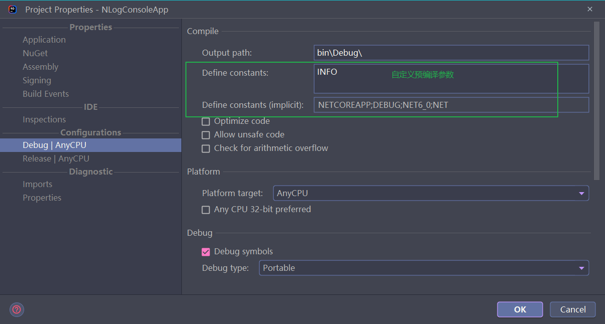
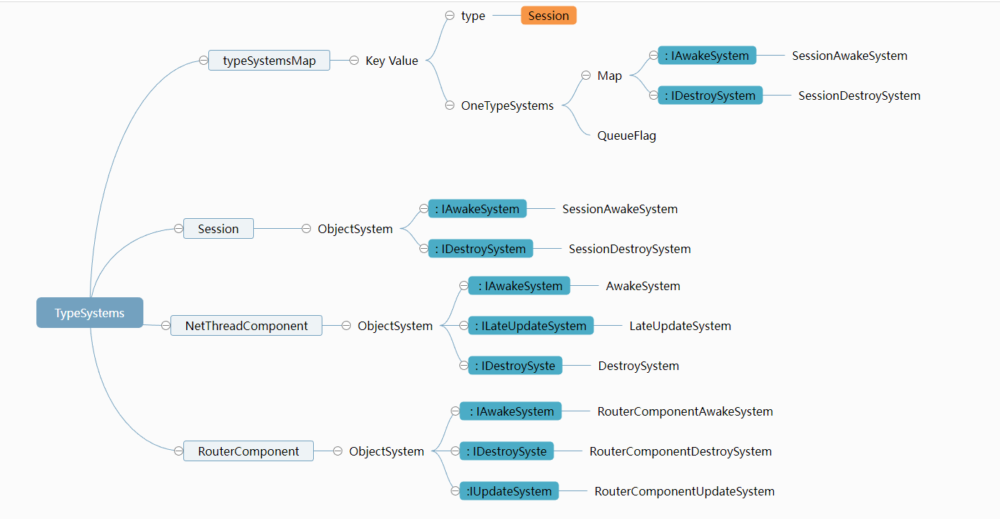

<!-- markdownlint-disable MD033 -->
# 网络游戏架构设计 笔记二

## 配置

### Option

`Options` 命令行启动参数解析类

```c#
//参数名 是否为必要参数 默认值 帮助描述
[Option("Process", Required = false, Default = 1, HelpText ="帮助描述")]
public int Process { get; set; }
```

示例:

```sh
dotnet App.dll --Process=1 --Console=1
```

* 用途
  1. 启动服务命令参数
  1. GM指令参数 也建议使用 [commandLineParser 解析命令行输入指令](https://github.com/commandlineparser/commandline)

### watcher 启动模式

[watcher 进程的作用，目前来看 watcher进程主要是负责启动本机配置的进程。进程挂掉有个监听报错提示。](https://et-framework.cn/d/642-consolewatcher)

```sh
dotnet App.dll --AppType=Watcher --StartConfig=StartConfig/Localhost --Console=1
```

### Log

使用 `NLog` 日志框架

`LogLevel` 命令行参数控制 `Logger` 日志等级:

```c#
private const int TraceLevel = 1;
private const int DebugLevel = 2;
private const int InfoLevel = 3;
private const int WarningLevel = 4;
```

正式发布时使用预处理标签全局屏蔽 Debug, 提高代码执行效率

```c#
[Conditional("Debug")]
public void Debug(string message)
```

Rider 设置预编译参数:



Rider 设置编译方式(Debug|Release):


日志字符串推荐拼接方式,可以有效减少GC:

```c#
Log.Debug($"message serialize cache: {message.GetType().Name}");
```

* `NLogger` 与 `UnityLogger`
* `Trace`输出堆栈信息
  
  ```c#
  public void Trace(string message, params object[] args)
  {
      if (!CheckLogLevel(TraceLevel))
      {
          return;
      }
      StackTrace st = new StackTrace(2, true); //跳过前面两层
      this.iLog.Trace($"{string.Format(message, args)}\n{st}");
  }
  ```

* `NLogger`初始化细节
  
  ```c#
  //name 对应NLog配置 rules->logger->name
  public NLogger(string name, int process, string configPath)
  {
      LogManager.Configuration = new NLog.Config.XmlLoggingConfiguration(configPath);
      LogManager.Configuration.Variables["appIdFormat"] = $"{process:000000}"; //日志文件名生成拼接了进程编号 如:Server.000001.2023031417.Debug.log
      LogManager.Configuration.Variables["currentDir"] = Environment.CurrentDirectory;
      this.logger = LogManager.GetLogger(name);
  }
  ```

* NLog日志配置规则

  ```xml
  <!-- minlevel="Trace" maxlevel="Error" 等级 -->
  <!-- writeTo="ServerDebug" 输出目标 -->
  <!-- ruleName="ServerDebug" 规则名 -->
  <rules>
    <logger ruleName="ServerDebug" name="Server" minlevel="Trace" maxlevel="Error" writeTo="ServerDebug" />
  </rules>

  <targets async="true"> <!-- 异步输出 -->
    <target name="ServerDebug" xsi:type="File"
        openFileCacheTimeout="10"
        keepFileOpen="true"
        archiveNumbering="Date"
        archiveEvery="Hour"
        archiveDateFormat="yyyyMMddHH"
        archiveFileName="${basedir}/../Logs/${logger}.${var:appIdFormat}.{#}.Debug.log"
        fileName="${basedir}/../Logs/${logger}.${var:appIdFormat}.${date:format=yyyyMMddHH}.Debug.log"
        deleteOldFileOnStartup="false" // 启动时是否删除旧日志
        layout="${longdate} ${callsite:className=false:methodName=false:fileName=true:includeSourcePath=false:skipFrames=3} ${message}" /> //输出格式
  </targets>
  ```

### Excel

* `Unity\Assets\Config\Excel` 主要用于启动配置

  `Unity\Assets\Config\Excel\StartConfig` 不同开发模式的启动配置(ET7), 不同模式的配置都将导出到 `Config\Excel\cs\StartConfig` 目录

  通过设置启动参数读取不同配置:`--StartConfig=StartConfig/Localhost`

  默认包含: `Benchmark` `Localhost` `Release` `RouterTest`

* `partial` 分部类通过覆盖`AfterEndInit` 方法实现配置内容的扩展, `StartSceneConfigCategory` 配置容器, `StartSceneConfig`配置实体

  ```c#
  public partial class StartSceneConfigCategory
  {
    public override void AfterEndInit()
    {
        foreach (StartSceneConfig startSceneConfig in this.GetAll().Values)
        {
            this.ProcessScenes.Add(startSceneConfig.Process, startSceneConfig);
        }
    }        
  }
  public partial class StartProcessConfig
  {
    //读取配置后,进行的加工操作
    public override void AfterEndInit()
    {
        InstanceIdStruct instanceIdStruct = new InstanceIdStruct((int)this.Id, 0);
        this.SceneId = instanceIdStruct.ToLong();
        Log.Info($"StartProcess info: {this.MachineId} {this.Id} {this.SceneId}");
    }
  }
  ```

* 用时加载配置, 配置文件只有等到使用时才会被加载到内存
  
  ```c#
  public abstract class ConfigSingleton<T>: ProtoObject, ISingleton where T: ConfigSingleton<T>, new()
  {
    public static T Instance
    {
        get
        {
            return instance ??= ConfigComponent.Instance.LoadOneConfig(typeof (T)) as T;
        }
    }
  }
  ```

## Component 组件系统

### Unit 单位

`Unit`指在一个场景中活动的单元

### 为什么用组件

* 成员继承关系的问题  
  1. 类层级调整复杂,耦合度高, 一个变化影响很多子类
  1. 继承成员不能随机组合
  1. 如果使用接口扩展, 冗余代码太多
  1. 接口增多, 类会变得巨大
  1. 缺乏动态性, 不能在运行时动态删减
  1. 缺乏规范, 太随意
* 类方法的问题
  1. 函数跟数据会在一起, 重构困难
  1. 类跟类之间方法相互调用, 耦合, 重构困难
  1. 静态方法跟类方法, 界限不清晰
* 虚函数的问题
  1. 行为跟类型绑定, 类型数量会爆炸
  1. 子类做不到任何成员组合, 子函数会巨大
  1. 不同类型经常方法逻辑都差不多
* 面向对象的问题
  1. 打补丁的设计模式
  1. 人员要求高
  1. 没有同一标准, 代码维护困难

### Unity 组件的优点/缺点

* 优点:
  1. 成员自由搭配
  1. 成员动态插拔, 内存利用率高
  1. 方法动态插拔, 更合理, 更不容易出错
  1. 临时数据不会导致信息爆炸, 成员, 方法, 代码可读性强
* 缺点:
  1. 数据跟方法没有分离, 容易耦合, 相互调用
  1. 事件方法基于反射
  1. GameObject过于庞大, 里面东西太多, 纯逻辑不需要View
  1. 没有替代多态的解决方案
  1. 组件没法再挂载组件, 组件没法再有子组件
  
### ECS(指守望先锋的ECS)的问题

1. Entity只有一个ID, 全是Entity
1. 组件是struct, 限制太大
1. 非树状结构, 不符合对世界的描述, 工厂的管理模式(生命周期)

## ET 的 ECS (Entity Component System)

### ET中ECS的特性

1. Entity 跟 Component 合并(ET6以后).
1. 数据跟方法完全分离
1. 不能继承(有分析器限制)
1. Entity树状可无限嵌套

### ET组件数据/方法分离的好处

1. 没有耦合, 没有设计模式, 学习简单, 重构简单
1. 热重载容易, 只用改动方法, 不用动数据结构
1. 多态实现简单, 能基于任何字段做逻辑分发

### 逻辑分发 - 多态

ET的消息分发形式, 基于`Attribute`的自动注册

`MessageDispatcherComponent`

```c#
public class MessageDispatcherInfo
{
    public SceneType SceneType { get; } //消息场景类型
    public IMHandler IMHandler { get; } //消息handler实现
    public MessageDispatcherInfo(SceneType sceneType, IMHandler imHandler)
    {
        this.SceneType = sceneType;
        this.IMHandler = imHandler;
    }
}
public class MessageDispatcherComponent: Entity, IAwake, IDestroy, ILoad
{
    public static MessageDispatcherComponent Instance
    {
        get;
        set;
    }
    public readonly Dictionary<ushort, List<MessageDispatcherInfo>> Handlers = new();
}
```

`MessageDispatcherComponentHelper.Load`

```c#
private static void Load(this MessageDispatcherComponent self)
{
    self.Handlers.Clear();
    HashSet<Type> types = EventSystem.Instance.GetTypes(typeof (MessageHandlerAttribute));
    //遍历所有 MessageHandler 标签
    foreach (Type type in types)
    {
        IMHandler iMHandler = Activator.CreateInstance(type) as IMHandler;
        if (iMHandler == null)
        {
            Log.Error($"message handle {type.Name} 需要继承 IMHandler");
            continue;
        }
        object[] attrs = type.GetCustomAttributes(typeof(MessageHandlerAttribute), false);
        
        foreach (object attr in attrs)
        {
            MessageHandlerAttribute messageHandlerAttribute = attr as MessageHandlerAttribute;
            //获取请求消息的类型        
            Type messageType = iMHandler.GetMessageType();
            //获取协议码
            ushort opcode = NetServices.Instance.GetOpcode(messageType);
            if (opcode == 0)
            {
                Log.Error($"消息opcode为0: {messageType.Name}");
                continue;
            }
            //封装 MessageDispatcherInfo 对象
            MessageDispatcherInfo messageDispatcherInfo = new (messageHandlerAttribute.SceneType, iMHandler);
            //关联协议码与消息分发器
            self.RegisterHandler(opcode, messageDispatcherInfo);
        }
    }
}
```

### Entity 树

* 实体都有 `Parent` ,但 `Root` (管理根部的Scene) 和 反序列化的实体是例外
  
  通过`AddChild`挂载子实体
* `Domain` 用于表示当前实体所在的具体场景
* 对象的生命周期管理重要性 (内存管理)
  
  需要知道什么时候能释放掉, 比如玩家被移除, 背包也要被回收掉
  
  ET中通过树结构直接将挂载的组件回收即可, 不用手动回收
* 组件

### 最佳实践

1. 不建议把`Entity`做成另一个`Entity`的成员, 要么作为组件`Component`, 要么作为`Child`

   这样的异步代码, 容易出现对象消失, 引用还在的情况
1. 服务端逻辑帧一般不用 `Update`跟`LastUpdate` ,因为这两个都是 1ms执行一次

   推荐自定义实现一个 `Update 100ms` System 或者使用定时器组件; 

   `TimerComponent.NewFrameTimer` 这个接口在服务端为 100ms执行一次

   ```c#
        public long NewFrameTimer(int type, object args)
        {
    #if DOTNET
            return this.NewRepeatedTimerInner(100, type, args);
    #else
            return this.NewRepeatedTimerInner(0, type, args);
    #endif
        }
   ```

### Entity 代码解读

```c#
public enum EntityStatus: byte
{
    None = 0,
    IsFromPool = 1, //是否从对象池申请出来的        Entity.IsFromPool
    IsRegister = 1 << 1, //是否注册到Root系统中     Entity.IsRegister
    IsComponent = 1 << 2, //是否为一个组件          Entity.IsComponent
    IsCreated = 1 << 3, //是否为创建完成            Entity.IsCreated
    IsNew = 1 << 4, //是否为 new, 因为有反序列化的   Entity.IsNew
}

public partial class Entity: DisposeObject
{
  //以Id为主键的 子实体
  private Dictionary<long, Entity> children;
  //以Type为逐渐的组件
  private Dictionary<Type, Entity> components;
}
```

严格限制 parent 必须要有 `domain` ,也就是说 `parent` 必须在数据树上面, 不能把一个Entity设置成一个刚反序列化的对象

只有刚刚反序列化出来的对象 `domain` 为空

`Realm` `Gate` `Map` 这些顶层的Scene `domain` 是它们本身 `this.Domain = this;`

添加组件`AddChild` 和 `AddComponent` 之后都会调用 `Parent.set` 和 `ComponentParent.set`

可以改变parent，但是不能设置为 `null`

```c#
// 可以改变parent，但是不能设置为null
[BsonIgnore]
public Entity Parent
{
    get => this.parent;
    private set
    {
        if (value == null)
        {
            throw new Exception($"cant set parent null: {this.GetType().Name}");
        }
        
        if (value == this)
        {
            throw new Exception($"cant set parent self: {this.GetType().Name}");
        }

        // 严格限制parent必须要有domain,也就是说parent必须在数据树上面
        if (value.Domain == null)
        {
            throw new Exception($"cant set parent because parent domain is null: {this.GetType().Name} {value.GetType().Name}");
        }

        if (this.parent != null) // 之前有parent
        {
            // parent相同，不设置
            if (this.parent == value)
            {
                Log.Error($"重复设置了Parent: {this.GetType().Name} parent: {this.parent.GetType().Name}");
                return;
            }
            this.parent.RemoveFromChildren(this);
        }
        
        this.parent = value;
        this.IsComponent = false;
        this.parent.AddToChildren(this); //添加到子实体容器
        this.Domain = this.parent.domain; //所有组件 Domain 都将指向顶层的 Scene Domain
//可视化预编译
#if ENABLE_VIEW && UNITY_EDITOR
        this.viewGO.GetComponent<ComponentView>().Component = this;
        this.viewGO.transform.SetParent(this.Parent == null ?
                UnityEngine.GameObject.Find("Global").transform : this.Parent.viewGO.transform);
        foreach (var child in this.Children.Values)
        {
            child.viewGO.transform.SetParent(this.viewGO.transform);
        }
        foreach (var comp in this.Components.Values)
        {
            comp.viewGO.transform.SetParent(this.viewGO.transform);
        }
#endif
    }
}
```

### 组件 调用`ComponentParent`方法

`public Entity Domain` 设置Domain的代码

```c#
Entity preDomain = this.domain;
this.domain = value;

if (preDomain == null) //只有刚刚从数据库反序列化出的的组件没有 旧 Domain
{
    this.InstanceId = IdGenerater.Instance.GenerateInstanceId();
    this.IsRegister = true;
    
    // 反序列化出来的需要设置父子关系 
    //componentsDB 和 childrenDB 里面都是从数据库反序列化出来的组件
    if (this.componentsDB != null)
    {
        foreach (Entity component in this.componentsDB)
        {
            component.IsComponent = true;
            this.Components.Add(component.GetType(), component);
            component.parent = this;
        }
    }
    if (this.childrenDB != null)
    {
        foreach (Entity child in this.childrenDB)
        {
            child.IsComponent = false;
            this.Children.Add(child.Id, child);
            child.parent = this;
        }
    }
}

// 递归设置孩子的Domain
if (this.children != null)
{
    foreach (Entity entity in this.children.Values)
    {
        entity.Domain = this.domain;
    }
}

if (this.components != null)
{
    foreach (Entity component in this.components.Values)
    {
        component.Domain = this.domain;
    }
}

if (!this.IsCreated) //如果是从数据库中反序列化出来的
{
    this.IsCreated = true;
    EventSystem.Instance.Deserialize(this); //执行反序列化操作
}
```

### 区分需要序列化的组件

需要序列化的组件会被添加到 `childrenDB` 和 `componentsDB`, 通过判断是否实现 `ISerializeToEntity`接口判断

```c#
private void AddToChildrenDB(Entity entity)
{
    if (!(entity is ISerializeToEntity))
    {
        return;
    }
    this.childrenDB ??= ObjectPool.Instance.Fetch<HashSet<Entity>>();
    this.childrenDB.Add(entity);
}
```

## Child 与 Component 的区别

`children` 同类型可以有多个, `components`同类型只能有一个

`Entity.Id` 为 `IdStruct` 类型

Id是逻辑层的, InstanceId是对象层的

场景跳转,Id不变,InstanceId是变化的

<big>序列化写数据库的是Id, 可以理解成 背包, 任务, 成就等分系统都与之关联的那个玩家ID</big>

### Entity.AddChild

使用 `IdGenerater.Instance.GenerateId()` 生成 `Entity.Id`

```c#
public T AddChild<T>(bool isFromPool = false) where T : Entity, IAwake
{
    Type type = typeof (T);
    T component = (T) Entity.Create(type, isFromPool);
    component.Id = IdGenerater.Instance.GenerateId(); //生成 `Entity.Id`
    component.Parent = this;
    EventSystem.Instance.Awake(component);
    return component;
}
```

### Entity.AddComponent

默认使用父组件的Id `Entity.Id == ParentComponent.Id`

```c#
public Entity AddComponent(Type type, bool isFromPool = false)
{
    if (this.components != null && this.components.ContainsKey(type))
    {
        throw new Exception($"entity already has component: {type.FullName}");
    }
    Entity component = Create(type, isFromPool);
    component.Id = this.Id;//默认使用父组件的Id 
    component.ComponentParent = this;
    EventSystem.Instance.Awake(component);
    
    if (this is IAddComponent)
    {
        EventSystem.Instance.AddComponent(this, component);
    }
    return component;
}
```

## EventSystem 事件系统

### Publish 发布事件

`[Event(SceneType.XXX)]` 标签标识

* 单项依赖, 防止相互依赖
* 模块隔离
* 同步 异步 两种通知类型
* 包含 SceneType

### Invoke

`[Invoke]` 标签标识

* 解决函数中不能直接调用的问题!?
  
  `Hotfix` 层逻辑代码无法直接使用 `HotfixView` 层的Unity API, 比如加载 AB资源
* 根据id分发 `[Invoke(TimerInvokeType.SessionIdleChecker)]`
  
  计时器根据Id分发, 类似虚函数分发, 机器人, 测试用例可以用 EventSystem做分发

`Invoke`跟`Publish`的区别(特别注意)

`Invoke`类似函数，必须有被调用方，否则异常，调用者跟被调用者属于同一模块，比如MoveComponent中的Timer计时器，调用跟被调用的代码均属于移动模块

既然Invoke跟函数一样，那么为什么不使用函数呢? 因为有时候不方便直接调用，比如Config加载，在客户端跟服务端加载方式不一样。比如TimerComponent需要根据Id分发

注意，不要把Invoke当函数使用，这样会造成代码可读性降低，能用函数不要用Invoke

`publish`是事件，抛出去可以没人订阅，调用者跟被调用者属于两个模块，比如任务系统需要知道道具使用的信息，则订阅道具使用事件

* ET7 将定时器逻辑的调用都改成了`EventSystem.Invoke`

  ```c#
  //SessionIdleChecker
  [Invoke(TimerInvokeType.SessionIdleChecker)]
  public class SessionIdleChecker: ATimer<SessionIdleCheckerComponent>{}

  //TimerComponent.Run
  EventSystem.Instance.Invoke(timerAction.Type, new TimerCallback() { Args = timerAction.Object });
  ```

### Publish 跟 Invoke的区别

Publish 抛出事件去不管结果, Invoke是主动调用(类似函数)

Publish 区分 SceneType, Invoke没有

Publish没有分发作用, Invoke带有分发

Publish 一对多, Invoke 一对一

Publish 与 Invoke 命名不一样

### EventSystem Publish Invoke 源码解析

```c#
//记录名字跟类型的映射
private readonly Dictionary<string, Type> allTypes = new();
//记录 Attribute 跟Type的映射关系 比如映射了 ConfigAttribute 所有对应的类型
private readonly UnOrderMultiMapSet<Type, Type> types = new();
//Publish参数跟订阅者
private readonly Dictionary<Type, List<EventInfo>> allEvents = new();
//Invoke参数跟被调用者
private Dictionary<Type, Dictionary<int, object>> allInvokes = new(); 

public void Add(Dictionary<string, Type> addTypes)
{
    this.allTypes.Clear();
    this.types.Clear();
    
    foreach ((string fullName, Type type) in addTypes)
    {
        this.allTypes[fullName] = type;
        
        if (type.IsAbstract)
        {
            continue;
        }
        
        // 记录所有的有BaseAttribute标记的的类型
        object[] objects = type.GetCustomAttributes(typeof(BaseAttribute), true);
        //填充所有BaseAttribute标记的的类型
        foreach (object o in objects)
        {
            this.types.Add(o.GetType(), type);
        }
    }

    this.typeSystems = new TypeSystems();

    foreach (Type type in this.GetTypes(typeof (ObjectSystemAttribute)))
    {
        object obj = Activator.CreateInstance(type);

        if (obj is ISystemType iSystemType)
        {
            OneTypeSystems oneTypeSystems = this.typeSystems.GetOrCreateOneTypeSystems(iSystemType.Type());
            oneTypeSystems.Map.Add(iSystemType.SystemType(), obj);
            InstanceQueueIndex index = iSystemType.GetInstanceQueueIndex();
            if (index > InstanceQueueIndex.None && index < InstanceQueueIndex.Max)
            {
                oneTypeSystems.QueueFlag[(int)index] = true;
            }
        }
    }
    //填充 EventAttribute 标签的事件 订阅器
    this.allEvents.Clear();
    foreach (Type type in types[typeof (EventAttribute)])
    {
        xxxxx
    }

    //填充所有的 InvokeAttribute 被调用器
    this.allInvokes = new Dictionary<Type, Dictionary<int, object>>();
    foreach (Type type in types[typeof (InvokeAttribute)])
    {
        xxxx
    }
}
```

### `Publish` 同步/异步 

```c#
//异步Publish
public async ETTask PublishAsync<T>(Scene scene, T a) where T : struct
{
    List<EventInfo> iEvents;
    //根据事件类型获取对应的订阅者
    if (!this.allEvents.TryGetValue(typeof(T), out iEvents))
    {
        return;
    }
    using ListComponent<ETTask> list = ListComponent<ETTask>.Create();    
    foreach (EventInfo eventInfo in iEvents)
    {
        //事件与订阅者的场景类型判断
        if (scene.SceneType != eventInfo.SceneType && eventInfo.SceneType != SceneType.None)
        {
            continue;
        }            
        xxxxx

        list.Add(aEvent.Handle(scene, a));
    }
    try
    {
        //等待所以订阅器异步执行
        await ETTaskHelper.WaitAll(list);
    }
    catch (Exception e)
    {
        Log.Error(e);
    }
}
//同步Publish
public void Publish<T>(Scene scene, T a) where T : struct
{
    List<EventInfo> iEvents;
    if (!this.allEvents.TryGetValue(typeof (T), out iEvents))
    {
        return;
    }
    SceneType sceneType = scene.SceneType;
    foreach (EventInfo eventInfo in iEvents)
    {
        xxxxx  //事件与订阅者的场景类型判断              
        aEvent.Handle(scene, a).Coroutine(); //直接协程调用事件订阅者
    }
}
```

### `Invoke` 无返回值/有返回值调用

```c#
//无返回值的 Invoke调用
public void Invoke<A>(int type, A args) where A: struct
{
    xxxx
    var aInvokeHandler = invokeHandler as AInvokeHandler<A>;
    if (aInvokeHandler == null)
    {
        throw new Exception($"Invoke error, not AInvokeHandler: {typeof(A).Name} {type}");
    }
    aInvokeHandler.Handle(args);
}

//有返回值的 Invoke调用
public T Invoke<A, T>(int type, A args) where A: struct
{
    xxxx
    var aInvokeHandler = invokeHandler as AInvokeHandler<A, T>;
    if (aInvokeHandler == null)
    {
        throw new Exception($"Invoke error, not AInvokeHandler: {typeof(T).Name} {type}");
    }    
    return aInvokeHandler.Handle(args);
}
```

### EventSystem TypeSystems 源码解析

`TypeSystems` 映射了 组件对应的 System




```c#
private TypeSystems typeSystems = new();

private class TypeSystems
{
    private readonly Dictionary<Type, OneTypeSystems> typeSystemsMap = new();
}

private class OneTypeSystems
{
    public readonly UnOrderMultiMap<Type, object> Map = new();
    // 这里不用hash，数量比较少，直接for循环速度更快 减少遍历
    public readonly bool[] QueueFlag = new bool[(int)InstanceQueueIndex.Max];
}
```

`QueueFlag` 的作用,将组件中的 `Update LateUpdate Load` System 映射到 queues, 以便减少逻辑执行的遍历操作

`UpdateSystem LateUpdateSystem LoadSystem`都实现接口返回值类型不一样, 参考 `InstanceQueueIndex`

```c#
private readonly Queue<long>[] queues = new Queue<long>[(int)InstanceQueueIndex.Max];
//注册代码
public void Add(Dictionary<string, Type> addTypes)
{
  xxxxx
  this.typeSystems = new TypeSystems();
  foreach (Type type in this.GetTypes(typeof (ObjectSystemAttribute)))
  {
      object obj = Activator.CreateInstance(type);
      if (obj is ISystemType iSystemType)
      {
          OneTypeSystems oneTypeSystems = this.typeSystems.GetOrCreateOneTypeSystems(iSystemType.Type());
          oneTypeSystems.Map.Add(iSystemType.SystemType(), obj);
          InstanceQueueIndex index = iSystemType.GetInstanceQueueIndex(); //UpdateSystem LateUpdateSystem LoadSystem都实现接口返回值类型不一样
          if (index > InstanceQueueIndex.None && index < InstanceQueueIndex.Max)
          {
              oneTypeSystems.QueueFlag[(int)index] = true;
          }
      }
  }
  xxxxx
}

//实例化 组件的时候 通过遍历QueueFlag 判断是否需要添加到 queues[index]
public void RegisterSystem(Entity component)
{
    Type type = component.GetType();
    OneTypeSystems oneTypeSystems = this.typeSystems.GetOneTypeSystems(type);
    if (oneTypeSystems == null)
    {
        return;
    }
    for (int i = 0; i < oneTypeSystems.QueueFlag.Length; ++i)
    {
        if (!oneTypeSystems.QueueFlag[i])
        {
            continue;
        }
        this.queues[i].Enqueue(component.InstanceId); //保持的是 InstanceId 而不是对象
    }
}

public enum InstanceQueueIndex
{
    None = -1,
    Update,
    LateUpdate,
    Load,
    Max,
}
//Update LateUpdate Load 调用queues
public void Update()
{
    Queue<long> queue = this.queues[(int)InstanceQueueIndex.Update];
    xxx
}

public void LateUpdate()
{
    Queue<long> queue = this.queues[(int)InstanceQueueIndex.LateUpdate];
}

public void Load()
{
    Queue<long> queue = this.queues[(int)InstanceQueueIndex.Load];
}
```

### EventSystem Awake

```c#
public void Awake(Entity component)
{
    //获取对应类型的 IAwakeSystem
    List<object> iAwakeSystems = this.typeSystems.GetSystems(component.GetType(), typeof (IAwakeSystem));
    if (iAwakeSystems == null)
    {
        return;
    }
    foreach (IAwakeSystem aAwakeSystem in iAwakeSystems)
    {
        if (aAwakeSystem == null)
        {
            continue;
        }
        try
        {
            aAwakeSystem.Run(component); //运行 AwakeSystem
        }
        catch (Exception e)
        {
            Log.Error(e);
        }
    }
}
```

### EventSystem Update

使用 `instanceId` 避免对象池回收再分配以后发生变化, 无法判断

```c#
public void Update()
{
    Queue<long> queue = this.queues[(int)InstanceQueueIndex.Update];
    int count = queue.Count;
    while (count-- > 0)
    {
        long instanceId = queue.Dequeue(); //获取实例id
        Entity component = Root.Instance.Get(instanceId); //遍历Root拿到实体对象
        if (component == null)
        {
            continue;
        }
        if (component.IsDisposed)
        {
            continue;
        }
        //拿到 UpdateSystems
        List<object> iUpdateSystems = this.typeSystems.GetSystems(component.GetType(), typeof (IUpdateSystem));
        if (iUpdateSystems == null)
        {
            continue;
        }
        queue.Enqueue(instanceId); //再次添加到队列
        //执行相关 UpdateSystems
        foreach (IUpdateSystem iUpdateSystem in iUpdateSystems)
        {
            try
            {
                iUpdateSystem.Run(component);
            }
            catch (Exception e)
            {
                Log.Error(e);
            }
        }
    }
}
```