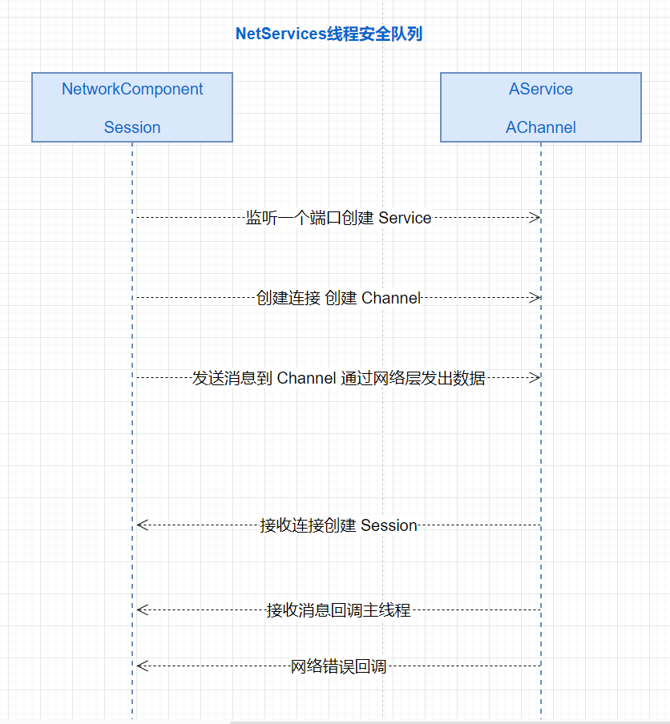

<!-- markdownlint-disable MD033 -->
# 网络游戏架构设计 笔记三

## 序列化与反序列化

* 使用场景
  1. Excel 配置文件, 编辑器配置文件, 大小跟速度都无所谓
  1. 网络消息 大小速度很重要
  1. Entity 对象, 很复杂 , 需要支持继承等复杂特性
  1. 数据库 mongodb
  1. 命令行参数
* 工具库选择
  1. Google Protobuf 性能好, 代码生成复杂, 容易无GC
  1. protobuf-net 性能较好, 代码简洁, 使用广泛
  1. MessagePack 性能较好, 代码简洁, 其他语言使用少
  1. Mongo.Bson 性能较差, 功能最强, 并且支持json

  <big>ET 选择 protobuf-net 与 Mongo.Bson</big>
* `MongoHelper`
  
  Mongo.Bson 忽略额外字段
  
  ```c#
  // 自动注册IgnoreExtraElements
  ConventionPack conventionPack = new ConventionPack { new IgnoreExtraElementsConvention(true) };
  ConventionRegistry.Register("IgnoreExtraElements", conventionPack, type => true);

  //注册需要序列化的结构体
  RegisterStruct<float2>();
  RegisterStruct<float3>();
  RegisterStruct<float4>();
  RegisterStruct<quaternion>();
  ```

* Mongo.Bson 序列化字典时的特殊处理
  
  ```c#
  //测试字典序列化 key非string的处理
  public class BB2:Person
  {
    //默认为 Document
    [BsonDictionaryOptions(DictionaryRepresentation.ArrayOfArrays)]
    public Dictionary<int, long> map1 = new() { {100,1},{200,2}};
  }
  ```

  输出: `{ "_t" : "BB2", "name" : null, "Age" : 0, "_id" : 0, "map1" : [[100, 1], [200, 2]] }`
* BsonClassMap 的用途是将一个类映射到一个 BSON 文档中，可以通过设置 MapMember 方法来指定类成员的名称。这样，我们就可以在序列化和反序列化时使用类而不是 BsonDocument。同时，BsonElement、BsonIgnore、BsonId 等这些标签也可以用于将类成员映射到 BSON 文档中，以更精确地控制类成员在 BSON 文档中的映射。

  ```c#
  public class Person
  {
      public string Name { get; set; }
      public int Age { get; set; }
      public bool IsStudent { get; set; }
  }

  // 然后，我们需要使用 BsonClassMap 来映射这个类
  BsonClassMap.RegisterClassMap<Person>(cm =>
  {
      cm.AutoMap();
      cm.MapMember(c => c.Name).SetElementName("name");
      cm.MapMember(c => c.Age).SetElementName("age");
      cm.MapMember(c => c.IsStudent).SetElementName("isStudent");
  });
  ```
  
  注册类

  ```c#
  private static void Handle6()
  {
    //注册BB1, 继承关系链 b1之后的反序列化才不会为空
    BsonClassMap.LookupClassMap(typeof (BB1));
    
    BB1 b1 = MongoHelper.FromJson(typeof(Person),"{ \"_t\" : \"BB1\", \"name\" : \"BB\", \"Age\" : 40, \"_id\" : 33, \"map1\" : { \"a\" : 1, \"b\" : 2 } }") 
        as BB1;
    Console.WriteLine(MongoHelper.ToJson(b1));
  }
  ```

* 输出标准JSON

  ```c#
  Console.WriteLine(MongoHelper.ToJson(b1,new JsonWriterSettings(){
      OutputMode = JsonOutputMode.CanonicalExtendedJson
    }));
  ```

### Entity 序列化的判断

区分需要序列化的组件

需要序列化的组件会被添加到 `childrenDB` 和 `componentsDB`

`AddToComponentsDB` 和 `AddToChildrenDB` 方法通过判断是否实现 `ISerializeToEntity`接口判断

### DeserializeSystem 反序列化后执行的System

Entity 在设置Domain时会判断是否需要进行反序列化操作

```c#
public Entity Domain
{
  private set
  {
    xxx
    if (!this.IsCreated)
    {
        this.IsCreated = true;
        EventSystem.Instance.Deserialize(this);
    }
  }
}
```

## 网络层

### 基础知识

* socket
* IP
* Port
* bind
* accept
* connect 阻塞/非阻塞
* read 阻塞/非阻塞
* write 阻塞/非阻塞


### ET的网络需求

* ET7 网络多线程
* 客户端 一个主线程 一个网络线程 利于GC
* 单进程有多个监听端口(accept) all in one 模式
* 序列化跟反序列化在网络线程, 减轻主线程压力

### ET的网络设计

* 抽象出`NetService` 来处理主线程跟网络线程通信
* 抽象出`AService`来处理,管理连接
* 抽象出`AChannel`(网络连接)来做消息收发
* 多个`AService`注册到`NetService`
* 主线程封装`NetComponent`处理收到的连接, 消息, 错误
* 主线程封装`Session`做主线程消息发送, 以及 RPC

### 主线程与网络线程的结构图




### NetServices 线程安全队列

`NetServices` 主线程跟网络线程通信 (跨线程操作)

1. 主线程 -> 网络线程
   1. 监听一个端口创建`Service`
   1. 创建连接创建`Channel`
   1. 发送消息给`Channel`
1. 网络线程 -> 主线程
   1. 接收连接创建`Session`
   1. 接收消息回调主线程
   1. 网络错误回调

<big>ET7 消息序列化与反序列化都是在网络线程中完成</big>

### NetThreadComponent 网络线程组件

  ```c#
  public class EntryEvent1_InitShare: AEvent<EventType.EntryEvent1>
  {
      protected override async ETTask Run(Scene scene, EventType.EntryEvent1 args)
      {
        //添加网络线程组件
        Root.Instance.Scene.AddComponent<NetThreadComponent>();
      }
  }
  ```

  NetThreadComponentSystem 主线程和网络线程 update驱动

  ```c#
  public static class NetThreadComponentSystem
  {
    public class AwakeSystem: AwakeSystem<NetThreadComponent>
    {
        protected override void Awake(NetThreadComponent self)
        {
            NetThreadComponent.Instance = self;
            // 网络线程update启动
            self.thread = new Thread(self.NetThreadUpdate);
            self.thread.Start();
        }
    }
    public class LateUpdateSystem: LateUpdateSystem<NetThreadComponent>
    {
        protected override void LateUpdate(NetThreadComponent self)
        {
          //主线程 update
          self.MainThreadUpdate();
        }
    }
  }
  ```

### 主线程与网络线程的跨线程交互 源码解析

  ```c#
  public class NetServices: Singleton<NetServices>
  {
    //网络线程操作队列
    private readonly ConcurrentQueue<NetOperator> netThreadOperators = new ConcurrentQueue<NetOperator>();
    //主线程操作队列
    private readonly ConcurrentQueue<NetOperator> mainThreadOperators = new ConcurrentQueue<NetOperator>();
    //网络线程关联的service
    private readonly Dictionary<int, AService> services = new Dictionary<int, AService>();
    //网络线程关联的service.id存储队列
    private readonly Queue<int> queue = new Queue<int>();
    
    //主线程 -> 网络线程 将网络操作添加到 netThreadOperators 线程安全队列
    public void SendMessage(int serviceId, long channelId, long actorId, object message)
    {
      NetOperator netOperator = new NetOperator() { Op = NetOp.SendMessage, ServiceId = serviceId, ChannelId = channelId, ActorId = actorId, Object = message };
      this.netThreadOperators.Enqueue(netOperator);
    }
    GetChannelConn
    ChangeAddress
    AddService
    RemoveService
    RemoveChannel
    CreateChannel

    xxx

    //网络线程 -> 主线程 将网络操作添加到 mainThreadOperators 线程安全队列
    public void OnAccept(int serviceId, long channelId, IPEndPoint ipEndPoint)
    {
        NetOperator netOperator = new NetOperator() { Op = NetOp.OnAccept, ServiceId = serviceId, ChannelId = channelId, Object = ipEndPoint };
        this.mainThreadOperators.Enqueue(netOperator);
    }
    OnRead
    OnError

    xxx
  }    
  ```

### UpdateInNetThread 网络线程执行的操作

  `NetThreadComponentSystem.NetThreadUpdate -> NetServices.UpdateInNetThread -> NetServices.RunNetThreadOperator`
  
  ```c#  
  public void UpdateInNetThread()
  {
      int count = this.queue.Count;
      while (count-- > 0)
      {
          int serviceId = this.queue.Dequeue();
          if (!this.services.TryGetValue(serviceId, out AService service))
          {
              continue;
          }
          this.queue.Enqueue(serviceId);
          service.Update();//TCP KCP WEB 等网络服务逻辑驱动
      }
      
      this.RunNetThreadOperator();
  }
  private void RunNetThreadOperator()
  {
      while (true)
      {
          if (!this.netThreadOperators.TryDequeue(out NetOperator op))
          {
              return;
          }
              switch (op.Op)
              {
                case NetOp.AddService :{}
                case NetOp.RemoveService :{}
                case NetOp.CreateChannel :{}
                case NetOp.RemoveChannel :{}
                case NetOp.SendMessage :{}
                case NetOp.GetChannelConn :{} //kcp
                case NetOp.ChangeAddress :{} //kcp
              }
      }
  }
  ```  

### UpdateInMainThread 主线程执行的操作

  `NetThreadComponentSystem.MainThreadUpdate -> NetServices.UpdateInMainThread`

  ```c#
  public void UpdateInMainThread()
  {
      while (true)
      {
          if (!this.mainThreadOperators.TryDequeue(out NetOperator op))
          {
              return;
          }
              switch (op.Op)
              {
                //执行对应操作的回调逻辑
                case NetOp.OnAccept:{}
                case NetOp.OnRead:{}
                case NetOp.OnError:{}
              }
      }
  }
  ```

### Callback 注册主线程网络回调逻辑

参考: `NetServerComponentSystem.AwakeSystem`

  ```c#
  //新连接建立
  NetServices.Instance.RegisterAcceptCallback(self.ServiceId, self.OnAccept);
  //读取数据
  NetServices.Instance.RegisterReadCallback(self.ServiceId, self.OnRead);
  //网络错误
  NetServices.Instance.RegisterErrorCallback(self.ServiceId, self.OnError);
  ```

### AService

### AChannel

## TCP

### TCP TService (网络线程驱动)

* `SocketAsyncEventArgs` 异步回调

  通过 SocketAsyncEventArgs 的 AcceptSocket 属性来指定接受连接的 Socket 对象。

  这样可以避免在每次接受连接时都创建一个新的 Socket 对象，从而提高性能并减少垃圾回收的压力。

  `Socket.AcceptAsync` 方法的返回值表示异步操作是否已经开始。如果返回值为 true，则表示异步操作将在后台执行，并且在操作完成后将触发 SocketAsyncEventArgs.Completed 事件；如果返回值为 false，则表示异步操作已经完成，此时可以直接处理异步操作的结果。

* `TService`

  ```c#
  private readonly SocketAsyncEventArgs innArgs = new SocketAsyncEventArgs();
  //TService网络线程的操作队列
  public ConcurrentQueue<TArgs> Queue = new ConcurrentQueue<TArgs>();

  //connect
  public TService(AddressFamily addressFamily, ServiceType serviceType)
  {
    this.ServiceType = serviceType;
  }

  //accept
  public TService(IPEndPoint ipEndPoint, ServiceType serviceType)
  {
    this.ServiceType = serviceType;
    this.acceptor = new Socket(ipEndPoint.AddressFamily, SocketType.Stream, ProtocolType.Tcp);
    this.innArgs.Completed += this.OnComplete;
    try
    {
      this.acceptor.Bind(ipEndPoint);//绑定监听地址端口信息
    }
    catch (Exception e)
    {
      throw new Exception($"bind error: {ipEndPoint}", e);
    }
    this.acceptor.Listen(1000);//挂起连接队列的最大长度。
    this.AcceptAsync();//等待新连接建立
  }
  //回调函数逻辑
  private void OnComplete(object sender, SocketAsyncEventArgs e)
  {
    switch (e.LastOperation)
    {
      case SocketAsyncOperation.Accept:
        //异步网络线程添加操作到线程安全队列
        this.Queue.Enqueue(new TArgs() {SocketAsyncEventArgs = e});
        break;
    }
  }
  ```

### TService 网络线程 Update

service.update处理Queue

```c#
//网络线程 service.update处理Queue
public override void Update()
{
  if (!this.Queue.TryDequeue(out var result))
  {
    break;
  }
  SocketAsyncEventArgs e = result.SocketAsyncEventArgs;
  if (e == null)
  {
    switch (result.Op)
    {
      case TcpOp.StartSend:{tChannel.StartSend();}
      case TcpOp.StartRecv:{tChannel.StartRecv();}
      case TcpOp.Connect:{tChannel.ConnectAsync();}
    }
  }
  switch (e.LastOperation)
  {
    case SocketAsyncOperation.Accept:
    {
      this.OnAcceptComplete(socketError, acceptSocket);
    }
    case SocketAsyncOperation.Connect:
    {
        tChannel.OnConnectComplete(e);
    }
    case SocketAsyncOperation.Disconnect:
    {
        tChannel.OnDisconnectComplete(e);
    }
    case SocketAsyncOperation.Receive:
    {
        tChannel.OnRecvComplete(e);
    }
    case SocketAsyncOperation.Send:
    {
        tChannel.OnSendComplete(e);
    }
  }
}
```

### TService acceptor.AcceptAsync 新连接

`TService Accept -> TChannel accept`

关联:[TChannel accept](#tchannel-accept-确认新建连接)

```c#
//新连接
private void AcceptAsync()
{
  this.innArgs.AcceptSocket = null;
  //异步接受连接
  if (this.acceptor.AcceptAsync(this.innArgs))
  {
    return;
  }
  OnAcceptComplete(this.innArgs.SocketError, this.innArgs.AcceptSocket);
}
//网络线程
public override void Update()
{
  if (!this.Queue.TryDequeue(out var result))
  {
    break;
  }
  SocketAsyncEventArgs e = result.SocketAsyncEventArgs;
  switch (e.LastOperation)
  {
    case SocketAsyncOperation.Accept:
    {
      SocketError socketError = e.SocketError;
      Socket acceptSocket = e.AcceptSocket;
      this.OnAcceptComplete(socketError, acceptSocket);
      break;
    }
  }
}
private void OnAcceptComplete(SocketError socketError, Socket acceptSocket)
{
  try
  {
    long id = NetServices.Instance.CreateAcceptChannelId();
    //新Channel
    TChannel channel = new TChannel(id, acceptSocket, this);
    this.idChannels.Add(channel.Id, channel);
    long channelId = channel.Id;
    //通知主线程新连接建立 关联session
    NetServices.Instance.OnAccept(this.Id, channelId, channel.RemoteAddress);
  }
  catch (Exception exception) {}    
  // 开始新的accept
  this.AcceptAsync();
}
```

### TService connect 操作

与远端连接建立成功

关联:[TChannel socket.ConnectAsync 连接](#tchannel-socketconnectasync-连接)

```c#
//网络线程
public override void Update()
{
  xxx
  switch (e.LastOperation)
  {
    case SocketAsyncOperation.Connect:
      {
        TChannel tChannel = this.Get(result.ChannelId);
        if (tChannel != null)
        {
          tChannel.OnConnectComplete(e);
        }
        break;
      }
  }
}
```

### TChannel 属性

```c#
//接收数据异步socket操作
private SocketAsyncEventArgs innArgs = new SocketAsyncEventArgs();
//发送数据异步socket操作
private SocketAsyncEventArgs outArgs = new SocketAsyncEventArgs();
//应用层buffer
//网络线程接收到消息 -> 主线程处理
private readonly CircularBuffer recvBuffer = new CircularBuffer();
//主线程写入消息 -> 网络线程发送
private readonly CircularBuffer sendBuffer = new CircularBuffer();

//异步回调函数
private void OnComplete(object sender, SocketAsyncEventArgs e)
{
  //网络线程添加操作到 Service 线程安全队列
  this.Service.Queue.Enqueue(new TArgs() {ChannelId = this.Id, SocketAsyncEventArgs = e});
}
```

### TChannel socket.ConnectAsync 连接

用于连接建立的构造 client

关联:[TService connect 操作](#tservice-connect-操作)

```c#
public TChannel(long id, IPEndPoint ipEndPoint, TService service)
{
  this.ChannelType = ChannelType.Connect;
  xxx
  this.Service = service;
  this.socket = new Socket(ipEndPoint.AddressFamily, SocketType.Stream, ProtocolType.Tcp);
  this.parser = new PacketParser(this.recvBuffer, this.Service);//接收协议 recvBuffer 缓存
  this.innArgs.Completed += this.OnComplete;
  this.outArgs.Completed += this.OnComplete;
  this.Service.Queue.Enqueue(new TArgs(){Op = TcpOp.Connect,ChannelId = this.Id});
}

//连接建立
public void ConnectAsync()
{
  this.outArgs.RemoteEndPoint = this.RemoteAddress;
  //连接远程主机异步操作
  if (this.socket.ConnectAsync(this.outArgs))
  {
    return;
  }
  OnConnectComplete(this.outArgs);
}

public void OnConnectComplete(SocketAsyncEventArgs e)
{
  e.RemoteEndPoint = null;
  this.isConnected = true;
  //建立完TCP连接后 启动Send和Recv
  this.Service.Queue.Enqueue(new TArgs() { Op = TcpOp.StartSend, ChannelId = this.Id});
  this.Service.Queue.Enqueue(new TArgs() { Op = TcpOp.StartRecv, ChannelId = this.Id});
}
```

### TChannel accept 操作

确认新建连接

`TService.OnAcceptComplete -> TChannel` 用于接收数据收发的构造 server

关联:[TService acceptor.AcceptAsync](#tservice-acceptoracceptasync-新连接)

```c#
//accept 用于接收数据收发的构造 server 
public TChannel(long id, Socket socket, TService service)
{
  this.ChannelType = ChannelType.Accept;
  xxx
  this.Service = service;
  this.socket = socket;
  this.parser = new PacketParser(this.recvBuffer, this.Service);//接收协议 recvBuffer 缓存
  this.Service.Queue.Enqueue(new TArgs() { Op = TcpOp.StartSend, ChannelId = this.Id});
  this.Service.Queue.Enqueue(new TArgs() { Op = TcpOp.StartRecv, ChannelId = this.Id});
}

```

### TChannel socket.ReceiveAsync 接收数据

接收数据 while循环判断,收到数据先添加到 recvBuffer 缓存

```c#
  public void StartRecv()
  {
    while (true) //ET5这里使用递归调用,有堆栈溢出的风险
    {
      try
      {
        int size = this.recvBuffer.ChunkSize - this.recvBuffer.LastIndex;
        //重置接收缓存size
        this.innArgs.SetBuffer(this.recvBuffer.Last, this.recvBuffer.LastIndex, size);
        //异步接收数据
        if (this.socket.ReceiveAsync(this.innArgs))
        {
          return;
        }
        //PacketParser 解包数据是将把写入到 recvBuffer 缓存中
        this.HandleRecv(this.innArgs);
      }
      catch(Exception e){}
    }
  }
```

### TChannel socket.SendAsync 发送数据

发送数据 while循环判断 sendBuffer,有数据就写出

```c#
public void StartSend()
{
  while (true) //ET5这里使用递归调用,有堆栈溢出的风险
    {
      try
      {
        // 没有数据需要发送
        if (this.sendBuffer.Length == 0)
        {
          this.isSending = false;
          return;
        }
        this.isSending = true;
        //获取 sendBuffer 缓存数据, 并通过socket发送出去
        int sendSize = this.sendBuffer.ChunkSize - this.sendBuffer.FirstIndex;
        if (sendSize > this.sendBuffer.Length)
        {
          sendSize = (int)this.sendBuffer.Length;
        }
        this.outArgs.SetBuffer(this.sendBuffer.First, this.sendBuffer.FirstIndex, sendSize);
        //异步发送数据
        if (this.socket.SendAsync(this.outArgs))
        {
          return;
        }
        HandleSend(this.outArgs);
      }
      catch (Exception e){}
    }
  
}
```

### CircularBuffer 接收应用层缓存

`CircularBuffer` 是一种循环缓冲区，可以在固定大小的缓冲区中存储和管理数据。它的作用是提高数据读写的效率，避免频繁地分配和释放内存。

当缓冲区已满时，新的数据将覆盖旧的数据，从而实现循环存储的效果。CircularBuffer通常用于实现高性能的数据传输和处理，如音视频编解码、网络通信等场景。

### PacketParser 消息的解析 写入 recvBuffer 缓存

`TChannel.HandleRecv` 解析消息,并反序列化消息

`PacketParser.Parse` 解析消息

`TChannel.OnRead` 将解析完的消息做反序列化操作

消息格式:

1. 外网
  
    ```c#
    [2Byte 长度] [2Byte Opcode] [Message Bytes]
    ```

1. 内网
  
    ```c#
    [4Byte 长度] [8Byte ActorId] [2Byte Opcode] [Message Bytes]
    ```

### 序列化

  `MessageSerializeHelper.MessageToStream`

  ```c#
  public static (ushort, MemoryStream) MessageToStream(object message)
  {
      int headOffset = Packet.ActorIdLength;
      MemoryStream stream = GetStream(headOffset + Packet.OpcodeLength);
      ushort opcode = NetServices.Instance.GetOpcode(message.GetType()); //协议码
      //Packet.ActorIdLength + Packet.OpcodeLength = 8 + 2
      stream.Seek(headOffset + Packet.OpcodeLength, SeekOrigin.Begin); //设置buffer起始位置, 跳过actorId 与 协议码
      stream.SetLength(headOffset + Packet.OpcodeLength);//设置buffer长度
      //写入 协议码
      stream.GetBuffer().WriteTo(headOffset, opcode);
      //序列化消息到buffer
      SerializeHelper.Serialize(message, stream);
      //重置buffer起始位置
      stream.Seek(0, SeekOrigin.Begin);
      return (opcode, stream);
  }
  ```

### 反序列化

  `TChannel.OnRead`

  ```c#
  private void OnRead(MemoryStream memoryStream)
  {
    //区分内网外网消息做反序列化操作
    switch (this.Service.ServiceType)
    {
      case ServiceType.Outer:
      {
        ushort opcode = BitConverter.ToUInt16(memoryStream.GetBuffer(), Packet.KcpOpcodeIndex);
        Type type = NetServices.Instance.GetType(opcode);
        message = SerializeHelper.Deserialize(type, memoryStream); //消息做反序列化
        break;
      }
      case ServiceType.Inner:
      {
        actorId = BitConverter.ToInt64(memoryStream.GetBuffer(), Packet.ActorIdIndex);
        ushort opcode = BitConverter.ToUInt16(memoryStream.GetBuffer(), Packet.OpcodeIndex);
        Type type = NetServices.Instance.GetType(opcode);
        message = SerializeHelper.Deserialize(type, memoryStream); //消息做反序列化
        break;
      }
    }
    NetServices.Instance.OnRead(this.Service.Id, channelId, actorId, message);
  }
  ```

### PacketParser.Parse 接收协议 recvBuffer 缓存

PacketParser.Parse 协议解析状态机逻辑 填充接收协议到 recvBuffer 缓存

TChannel关联写缓存: [connect](#tchannel-socketconnectasync-连接) [accept](#tchannel-accept-操作)

```c#
public const int InnerPacketSizeLength = 4;
public const int OuterPacketSizeLength = 2;
public bool Parse()
{
  while (true)
  {
    switch (this.state)
    {
      case ParserState.PacketSize:
      {
        //内网协议消息
        if (this.service.ServiceType == ServiceType.Inner)
        {
          this.buffer.Read(this.cache, 0, InnerPacketSizeLength);
          //获取协议长度
          this.packetSize = BitConverter.ToInt32(this.cache, 0);
        }
        else
        {
          //外网协议消息
          this.buffer.Read(this.cache, 0, OuterPacketSizeLength);
          //获取协议长度
          this.packetSize = BitConverter.ToUInt16(this.cache, 0);
        }
        //进入消息体解析状态
        this.state = ParserState.PacketBody;
        break;
      }
      case ParserState.PacketBody:
      {
        if (this.buffer.Length < this.packetSize)
        {
          return false;
        }
        MemoryStream memoryStream = new MemoryStream(this.packetSize);
        //将接收的数据写入到 recvBuffer 缓存
        this.buffer.Read(memoryStream, this.packetSize);
        //memoryStream.SetLength(this.packetSize - Packet.MessageIndex);
        this.MemoryStream = memoryStream;
        //设置消息体所在缓存中的其实位置
        if (this.service.ServiceType == ServiceType.Inner)
        {
          //内网消息 跳过[8Byte ActorId] [2Byte Opcode]
          memoryStream.Seek(Packet.MessageIndex, SeekOrigin.Begin);
        }
        else
        {
          //外网消息 跳过[2Byte Opcode]
          memoryStream.Seek(Packet.OpcodeLength, SeekOrigin.Begin);
        }
        //进入消息长度解析状态
        this.state = ParserState.PacketSize;
        return true;
      }
    }
  }
}
```

### TChannel.Send 写入 sendBuffer缓存

网络线程发送消息 `RunNetThreadOperator -> TService.Send -> TChannel.Send`

`TService.Send` 先将消息序列化

```c#
public override void Send(long channelId, long actorId, object message)
{
    TChannel aChannel = this.Get(channelId);
    //序列化消息 AService.GetMemoryStream -> MessageSerializeHelper.MessageToStream -> SerializeHelper.Serialize
    //这里预留了 [8Byte ActorId] + [2Byte Opcode]的空间 并填充了 opcode内容
    MemoryStream memoryStream = this.GetMemoryStream(message);
    aChannel.Send(actorId, memoryStream);
}
```

`TChannel.Send` 将消息按格式封装

```c#
public void Send(long actorId, MemoryStream stream)
{
  if (this.IsDisposed)
  {
    throw new Exception("TChannel已经被Dispose, 不能发送消息");
  }
  switch (this.Service.ServiceType)
  {
    case ServiceType.Inner:
    {
      int messageSize = (int) (stream.Length - stream.Position);
      if (messageSize > ushort.MaxValue * 16)
      {
        throw new Exception($"send packet too large: {stream.Length} {stream.Position}");
      }
      //[4Byte 长度]
      this.sendCache.WriteTo(0, messageSize);
      this.sendBuffer.Write(this.sendCache, 0, PacketParser.InnerPacketSizeLength);
      // actorId [8 byte]
      stream.GetBuffer().WriteTo(0, actorId);
      //将stream 接入sendBuffer缓存中
      this.sendBuffer.Write(stream.GetBuffer(), (int)stream.Position, (int)(stream.Length - stream.Position));
      break;
    }
    case ServiceType.Outer:
    {
      //不需要actorId 直接跳过 [8Byte ActorId]
      stream.Seek(Packet.ActorIdLength, SeekOrigin.Begin); // 外网不需要actorId
      ushort messageSize = (ushort) (stream.Length - stream.Position);
      //[2Byte 长度]
      this.sendCache.WriteTo(0, messageSize);
      this.sendBuffer.Write(this.sendCache, 0, PacketParser.OuterPacketSizeLength);
      //将stream 接入sendBuffer缓存中
      this.sendBuffer.Write(stream.GetBuffer(), (int)stream.Position, (int)(stream.Length - stream.Position));
      break;
    }
  }
  
  if (!this.isSending)
  {
    //this.StartSend();
    this.Service.Queue.Enqueue(new TArgs() { Op = TcpOp.StartSend, ChannelId = this.Id});
  }
}
```

### 内网建立与另一个进程的连接

`NetInnerComponentSystem.Get`

`NetServices.RunNetThreadOperator -> case NetOp.CreateChannel:`

`TChannel.TChannel`

```c#
//connect 用于连接建立的构造 client 
public TChannel(long id, IPEndPoint ipEndPoint, TService service)
{
  this.ChannelType = ChannelType.Connect;
  xxx
  this.socket = new Socket(ipEndPoint.AddressFamily, SocketType.Stream, ProtocolType.Tcp);
  this.innArgs.Completed += this.OnComplete;
  this.outArgs.Completed += this.OnComplete;
  xxx
  this.Service.Queue.Enqueue(new TArgs(){Op = TcpOp.Connect,ChannelId = this.Id});
}
```

### 遇到的问题

1. `TChannel.StartRecv` 堆栈溢出的风险
1. Linux TCP 会多线程 占用多核资源 不便于观察性能

## KCP

### TCP的问题

* 有连接(内核操作系统控制) 无法进行一些定制(如断开)
* 拥塞控制算法比较保守
* 丢包重传算法 丢包代价比较大
* ICMP
  
  ICMP是Internet控制消息协议的缩写，它的作用是在IP网络中传递控制消息，如错误报告、网络拥塞控制等。
* 容易破解 (截包)
* 内核 不好定制

### UDP特点

* 无连接
* 不可靠
* 无序

### KCP特点

* 应用层连接 不关心底层(TCP/UDP)
* 可靠有序
* 数据冗余, 降低丢包影响
* 拥塞控制 丢包影响的恢复更快
* 好定制
* `http3.0` 也实现了一套类似的东西
* MOBA 开发(经验) TCP 5%丢包就不能正常游戏了, KCP 20%丢包还能正常游戏

### ET KCP改进

* 默认连接端才有 conn, ET双端都有 conn
* 默认客户端只能一个socket一个连接, ET一个socket可以发起多个连接
* `ikcp_input` 修改
  
  `ikcp.c:792` 服务端与客户端都有各自的连接号

  ```c++
  int ikcp_input(ikcpcb *kcp, const char *data, int offset, int size)
  {
  /*if (conv != kcp->conv) return -1;*/
  }
  ```

* ET KCP消息格式:

  `[flag byte] [local conn uint] [remote conn uint] [content]`

  1. `flag` 标识消息类型
  2. `[local conn]` 本地连接号
  3. `[remote conn]` 远端连接号
  4. `[content]` 消息内容

### KCP 握手流程

  SYN会发送多次, 收到ACK后则停止SYN的发送

    

### KCP 收消息流程

kcp lib 保证消息完整

* KcpInput 将收到的消息扔到 kcp lib中处理
* KcpPeeksize 判断 kcp 消息是否是完整的
* KcpRecv 读取消息

### KCP 发消息流程

* KcpWaitsnd 检查等待发送的消息，如果超出最大等待大小，应该断开连接
* KcpSend 将消息写入 kcp lib
* KcpSetoutput(KcpOutput) 设置Kcp回调应用层自定义`KcpOutput` 发送 ; 可能会多次调用,因为 MTU 该值将会影响数据包归并及分片时候的最大传输单元。

### KService

* 管理KCP连接的Channel
* socket.Available 指示有数据可读, 避免阻塞
  
  `KService.Recv` -> `while (socket != null && this.socket.Available > 0)`
* KService的计时器

### KService 初始化 accept connect

```c#
public sealed class KService: AService
{
  //IntPtr kcp的指针 对应 应用层channel
  public readonly Dictionary<IntPtr, KChannel> KcpPtrChannels = new Dictionary<IntPtr, KChannel>();
  // 保存所有的channel
  // LocalConn <-> KChannel
  private readonly Dictionary<long, KChannel> localConnChannels = new Dictionary<long, KChannel>();
  //等待连接的channel AYN过程中的连接 还没连接成功 KChannel, 避免重复创建Channel
  // RemoteConn <-> KChannel
  private readonly Dictionary<long, KChannel> waitAcceptChannels = new Dictionary<long, KChannel>();
  // 下次时间更新的channel 计时器
  private readonly MultiMap<long, long> timeId = new MultiMap<long, long>();
  private readonly List<long> timeOutTime = new List<long>();
  //在连接没有成功建立之前, 要发送的数据将缓存在这个队列中
  private readonly Queue<KcpWaitPacket> sendBuffer = new Queue<KcpWaitPacket>();
  static KService()
  {
      Kcp.KcpSetoutput(KcpOutput);//消息发送回调方法
  }
  // accept Server
  public KService(IPEndPoint ipEndPoint, ServiceType serviceType)
  {
      this.ServiceType = serviceType;
      this.startTime = TimeHelper.ClientNow();
      this.socket = new Socket(ipEndPoint.AddressFamily, SocketType.Dgram, ProtocolType.Udp);
      if (!RuntimeInformation.IsOSPlatform(OSPlatform.OSX)) //OSX系统无效
      {
          this.socket.SendBufferSize = Kcp.OneM * 64; //socket缓冲区 64M
          this.socket.ReceiveBufferSize = Kcp.OneM * 64;//socket缓冲区 64M
      }
      this.socket.Bind(ipEndPoint); //绑定端口
      NetworkHelper.SetSioUdpConnReset(this.socket); //针对windows平台 UDP 连接socket关闭时不通知对端
  }
  // connect Client
  public KService(AddressFamily addressFamily, ServiceType serviceType)
  {
      this.ServiceType = serviceType;
      this.startTime = TimeHelper.ClientNow();
      this.socket = new Socket(addressFamily, SocketType.Dgram, ProtocolType.Udp);
      NetworkHelper.SetSioUdpConnReset(this.socket);
  }
  //KcpOutput 回调 用于最后发送数据
  private static int KcpOutput(IntPtr bytes, int len, IntPtr kcp, IntPtr user)
  {
   KService kService = NetServices.Instance.Get(user.ToInt32()) as KService;
   kChannel.Output(bytes, len); //KChannel-> Output
   return len;
  }
}
```

### KService.Send 发送数据

```c#
// 发送消息
public override void Send(long channelId, long actorId, object message)
{
    KChannel channel = this.Get(channelId);
    if (channel == null)
    {
        return;
    }
    
    MemoryStream memoryStream = this.GetMemoryStream(message); // 序列化消息到缓存中
    channel.Send(actorId, memoryStream); // 发送消息
}
```

### KService.Recv 接收数据

KCP建立连接时: accept 收到SYN, connect 收到ACK

```c#
// 接收消息
private void Recv()
{
  while (socket != null && this.socket.Available > 0)
  {
      int messageLength = this.socket.ReceiveFrom(this.cache, ref this.ipEndPoint);
      if (messageLength < 1) // 长度小于1，不是正常的消息
      {continue;}
      // accept
      byte flag = this.cache[0];
      // conn从100开始，如果为1，2，3则是特殊包
      uint remoteConn = 0;
      uint localConn = 0;          
      KChannel kChannel = null;
      switch (flag)
      {
        case KcpProtocalType.RouterReconnectSYN: break;// 软路由重连
        case KcpProtocalType.SYN: break;// accept
        case KcpProtocalType.ACK: break;// connect返回
        case KcpProtocalType.FIN: break;// 断开
        case KcpProtocalType.MSG: break;// 接收消息
      }
  }
}
```

### KService.Update 网络线程驱动

```c#
//网络线程驱动
public override void Update()
{
    uint timeNow = this.TimeNow;
    this.TimerOut(timeNow);//计算到期需要update的channel
    this.CheckWaitAcceptChannel(timeNow);// 清理连接超时的channel
    this.Recv();// 驱动消息解析
    this.UpdateChannel(timeNow); // 驱动到期需要执行的Channel
}
```

### KService.Recv SYN

* 软路由模式下 Realm/Gate : 收到Router转发 SYN消息后 返回ACK消息给Router
  
  `[Router] -SYN-> [Realm] -ACK-> [Router] -ACK-> [Client]`

```c#
// 接收消息
case KcpProtocalType.SYN: // accept
  string realAddress = null;
  remoteConn = BitConverter.ToUInt32(this.cache, 1);
  if (messageLength > 9)
  {//解析获取实际Client地址 C->S情况下经过Router转发才会有这个数据
      realAddress = this.cache.ToStr(9, messageLength - 9);
  }
  this.waitAcceptChannels.TryGetValue(remoteConn, out kChannel);
  if (kChannel == null)
  {
      // accept的localConn不能与connect的localConn冲突，所以设置为一个大的数
      // localConn被人猜出来问题不大，因为remoteConn是随机的,第三方并不知道
      localConn = NetServices.Instance.CreateAcceptChannelId();
      // 已存在同样的localConn，则不处理，等待下次sync
      if (this.localConnChannels.ContainsKey(localConn))
      {
          break;
      }
      //kChannel.RemoteAddress == this.CloneAddress() C->S情况下为 Router 地址
      kChannel = new KChannel(localConn, remoteConn, this.socket, this.CloneAddress(), this);
      kChannel.RealAddress = realAddress;
  }
  byte[] buffer = this.cache;
  buffer.WriteTo(0, KcpProtocalType.ACK);
  buffer.WriteTo(1, kChannel.LocalConn);
  buffer.WriteTo(5, kChannel.RemoteConn);
  Log.Info($"kservice syn: {kChannel.Id} {remoteConn} {localConn}");
  //kChannel.RemoteAddress C->S情况下为Router地址
  this.socket.SendTo(buffer, 0, 9, SocketFlags.None, kChannel.RemoteAddress);
  break;
```

### KService.Recv MSG

软路由模式下 Client: 

```c#
case KcpProtocalType.MSG: // 接收消息
    // 对方发来msg，说明kchannel连接完成
    if (!kChannel.IsConnected)
    {
        kChannel.IsConnected = true;
        this.waitAcceptChannels.Remove(kChannel.RemoteConn);
    }
    kChannel.HandleRecv(this.cache, 5, messageLength - 5);
    break;
```

### KChannel

单个KCP连接 socket 读写缓存等信息

```c#
private Socket socket;
public IntPtr kcp { get; private set; } //kcp 指针
//连接建立成功之前的写缓存
private readonly Queue<KcpWaitPacket> sendBuffer = new Queue<KcpWaitPacket>();
public uint LocalConn; //localConn
public uint RemoteConn { get; set; }//remoteConn
private readonly byte[] sendCache = new byte[2 * 1024];//写缓存
public bool IsConnected { get; set; }//收到ACK 设置为true
public string RealAddress { get; set; }// 真实地址 收到SYN填充
private MemoryStream readMemory;//读缓存
```

### KChannel Connect Client 发起连接 SYN

`NetClientComponent.Create -> NetServices.CreateChannel -> KChannel.Connect -> SYN` 发起SYN请求

每300毫秒发起一次SYN请求, 知道10秒连接超时

```c#
// connect Client
public KChannel(uint localConn, Socket socket, IPEndPoint remoteEndPoint, KService kService)
{
  this.LocalConn = localConn;
  this.ChannelType = ChannelType.Connect;
  xxx
  this.Connect(this.CreateTime);
}
//发起SYN请求
private void Connect(uint timeNow)
{
    if (this.IsConnected)
    {return;}
    
    // 10秒连接超时
    if (timeNow > this.CreateTime + KService.ConnectTimeoutTime)
    {
      Log.Error($"kChannel connect timeout: {this.Id} {this.RemoteConn} {timeNow} {this.CreateTime} {this.ChannelType} {this.RemoteAddress}");
      this.OnError(ErrorCore.ERR_KcpConnectTimeout);
      return;
    }
    byte[] buffer = sendCache;
    buffer.WriteTo(0, KcpProtocalType.SYN);
    buffer.WriteTo(1, this.LocalConn);
    buffer.WriteTo(5, this.RemoteConn);
    this.socket.SendTo(buffer, 0, 9, SocketFlags.None, this.RemoteAddress);
    Log.Info($"kchannel connect {this.LocalConn} {this.RemoteConn} {this.RealAddress} {this.socket.LocalEndPoint}");
    
    // 300毫秒后再次update发送connect请求 定时器
    this.Service.AddToUpdate(timeNow + 300, this.Id);//KChannel.Update 中判断是否已经连接成功,否则继续发送SYN 
}
```

### KChannel Accept Server 接收连接 读写消息

```c#
public class KChannel : AChannel
{
  // accept Server
  public KChannel(uint localConn, uint remoteConn, Socket socket, IPEndPoint remoteEndPoint, KService kService)
  {
    this.ChannelType = ChannelType.Accept;
    xxx
    this.kcp = Kcp.KcpCreate(this.RemoteConn, new IntPtr(this.Service.Id));
    this.InitKcp();
    this.CreateTime = kService.TimeNow;
  }
  
}
```

### KChannel.InitKcp 初始化 KCP参数

* InitKcp 参数设置

`KChannel.InitKcp`

```c#
private void InitKcp()
{
  this.Service.KcpPtrChannels.Add(this.kcp, this);
  switch (this.Service.ServiceType)
  {
    case ServiceType.Inner:
      Kcp.KcpNodelay(kcp, 1, 10, 2, 1); //是否启用 nodelay模式，0不启用；1启用
      Kcp.KcpWndsize(kcp, 1024, 1024); //最大窗口
      Kcp.KcpSetmtu(kcp, 1400); // 最大传输单元： 默认1400 分片大小
      Kcp.KcpSetminrto(kcp, 30);// 最小RTO 重传超时时间
      break;
    case ServiceType.Outer:
      Kcp.KcpNodelay(kcp, 1, 10, 2, 1);
      Kcp.KcpWndsize(kcp, 256, 256);
      Kcp.KcpSetmtu(kcp, 470);
      Kcp.KcpSetminrto(kcp, 30);
      break;
  }
}
```

[可参考kcp设置](https://github.com/skywind3000/kcp/wiki/KCP-Basic-Usage)

```c++
//工作模式：
int ikcp_nodelay(ikcpcb *kcp, int nodelay, int interval, int resend, int nc)
// nodelay ：是否启用 nodelay模式，0不启用；1启用。
// interval ：协议内部工作的 interval，单位毫秒，比如 10ms或者 20ms
// resend ：快速重传模式，默认0关闭，可以设置2（2次ACK跨越将会直接重传）
// nc ：是否关闭流控，默认是0代表不关闭，1代表关闭。
// 普通模式：`ikcp_nodelay(kcp, 0, 40, 0, 0);
// 极速模式： ikcp_nodelay(kcp, 1, 10, 2, 1);

//最大窗口：
int ikcp_wndsize(ikcpcb *kcp, int sndwnd, int rcvwnd);
//该调用将会设置协议的最大发送窗口和最大接收窗口大小
//RTO(Retransmission Time Out)：重传超时时间
```

### KChannel HandleRecv 接收消息 MSG

```c#
// 接收消息
public void HandleRecv(byte[] date, int offset, int length)
{
  Kcp.KcpInput(this.kcp, date, offset, length); //将收到的消息扔到 kcp lib中处理
  this.Service.AddToUpdate(0, this.Id);// 添加定时器
  while (true)
  {
    if (this.IsDisposed)
    {
      break;
    }
    int n = Kcp.KcpPeeksize(this.kcp); //判断 kcp 消息是否是完整的
    if (this.needReadSplitCount > 0) // 说明消息分片了, 进行分片读取消息
    {
      byte[] buffer = readMemory.GetBuffer();
      int count = Kcp.KcpRecv(this.kcp, buffer, (int)this.readMemory.Length - this.needReadSplitCount, n);
      this.needReadSplitCount -= count;
      xxx
    }
    else
    {
      this.readMemory = this.ms;
      this.readMemory.SetLength(n);
      this.readMemory.Seek(0, SeekOrigin.Begin);
      
      byte[] buffer = readMemory.GetBuffer();
      int count = Kcp.KcpRecv(this.kcp, buffer, 0, n);//将数据写入 readMemory 缓存
      // 判断是不是分片
      if (n == 8)
      {
        int headInt = BitConverter.ToInt32(this.readMemory.GetBuffer(), 0);
        if (headInt == 0)
        {
          xxx
        }
      }          
    }
    switch (this.Service.ServiceType)
    {
      //区分内外网 ActorId, 设置读取消息内容起始位置
      case ServiceType.Inner:
        this.readMemory.Seek(Packet.ActorIdLength + Packet.OpcodeLength, SeekOrigin.Begin);
        break;
      case ServiceType.Outer:
        this.readMemory.Seek(Packet.OpcodeLength, SeekOrigin.Begin);
        break;
    }
    MemoryStream mem = this.readMemory;
    this.readMemory = null;
    this.OnRead(mem);//对消息包进行反序列化操作 将消息传递到主线程
  }
}
```

### KChannel KCP 消息发送 分片

```c#
//发送消息
public void Send(long actorId, MemoryStream stream)
{
  int n = Kcp.KcpWaitsnd(this.kcp);
  int maxWaitSize = 0;
  switch (this.Service.ServiceType)
  {
    case ServiceType.Inner:
      maxWaitSize = Kcp.InnerMaxWaitSize;
      break;
    case ServiceType.Outer:
      maxWaitSize = Kcp.OuterMaxWaitSize;
      break;
  }
  if (n > maxWaitSize) // 检查等待发送的消息，如果超出最大等待大小，应该断开连接
  {
    Log.Error($"kcp wait snd too large: {n}: {this.LocalConn} {this.RemoteConn}");
    this.OnError(ErrorCore.ERR_KcpWaitSendSizeTooLarge);
    return;
  }
  this.KcpSend(kcpWaitPacket);
}

private void KcpSend(KcpWaitPacket kcpWaitPacket)
{
  MemoryStream memoryStream = kcpWaitPacket.MemoryStream;
  switch (this.Service.ServiceType)
  {
    case ServiceType.Inner:
    {
      // 填充 ActorId
      memoryStream.GetBuffer().WriteTo(0, kcpWaitPacket.ActorId);
      break;
    }
    case ServiceType.Outer:
    {
      // 外网不需要发送actorId，跳过
      memoryStream.Seek(Packet.ActorIdLength, SeekOrigin.Begin);
      break;
    }
  }
  int count = (int) (memoryStream.Length - memoryStream.Position);
  // 超出maxPacketSize=10000需要分片 
  if (count <= maxPacketSize)
  {
    Kcp.KcpSend(this.kcp, memoryStream.GetBuffer(), (int)memoryStream.Position, count);
  }
  else
  {
    // 先发分片信息
    this.sendCache.WriteTo(0, 0);//头4字节为0
    this.sendCache.WriteTo(4, count);//分片的长度
    Kcp.KcpSend(this.kcp, this.sendCache, 0, 8); //长度为8字节的分片信息包
    // 分片发送
    int alreadySendCount = 0;
    while (alreadySendCount < count)
    {
      int leftCount = count - alreadySendCount;
      int sendCount = leftCount < maxPacketSize? leftCount: maxPacketSize;
      Kcp.KcpSend(this.kcp, memoryStream.GetBuffer(), (int)memoryStream.Position + alreadySendCount, sendCount);
      alreadySendCount += sendCount;
    }
  }
}
```

### KChannel Output KCP发送消息回调 MSG

```c#
//写出消息
public void Output(IntPtr bytes, int count)
{
    byte[] buffer = this.sendCache;
    buffer.WriteTo(0, KcpProtocalType.MSG); //[flag]
    // 每个消息头部写下该channel的id;
    buffer.WriteTo(1, this.LocalConn); //[local conn] 
    Marshal.Copy(bytes, buffer, 5, count); // [remote conn] [content] 在 kcp lib中已经封装好
    this.socket.SendTo(buffer, 0, count + 5, SocketFlags.None, this.RemoteAddress);
}
```

## NetworkComponent

* NetServerComponent
* NetClientComponent
* NetInnerComponent

1. 处理接收消息, 接收连接, 错误等回调
1. 管理主动的连接跟accept的连接

### Session

1. 封装了发消息方法 便于主线程send操作 `Session.Send`
2. rpc调用 `Session.Call`


节点之间 NetworkComponent与session的关系:


```c#
//可被取消的RPC Call调用
public static async ETTask<IResponse> Call(this Session self, IRequest request, ETCancellationToken cancellationToken)
{
  xxx
}
//RPC Call调用
public static async ETTask<IResponse> Call(this Session self, IRequest request)
{
  xxx
}

//NetServerComponentOnReadEvent NetClientComponentOnReadEvent 触发响应回调
//response.RpcId 在远端 AMRpcHandler<Request,Response>.HandleAsync 调用后被赋值
public static void OnResponse(this Session self, IResponse response)
{
}
```

可被取消的RPC Call调用伪代码:

```c#
ETCancellationToken cancellationToken = new ETCancellationToken();
G2C_EnterMap g2CEnterMap = await clientScene.GetComponent<SessionComponent>().Session.Call(new C2G_EnterMap(), cancellationToken) as G2C_EnterMap;
if(cancellationToken.IsCancel())
{
  //执行取消相关操作
}else{}

//在另一个协程中调用 Cancel 操作
cancellationToken.Cancel();
```


### NetClientComponent 客户端网络组件

```c#
public class AwakeSystem: AwakeSystem<NetClientComponent, AddressFamily>
{
    protected override void Awake(NetClientComponent self, AddressFamily addressFamily)
    {
        self.ServiceId = NetServices.Instance.AddService(new KService(addressFamily, ServiceType.Outer));
        NetServices.Instance.RegisterReadCallback(self.ServiceId, self.OnRead);
        NetServices.Instance.RegisterErrorCallback(self.ServiceId, self.OnError);
    }
}
```

* TCP 连接

  `public static Session Create(this NetClientComponent self, IPEndPoint realIPEndPoint)`
* UDP 连接

  `public static Session Create(this NetClientComponent self, IPEndPoint routerIPEndPoint, IPEndPoint realIPEndPoint, uint localConn)`

### NetServerComponent 服务端网络组件

```c#
public class AwakeSystem: AwakeSystem<NetServerComponent, IPEndPoint>
{
    protected override void Awake(NetServerComponent self, IPEndPoint address)
    {
        self.ServiceId = NetServices.Instance.AddService(new KService(address, ServiceType.Outer));
        NetServices.Instance.RegisterAcceptCallback(self.ServiceId, self.OnAccept);
        NetServices.Instance.RegisterReadCallback(self.ServiceId, self.OnRead);
        NetServices.Instance.RegisterErrorCallback(self.ServiceId, self.OnError);
    }
}
```

### NetInnerComponent 内网进程网络组件

有两个awake 分别实现了 accept 和 connect 的功能

```c#
//connect 
public class NetInnerComponentAwakeSystem: AwakeSystem<NetInnerComponent>
{
    protected override void Awake(NetInnerComponent self)
    {
        NetInnerComponent.Instance = self;
        switch (self.InnerProtocol)
        {
            case NetworkProtocol.TCP:
            {
                self.ServiceId = NetServices.Instance.AddService(new TService(AddressFamily.InterNetwork, ServiceType.Inner));
                break;
            }
            case NetworkProtocol.KCP:
            {
                self.ServiceId = NetServices.Instance.AddService(new KService(AddressFamily.InterNetwork, ServiceType.Inner));
                break;
            }
        }
        NetServices.Instance.RegisterReadCallback(self.ServiceId, self.OnRead);
        NetServices.Instance.RegisterErrorCallback(self.ServiceId, self.OnError);
    }
}
//accept
public class NetInnerComponentAwake1System: AwakeSystem<NetInnerComponent, IPEndPoint>
{
    protected override void Awake(NetInnerComponent self, IPEndPoint address)
    {
        NetInnerComponent.Instance = self;
        switch (self.InnerProtocol)
        {
            case NetworkProtocol.TCP:
            {
                self.ServiceId = NetServices.Instance.AddService(new TService(address, ServiceType.Inner));
                break;
            }
            case NetworkProtocol.KCP:
            {
                self.ServiceId = NetServices.Instance.AddService(new KService(address, ServiceType.Inner));
                break;
            }
        }
        NetServices.Instance.RegisterAcceptCallback(self.ServiceId, self.OnAccept);
        NetServices.Instance.RegisterReadCallback(self.ServiceId, self.OnRead);
        NetServices.Instance.RegisterErrorCallback(self.ServiceId, self.OnError);
    }
}
```

### NetInnerComponent CreateInner 内网连接

创建与内部节点的连接

`NetInnerComponentSystem.CreateInner -> NetServices.CreateChannel -> TService.Create -> new TChannel`

```c#
// 内网actor session，channelId是进程号
public static Session Get(this NetInnerComponent self, long channelId)
{
    Session session = self.GetChild<Session>(channelId);
    if (session != null)
    {
        return session;
    }
    IPEndPoint ipEndPoint = StartProcessConfigCategory.Instance.Get((int) channelId).InnerIPPort;
    session = self.CreateInner(channelId, ipEndPoint);
    return session;
}

private static Session CreateInner(this NetInnerComponent self, long channelId, IPEndPoint ipEndPoint)
{
    Session session = self.AddChildWithId<Session, int>(channelId, self.ServiceId);
    session.RemoteAddress = ipEndPoint;
    NetServices.Instance.CreateChannel(self.ServiceId, channelId, ipEndPoint);
    //session.AddComponent<InnerPingComponent>();
    //session.AddComponent<SessionIdleCheckerComponent, int, int, int>(NetThreadComponent.checkInteral, NetThreadComponent.recvMaxIdleTime, NetThreadComponent.sendMaxIdleTime);
    return session;
}
```

### OpcodeTypeComponent 协议码组件

1. 记录外网消息 opcode

    ```c#
    OuterMinOpcode = 10001;
    OuterMaxOpcode = 20000;
    ```

1. 记录 Request 跟 Response 配对
1. 相关数据结构

    ```c#
    //记录外网消息 opcode
    public HashSet<ushort> outrActorMessage = new HashSet<ushort>();
    //记录 Request 跟 Response 配对
    public readonly Dictionary<Type, Type> requestResponse = new Dictionary<Type, Type>();
    ```

### MessageDispatcherComponent 消息分发组件

1. 消息分发 AMRpcHandler(有返回的调用) AMHandler(无返回调用)

### SessionAcceptTimeoutComponent 会话超时判断组件

默认session建立后5秒主动断开,

<big>验证后session才能保留(移除SessionAcceptTimeoutComponent组件即可) </big>

用于主动断开非法连接

### PingComponent

每间隔2秒发送一个ping消息, 保活连接

```c#
while(true)
{
  G2C_Ping response = await session.Call(new C2G_Ping()) as G2C_Ping;
  await TimerComponent.Instance.WaitAsync(2000);
}
```

### SessionIdleCheckerComponent

每间隔10秒判断一次 session是否断开(没有发ping消息上来)

### SessionMessageStatisticsComponent

统计客户端每秒发送消息的数量

用于检测攻击(异常) 或是逻辑错误
