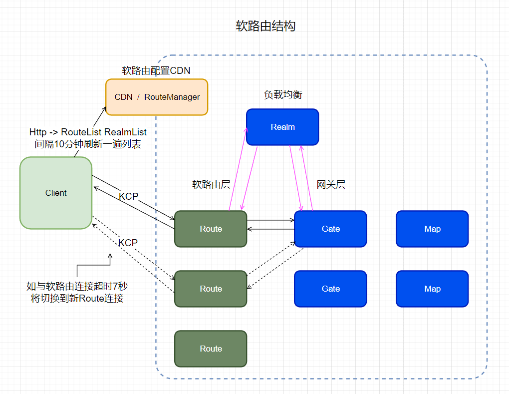
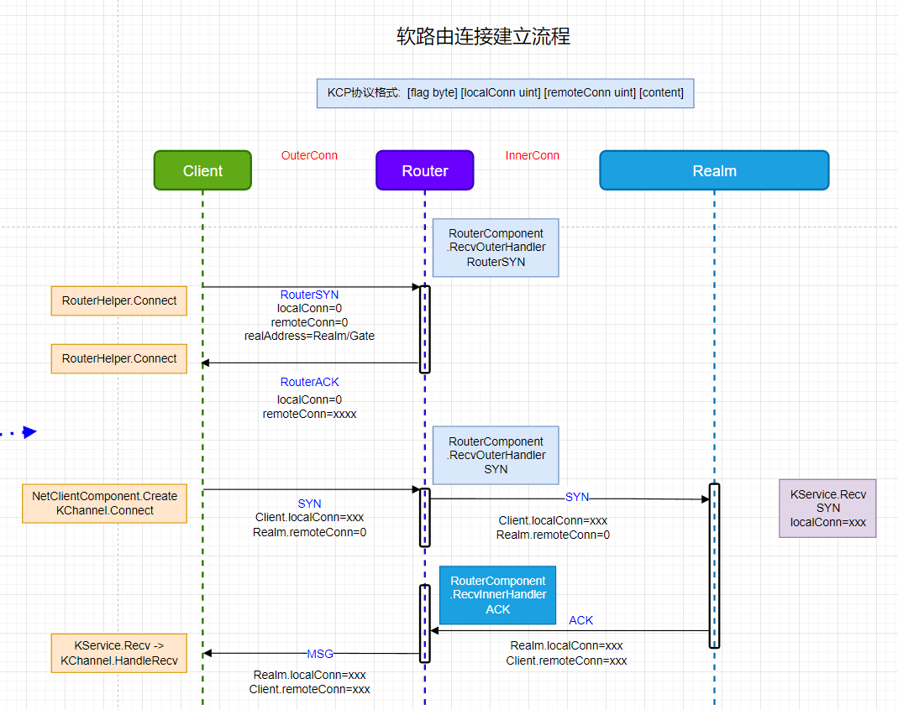

<!-- markdownlint-disable MD033 -->
# 网络游戏架构设计 笔记四

## 软路由原理

### 常见黑客攻击方式

1. tcp连接攻击 大量创建连接 消耗服务器资源
2. 流量攻击 消耗带宽 无法发送/接收消息
3. 协议攻击 修改协议数据

### Http防攻击方法

CDN -> HTTP Server

### 游戏服务器和Http不同

* 实时性高
* 交互更多
* 逻辑更复杂(业务不方便拆分)
* 服务集中
* 多为长连接

### 游戏服务器的弱点

* TCP 资源占用
* 对外地址固定
* 协议简单(自定义协议容易被破解)

### 大部分黑客特点

* 流量不多(花钱买量,然后敲诈勒索)
* 攻击单个地址
* 一般不会进行协议破解攻击(成本高)

### 针对性解决

* 使用UDP
* 多个对外地址(转发)
* 提高协议复杂性, 提高破解难度(定制KCP包装UDP)

### 防攻击的目标

* 服务器不受影响
* 保持连接, 不能让在线玩家掉线
* 在线玩家无感

### 软路由方案, 增加类似CDN的东西

* 软路由的设计

  1. 使用UDP + KCP, KCP 有序可靠性
  2. 一个软路由被攻击, 客户端可以自动切换其他软路由做转发
  3. 随时增加减少软路由(动态性)
  4. 使用CDN配置 软路由服务地址列表
  5. KCP底层会确认 每个数据包是否到达

localConn remoteConn

### ET KCP消息格式

`[flag byte] [local conn uint] [remote conn uint] [content]`

### ET 软路由结构图



### ET 软路由连接流程



### ET 软路由消息转发流程


## Client 软路由代码实现

### LoginHelper 登录 Realm和Gate逻辑

```c#
public static async ETTask Login(Scene clientScene, string account, string password)
{
  // 创建一个ETModel层的Session
  clientScene.RemoveComponent<RouterAddressComponent>();
  // 获取路由跟realmDispatcher地址
  RouterAddressComponent routerAddressComponent = clientScene.GetComponent<RouterAddressComponent>();
  if (routerAddressComponent == null)
  {
      routerAddressComponent = clientScene.AddComponent<RouterAddressComponent, string, int>(ConstValue.RouterHttpHost, ConstValue.RouterHttpPort);
      await routerAddressComponent.Init(); // 刷新软路由列表
      clientScene.AddComponent<NetClientComponent, AddressFamily>(routerAddressComponent.RouterManagerIPAddress.AddressFamily);
  }
  //负载均衡实际连接地址 account哈希取余
  IPEndPoint realmAddress = routerAddressComponent.GetRealmAddress(account);
  R2C_Login r2CLogin;
  //向 Realm 节点 发起登录协议
  using (Session session = await RouterHelper.CreateRouterSession(clientScene, realmAddress))
  {
      r2CLogin = (R2C_Login) await session.Call(new C2R_Login() { Account = account, Password = password });
  }
  // 与Gate节点建立连接
  // 创建一个gate Session,并且保存到SessionComponent中
  Session gateSession = await RouterHelper.CreateRouterSession(clientScene, NetworkHelper.ToIPEndPoint(r2CLogin.Address));
  clientScene.AddComponent<SessionComponent>().Session = gateSession;
  //向 Gate 节点 发起登录协议
  G2C_LoginGate g2CLoginGate = (G2C_LoginGate)await gateSession.Call(
      new C2G_LoginGate() { Key = r2CLogin.Key, GateId = r2CLogin.GateId});
}
```

### RouterAddressComponent 获取软路由与负载服务 列表

`RouterAddressComponentSystem.Init -> RouterAddressComponentSystem.GetAllRouter`

通过 CDN / RouterManager 获取软路由列表

```c#
private static async ETTask GetAllRouter(this RouterAddressComponent self)
{
    string url = $"http://{self.RouterManagerHost}:{self.RouterManagerPort}/get_router?v={RandomGenerator.RandUInt32()}";
    Log.Debug($"start get router info: {url}");
    string routerInfo = await HttpClientHelper.Get(url);
    Log.Debug($"recv router info: {routerInfo}");
    HttpGetRouterResponse httpGetRouterResponse = JsonHelper.FromJson<HttpGetRouterResponse>(routerInfo);
    self.Info = httpGetRouterResponse;
    Log.Debug($"start get router info finish: {JsonHelper.ToJson(httpGetRouterResponse)}");
    // 打乱顺序
    RandomGenerator.BreakRank(self.Info.Routers);
    //间隔10分钟再次刷新软路由列表
    self.WaitTenMinGetAllRouter().Coroutine();
}
```

间隔10分钟再次刷新软路由列表

```c#
// 等10分钟再获取一次
public static async ETTask WaitTenMinGetAllRouter(this RouterAddressComponent self)
{
    await TimerComponent.Instance.WaitAsync(5 * 60 * 1000);
    if (self.IsDisposed)
    {
        return;
    }
    await self.GetAllRouter();
}
```

### RouterHelper 创建软路由Session

```c#
public static async ETTask<Session> CreateRouterSession(Scene clientScene, IPEndPoint address)
{
    (uint recvLocalConn, IPEndPoint routerAddress) = await GetRouterAddress(clientScene, address, 0, 0);
    if (recvLocalConn == 0)
    {
        throw new Exception($"get router fail: {clientScene.Id} {address}");
    }
    Log.Info($"get router: {recvLocalConn} {routerAddress}");
    Session routerSession = clientScene.GetComponent<NetClientComponent>().Create(routerAddress, address, recvLocalConn);
    routerSession.AddComponent<PingComponent>();
    routerSession.AddComponent<RouterCheckComponent>(); //Router 切换检测组件
    return routerSession;
}
```

### RouterHelper RouterSYN/RouterReconnectSYN -> RouterACK/RouterReconnectACK

新连接一个Router, [Client 向 Router 发起 RouterSYN](#recvouterhandler-routersyn---routerack)

重连Router [Client 向 Router 发起 RouterReconnectSYN](#recvouterhandler-routerreconnectsyn-重连路由)

`GetRouterAddress -> Connect`

```C#
// RouterHelper.GetRouterAddress 重新连接一个Router
public static async ETTask<(uint, IPEndPoint)> GetRouterAddress(Scene clientScene, IPEndPoint address, uint localConn, uint remoteConn)
{
    Log.Info($"start get router address: {clientScene.Id} {address} {localConn} {remoteConn}");
    RouterAddressComponent routerAddressComponent = clientScene.GetComponent<RouterAddressComponent>();
    //分配新的 Router地址
    IPEndPoint routerInfo = routerAddressComponent.GetAddress();
    //连接新的 Router
    uint recvLocalConn = await Connect(routerInfo, address, localConn, remoteConn);
    Log.Info($"finish get router address: {clientScene.Id} {address} {localConn} {remoteConn} {recvLocalConn} {routerInfo}");
    return (recvLocalConn, routerInfo);
}
// 连接Router
private static async ETTask<uint> Connect(IPEndPoint routerAddress, IPEndPoint realAddress, uint localConn, uint remoteConn)
{
  uint connectId = RandomGenerator.RandUInt32();
  // UDP连接
  using Socket socket = new Socket(routerAddress.AddressFamily, SocketType.Dgram, ProtocolType.Udp);
  int count = 20;//尝试SYN连接次数
  uint synFlag = localConn == 0? KcpProtocalType.RouterSYN : KcpProtocalType.RouterReconnectSYN;
  sendCache.WriteTo(0, synFlag);//是否为发起重连
  sendCache.WriteTo(1, localConn);//首次连接 localConn = 0
  sendCache.WriteTo(5, remoteConn);//首次连接 remoteConn = 0
  sendCache.WriteTo(9, connectId);//随机生成的连接ID
  byte[] addressBytes = realAddress.ToString().ToByteArray();// 实际连接地址 可能是 Realm 或者 Gate
  Array.Copy(addressBytes, 0, sendCache, 13, addressBytes.Length);//写入实际连接地址
  while (true)
  {
    //SYN 连接 ,间隔300毫秒尝试一次 SYN 连接, 超过20次则失败
    long timeNow = TimeHelper.ClientFrameTime();
    if (timeNow - lastSendTimer > 300)
    {
        if (--count < 0)
        {
            Log.Error($"router connect timeout fail! {localConn} {remoteConn} {routerAddress} {realAddress}");
            return 0;
        }
        lastSendTimer = timeNow;
        // 发送
        socket.SendTo(sendCache, 0, addressBytes.Length + 13, SocketFlags.None, routerAddress);
    }
    await TimerComponent.Instance.WaitFrameAsync();//停1毫秒
    // 接收 ACK
    if (socket.Available > 0)
    {
        int messageLength = socket.ReceiveFrom(recvCache, ref recvIPEndPoint);
        if (messageLength != 9)
        {
            Log.Error($"router connect error1: {connectId} {messageLength} {localConn} {remoteConn} {routerAddress} {realAddress}");
            continue;
        }
        byte flag = recvCache[0];//返回标识消息类型
        if (flag != KcpProtocalType.RouterReconnectACK && flag != KcpProtocalType.RouterACK)
        {
            Log.Error($"router connect error2: {connectId} {synFlag} {flag} {localConn} {remoteConn} {routerAddress} {realAddress}");
            continue;
        }
        uint recvRemoteConn = BitConverter.ToUInt32(recvCache, 1);
        uint recvLocalConn = BitConverter.ToUInt32(recvCache, 5);
        Log.Info($"router connect finish: {connectId} {recvRemoteConn} {recvLocalConn} {localConn} {remoteConn} {routerAddress} {realAddress}");
        return recvLocalConn;// 本地连接号
    }
  }
}
```

### RouterCheckComponent 软路由超时判断

如果 `Session` 连接超过7秒没有消息返回, 就重新连接一个新的 Router

`RouterCheckComponentAwakeSystem`

```c#
private static async ETTask CheckAsync(RouterCheckComponent self)
{
    while (true)
    {
        //间隔一秒执行一次检测
        await TimerComponent.Instance.WaitAsync(1000);
        long time = TimeHelper.ClientFrameTime();
        //判断最后一次接收消息的时间是否大于 7 秒
        if (time - session.LastRecvTime < 7 * 1000)
        {
            continue;
        }

        long sessionId = session.Id;
        //获取连接信息
        (uint localConn, uint remoteConn) = await NetServices.Instance.GetChannelConn(session.ServiceId, sessionId);
        //实际连接地址
        IPEndPoint realAddress = self.GetParent<Session>().RemoteAddress;
        Log.Info($"get recvLocalConn start: {self.ClientScene().Id} {realAddress} {localConn} {remoteConn}");
        //换一个Router 重新连接一个
        (uint recvLocalConn, IPEndPoint routerAddress) = await RouterHelper.GetRouterAddress(self.ClientScene(), realAddress, localConn, remoteConn);
        if (recvLocalConn == 0)
        {
            Log.Error($"get recvLocalConn fail: {self.ClientScene().Id} {routerAddress} {realAddress} {localConn} {remoteConn}");
            continue;
        }
        Log.Info($"get recvLocalConn ok: {self.ClientScene().Id} {routerAddress} {realAddress} {recvLocalConn} {localConn} {remoteConn}");
        session.LastRecvTime = TimeHelper.ClientNow();
        NetServices.Instance.ChangeAddress(session.ServiceId, sessionId, routerAddress);
    }
}
```

## Server 软路由代码实现

### RouterNode

```c#
public class RouterNode: Entity, IDestroy, IAwake
{
    public uint ConnectId;
    public string InnerAddress;
    public IPEndPoint InnerIpEndPoint;//关联的内网ip地址(Realm,Gate)
    public IPEndPoint OuterIpEndPoint;//关联的外网ip地址(Client)
    public IPEndPoint SyncIpEndPoint;//Client->Router 为Client地址;Inner->Router为内 Inner网节点地址
    public uint OuterConn;//Client KCP localConn
    public uint InnerConn;//Realm,Gate KCP localConn
    public long LastRecvOuterTime;//最后接收外网消息时间
    public long LastRecvInnerTime;//最后接收内网消息时间
    public int RouterSyncCount;
    public int SyncCount;
}
```

### RouterComponent 属性

```c#
public class RouterComponent: Entity, IAwake<IPEndPoint, string>, IDestroy, IUpdate
{
    public Socket OuterSocket;//接受外网socket(KCP) 服务
    public Socket InnerSocket;//接受内网socket(KCP) 服务
    public EndPoint IPEndPoint = new IPEndPoint(IPAddress.Any, 0);
    public byte[] Cache = new byte[1500];
    // 建立连接中握手的数据
    public Dictionary<uint, RouterNode> ConnectIdNodes = new Dictionary<uint, RouterNode>();
    // 已经连接成功的，虽然跟id一样，但是没有经过验证的不会加到这里
    public Dictionary<uint, RouterNode> OuterNodes = new Dictionary<uint, RouterNode>();
    public long LastCheckTime = 0;
}
```

### RouterComponent 初始化

`Router` 启动 内网和外网的socket(KCP) 服务

```c#
//初始化软路由socket(KCP)服务
protected override void Awake(RouterComponent self, IPEndPoint outerAddress, string innerIP)
{
    //外网socket(KCP) 服务
    self.OuterSocket = new Socket(outerAddress.AddressFamily, SocketType.Dgram, ProtocolType.Udp);
    self.OuterSocket.Bind(outerAddress);
    //内网socket(KCP) 服务
    self.InnerSocket = new Socket(outerAddress.AddressFamily, SocketType.Dgram, ProtocolType.Udp);
    self.InnerSocket.Bind(new IPEndPoint(IPAddress.Parse(innerIP), 0));
    //针对windows平台 UDP 连接socket关闭时不通知对端
    NetworkHelper.SetSioUdpConnReset(self.OuterSocket);
    NetworkHelper.SetSioUdpConnReset(self.InnerSocket);
}
//Update驱动接收消息
protected override void Update(RouterComponent self)
{
    long timeNow = TimeHelper.ClientNow();
    self.RecvOuter(timeNow);
    self.RecvInner(timeNow);
    // 每秒钟检查一次
    if (timeNow - self.LastCheckTime > 1000)
    {
        self.CheckConnectTimeout(timeNow);
        self.LastCheckTime = timeNow;
    }
}
```

## RouterComponent RecvOuterHandler 接受外网信息

建立连接 接收消息

外网: `RouterComponentSystem.RecvOuter -> RouterComponentSystem.RecvOuterHandler`

```c#
private static void RecvOuterHandler(this RouterComponent self, int messageLength, long timeNow)
{
  byte flag = self.Cache[0];
  switch (flag)
  {
      //对应客户端 RouterHelper.Connect发送内容, RouterReconnectSYN和RouterSYN
      case KcpProtocalType.RouterReconnectSYN:
      case KcpProtocalType.RouterSYN:
      case KcpProtocalType.SYN:
      case KcpProtocalType.FIN:
      case KcpProtocalType.MSG:
  }
}
```

### RecvOuterHandler RouterSYN -> RouterACK

[RecvOuterHandler 处理 Client 发送过来的 RouterSYN](#routerhelper-routersynrouterreconnectsyn---routerackrouterreconnectack)

接收并建立对外网的KCP SYN连接

`[Client] -RouterSYN-> Router -RouterACK-> [Client]`

```c#
case KcpProtocalType.RouterSYN:
  if (messageLength < 13)
  {
      break;
  }
  uint outerConn = BitConverter.ToUInt32(self.Cache, 1);
  uint innerConn = BitConverter.ToUInt32(self.Cache, 5);
  uint connectId = BitConverter.ToUInt32(self.Cache, 9);
  string realAddress = self.Cache.ToStr(13, messageLength - 13);// 实际连接地址(Realm,Gate)
  RouterNode routerNode;
  self.ConnectIdNodes.TryGetValue(connectId, out routerNode);
  if (routerNode == null)
  {   //初始化新软路由节点对象
      outerConn = NetServices.Instance.CreateConnectChannelId();
      routerNode = self.New(realAddress, connectId, outerConn, innerConn, self.CloneAddress());
      Log.Info($"router create: {realAddress} {connectId} {outerConn} {innerConn} {routerNode.SyncIpEndPoint}");
      self.OuterNodes.Add(routerNode.OuterConn, routerNode);
  }
  // 校验ip，连接过程中ip不能变化
  if (!Equals(routerNode.SyncIpEndPoint, self.IPEndPoint)){break;}
  // 校验内网地址
  if (routerNode.InnerAddress != realAddress){break;}
  //发送RouteACK
  self.Cache.WriteTo(0, KcpProtocalType.RouterACK);
  self.Cache.WriteTo(1, routerNode.InnerConn);//localConn = 0
  self.Cache.WriteTo(5, routerNode.OuterConn);//生成remoteConn并返回; outerConn = NetServices.Instance.CreateConnectChannelId();
  self.OuterSocket.SendTo(self.Cache, 0, 9, SocketFlags.None, routerNode.SyncIpEndPoint);
```

### RecvOuterHandler SYN 转发给内网节点

RecvOuterHandler 处理 Client 发送过来的 SYN

根据 RouterSYN 提交的 realAddress, 转发到内网(Realm, Gate)节点

`NetClientComponent.Create -> NetServices.CreateChannel -> KChannel.Connect -> SYN` 发起SYN请求

`[Client] -SYN-> [Router] -SYN-> [Realm]`

```c#
case KcpProtocalType.SYN:
{
    // 长度!=13，不是accpet消息
    if (messageLength != 9)
    {
        break;
    }
    uint outerConn = BitConverter.ToUInt32(self.Cache, 1); // remote Client KCP localConn
    uint innerConn = BitConverter.ToUInt32(self.Cache, 5);// innerConn = 0
    // 发了syn过来，那么RouterSyn就成功了，可以删除ConnectId
    self.ConnectIdNodes.Remove(kcpRouter.ConnectId);
    kcpRouter.LastRecvOuterTime = timeNow;
    kcpRouter.OuterIpEndPoint = self.CloneAddress();
    // 转发到内网, 带上客户端的地址
    self.Cache.WriteTo(0, KcpProtocalType.SYN);
    self.Cache.WriteTo(1, outerConn);
    self.Cache.WriteTo(5, innerConn);
    //填充Client地址信息 转发给KService
    byte[] addressBytes = ipEndPoint.ToString().ToByteArray();
    Array.Copy(addressBytes, 0, self.Cache, 9, addressBytes.Length);
    Log.Info($"kcp router syn: {outerConn} {innerConn} {kcpRouter.InnerIpEndPoint} {kcpRouter.OuterIpEndPoint}");
    //转发SYN 给 InnerIpEndPoint对应的内网节点(Realm,Gate)
    self.InnerSocket.SendTo(self.Cache, 0, 9 + addressBytes.Length, SocketFlags.None, kcpRouter.InnerIpEndPoint);
    if (!kcpRouter.CheckOuterCount(timeNow))//每秒转发包数量检测
    {
        self.OnError(kcpRouter.Id, ErrorCore.ERR_KcpRouterTooManyPackets);
    }
    break;
}
```

### RecvOuterHandler RouterReconnectSYN 重连路由

网络异常发起对路由的重连 尝试连接一个新的 Router

`[Client] -RouterReconnectSYN-> Router -RouterReconnectSYN-> [Realm/Gate]`

[Realm/Gate 参考:](#kservicerecv-routerreconnectsyn)

```c#
case KcpProtocalType.RouterReconnectSYN:
{
    if (messageLength < 13)
    {
        break;
    }
    uint outerConn = BitConverter.ToUInt32(self.Cache, 1);
    uint innerConn = BitConverter.ToUInt32(self.Cache, 5);
    uint connectId = BitConverter.ToUInt32(self.Cache, 9);
    string realAddress = self.Cache.ToStr(13, messageLength - 13);
    RouterNode routerNode;
    // RouterAck之后ConnectIdNodes会删除，加入到OuterNodes中来
    if (!self.OuterNodes.TryGetValue(outerConn, out routerNode))
    {
        self.ConnectIdNodes.TryGetValue(connectId, out routerNode);
        if (routerNode == null)
        {
            Log.Info($"router create reconnect: {self.IPEndPoint} {realAddress} {connectId} {outerConn} {innerConn}");
            routerNode = self.New(realAddress, connectId, outerConn, innerConn, self.CloneAddress());
            // self.OuterNodes 这里不能add，因为还没验证完成,要在RouterAck中加入
        }
    }
    // 不是自己的，outerConn冲突, 直接break,也就是说这个软路由上有个跟自己outerConn冲突的连接，就不能连接了
    // 这个路由连接不上，客户端会换个软路由，所以没关系
    if (routerNode.InnerConn != innerConn)
    if (routerNode.OuterConn != outerConn)
    // 校验ip，连接过程中ip不能变化
    if (!Equals(routerNode.SyncIpEndPoint, self.IPEndPoint))
    // 校验内网地址
    if (routerNode.InnerAddress != realAddress)
    if (++routerNode.RouterSyncCount > 40)
    // 转发到内网
    self.Cache.WriteTo(0, KcpProtocalType.RouterReconnectSYN);
    self.Cache.WriteTo(1, outerConn);
    self.Cache.WriteTo(5, innerConn);
    self.Cache.WriteTo(9, connectId);
    self.InnerSocket.SendTo(self.Cache, 0, 13, SocketFlags.None, routerNode.InnerIpEndPoint);
    if (!routerNode.CheckOuterCount(timeNow))
    {
        self.OnError(routerNode.Id, ErrorCore.ERR_KcpRouterTooManyPackets);
    }
    break;
}
```

### KService.Recv RouterReconnectSYN

`[Client] -RouterReconnectSYN-> Router -RouterReconnectSYN-> [Realm/Gate] -RouterReconnectACK-> [Router]`

[Router RouterReconnectACK -> RouterComponentSystem.RecvInnerHandler 参考](#recvinnerhandler-routerreconnectack)

如果重连过程中 `router` 地址发生变化(原Router被攻击,无法连接), 将会替换 `kChannel.RemoteAddress`

```c#
case KcpProtocalType.RouterReconnectSYN:
{
    // 长度!=5，不是RouterReconnectSYN消息
    if (messageLength != 13)
    string realAddress = null;
    remoteConn = BitConverter.ToUInt32(this.cache, 1);
    localConn = BitConverter.ToUInt32(this.cache, 5);
    uint connectId = BitConverter.ToUInt32(this.cache, 9);

    this.localConnChannels.TryGetValue(localConn, out kChannel);
    if (kChannel == null)
    // 这里必须校验localConn，客户端重连，localConn一定是一样的
    if (localConn != kChannel.LocalConn)
    if (remoteConn != kChannel.RemoteConn)
    // 重连的时候router地址变化, 这个不能放到msg中，必须经过严格的验证才能切换
    if (!Equals(kChannel.RemoteAddress, this.ipEndPoint))
    {
      kChannel.RemoteAddress = this.CloneAddress();
    }
    byte[] buffer = this.cache;
    buffer.WriteTo(0, KcpProtocalType.RouterReconnectACK);
    buffer.WriteTo(1, kChannel.LocalConn);
    buffer.WriteTo(5, kChannel.RemoteConn);
    buffer.WriteTo(9, connectId);
    this.socket.SendTo(buffer, 0, 13, SocketFlags.None, this.ipEndPoint);
    break;
}
```

### CheckOuterCount 每秒转发包数量检测

目前的上限为 1000

```c#
if (++self.LimitCountPerSecond > 1000)
{
    return false;
}
```

### RecvOuterHandler MSG 转发给内网节点

`KChannel Output` -> `[Client] -MSG-> [Router] -MSG-> [Realm/Gate]`

[RecvInnerHandler MSG 将消息转发给 Client](#recvinnerhandler-msg-转发给内client)

```c#
case KcpProtocalType.MSG:
{
    // 长度<9，不是Msg消息
    if (messageLength < 9)
    {
        break;
    }
    // 处理chanel
    uint outerConn = BitConverter.ToUInt32(self.Cache, 1); // remote
    uint innerConn = BitConverter.ToUInt32(self.Cache, 5); // local
    // 转发到内网节点 InnerIpEndPoint
    self.InnerSocket.SendTo(self.Cache, 0, messageLength, SocketFlags.None, kcpRouter.InnerIpEndPoint);
}
```

## RouterComponent.RecvInnerHandler 接受内网消息

### RecvInnerHandler ACK

Router接收内网节点(Realm,Gate)返回的ACK, 转发给Client

`[Realm] -ACK-> [Router] -ACK-> [Client]`

```c#
case KcpProtocalType.ACK:
{
    uint innerConn = BitConverter.ToUInt32(self.Cache, 1); // remote
    uint outerConn = BitConverter.ToUInt32(self.Cache, 5); // local
    if (!self.OuterNodes.TryGetValue(outerConn, out RouterNode kcpRouterNode))
    {
        Log.Warning($"kcp router ack not found outer nodes: {outerConn} {innerConn}");
        break;
    }
    
    kcpRouterNode.Status = RouterStatus.Msg;
    kcpRouterNode.InnerConn = innerConn;
    kcpRouterNode.LastRecvInnerTime = timeNow;
    // 转发出去
    Log.Info($"kcp router ack: {outerConn} {innerConn} {kcpRouterNode.OuterIpEndPoint}");
    self.OuterSocket.SendTo(self.Cache, 0, messageLength, SocketFlags.None, kcpRouterNode.OuterIpEndPoint);
    break;
}
```

### RecvInnerHandler RouterReconnectACK

`[Client] -RouterReconnectSYN-> Router -RouterReconnectSYN-> [Realm/Gate] -RouterReconnectACK-> [Router] -RouterReconnectACK-> [Client]`

[Client RouterReconnectACK -> RouterHelper.Connect 参考](#routerhelper-routersynrouterreconnectsyn---routerackrouterreconnectack)

```c#
case KcpProtocalType.RouterReconnectACK:
{
    uint innerConn = BitConverter.ToUInt32(self.Cache, 1);
    uint outerConn = BitConverter.ToUInt32(self.Cache, 5);
    uint connectId = BitConverter.ToUInt32(self.Cache, 9);
    if (!self.ConnectIdNodes.TryGetValue(connectId, out RouterNode kcpRouterNode))
    // 必须校验innerConn，防止伪造
    if (innerConn != kcpRouterNode.InnerConn)
    // 必须校验outerConn，防止伪造
    if (outerConn != kcpRouterNode.OuterConn)
    kcpRouterNode.Status = RouterStatus.Msg;
    kcpRouterNode.LastRecvInnerTime = timeNow;
    // 校验成功才加到outerNodes中, 如果这里有冲突，外网将连接失败，不过几率极小
    if (!self.OuterNodes.ContainsKey(outerConn))
    // 转发出去
    self.Cache.WriteTo(0, KcpProtocalType.RouterReconnectACK);
    self.Cache.WriteTo(1, kcpRouterNode.InnerConn);
    self.Cache.WriteTo(5, kcpRouterNode.OuterConn);
    Log.Info($"kcp router RouterAck: {outerConn} {innerConn} {kcpRouterNode.SyncIpEndPoint}");
    self.OuterSocket.SendTo(self.Cache, 0, 9, SocketFlags.None, kcpRouterNode.SyncIpEndPoint);
    break;
}
```

### RecvInnerHandler MSG 转发给内Client

Router转发内网节点(Realm,Gate)返回的MSG, 转发给Client

`[Realm/Gate] -MSG-> [Router] -MSG-> [Client]`

```c#
case KcpProtocalType.MSG:
  // 长度<9，不是Msg消息
  if (messageLength < 9)
  {
      break;
  }
  uint innerConn = BitConverter.ToUInt32(self.Cache, 1); // remote
  uint outerConn = BitConverter.ToUInt32(self.Cache, 5); // local
  kcpRouterNode.LastRecvInnerTime = timeNow;
  //转发到 OuterIpEndPoint -> Client
  self.OuterSocket.SendTo(self.Cache, 0, messageLength, SocketFlags.None, kcpRouterNode.OuterIpEndPoint);
  break;
```
