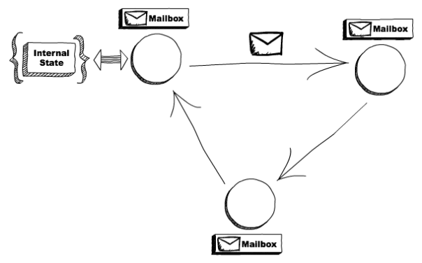
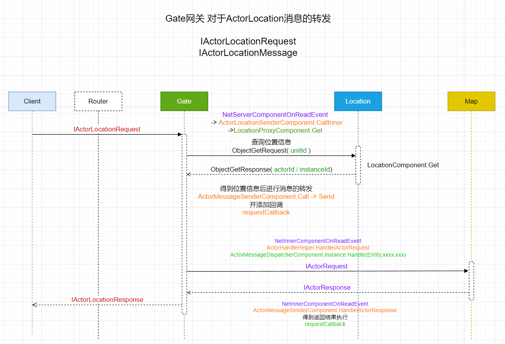

<!-- markdownlint-disable MD033 -->
# 网络游戏架构设计 笔记五

## Actor

在计算机科学中，演员模型（英语：Actor model）是一种并发运算上的模型。“演员”是一种程序上的抽象概念，被视为并发运算的基本单元：当一个演员接收到一则消息，它可以做出一些决策、创建更多的演员、发送更多的消息、决定要如何回答接下来的消息。演员可以修改它们自己的私有状态，但是只能通过消息间接的相互影响（避免了基于锁的同步）



### ET Actor

用于服务端内网进程之间的逻辑调用

* InstanceId 表示游戏中的具体对象
  
  具有位置信息 包含进程id
* StartSceneConfig Scene的InstanceId

  可以给Scene发消息, 也可以给Root.Scene(进程)发消息

  StartSceneConfig.AfterEndInit 填充Scene配置 InstanceId, 包含进程ID + 配置ID

  ```c#
  public override void AfterEndInit()
  {
      this.Type = EnumHelper.FromString<SceneType>(this.SceneType);
      InstanceIdStruct instanceIdStruct = new InstanceIdStruct(this.Process, (uint) this.Id);
      this.InstanceId = instanceIdStruct.ToLong();
  }
  ```

  给指定 Scene 发消息示例 `LocationProxyComponent.Add`:

  ```c#
  await ActorMessageSenderComponent.Instance.Call(GetLocationSceneId(key),
                new ObjectAddRequest() { Key = key, InstanceId = instanceId });
  ```

* 服务器所有内部消息发送, 包括Gate消息的转发都是通过 Actor
* MailboxComponent 三种 MailboxType
  
  ```c#
  public enum MailboxType
  {
      MessageDispatcher, //顺序分发(队列等待)
      UnOrderMessageDispatcher, //无序分发,协程(不等待)
      GateSession, //Map unit玩家身上绑定Gate.Session, 提高发送效率
  }
  ```

* Actor 死锁

  `MessageDispatcher` 类型消息 之间的通信容易产生相互等待返回数据而造成的死锁情况

  解决方式: 使用 `UnOrderMessageDispatcher` 替换 `MessageDispatcher`

### ET 中 Protobuf 消息类型及用途

||普通消息|Actor|ActorLocation|
|-|:-|-|-|
|用途|客户端与服务端对外节点的(Gate,Realm等)协议消息通信|服务器内网 Scene 之间协议消息通信|服务器内网 Unit (游戏实体)之间的协议消息通信|
|消息|单向推送消息:<br/>IMessage<br/>请求与响应(RPC):<br/>IRequest<br/>IResponse |单向推送消息:<br/>IActorMessage<br/>请求与响应(RPC):<br/>IActorRequest<br/>IActorResponse|单向推送消息:<br/>IActorLocationMessage<br/>请求与响应(RPC):<br/>IActorLocationRequest<br/>IActorLocationResponse|

### Actor 协议消息

用于游戏节点内部节点 `Scene` 的协议通讯

消息处理器标签: `ActorMessageHandler`

实现消息处理器: `AMActorRpcHandler`

对应协议RPC请求响应接口: `IActorRequest` `IActorResponse`

### ActorLocation 协议消息

用于游戏节点内部节点的 `Unit` (玩家或游戏实体) 协议通讯

消息处理器标签: `ActorMessageHandler`

实现消息处理器: `AMActorLocationRpcHandler` ; `AMActorLocationHandler`

对应协议RPC请求响应接口: `IActorLocationRequest` `IActorLocationResponse`

### ActorMessage 协议消息

单项推送消息模式, 无返回(非RPC)

消息处理器标签: `MessageHandler`

实现消息处理器: `AMHandler`

对应协议消息接口: `IActorMessage`

## ActorMessageSenderComponent 发送消息

```c#
public class ActorMessageSenderComponent: Entity, IAwake, IDestroy
{
    public const long TIMEOUT_TIME = 40 * 1000;//Callback调用超时时间常量
    public static ActorMessageSenderComponent Instance { get; set; }
    public int RpcId;//自增RpcId
    //Callback 回调字典(排序)
    public readonly SortedDictionary<int, ActorMessageSender> requestCallback = new SortedDictionary<int, ActorMessageSender>();
    //Callback调用超时定时器
    public long TimeoutCheckTimer;
    //超时回调RpcId
    public List<int> TimeoutActorMessageSenders = new List<int>();
}
```

### ProcessActorId 进程ID解析/封装

`ActorId = InstanceId`

```c#
public struct ProcessActorId
{
    public int Process;
    public long ActorId;
    public ProcessActorId(long actorId)
    {
        InstanceIdStruct instanceIdStruct = new InstanceIdStruct(actorId);
        this.Process = instanceIdStruct.Process;//目标进程id
        instanceIdStruct.Process = Options.Instance.Process;//本地进程id,最后发送的是这个
        this.ActorId = instanceIdStruct.ToLong();//最后ActorId包含的进程id为本地进程ID
    }
}
```

### Send 无返回请求

```c#
public static void Send(this ActorMessageSenderComponent self, long actorId, IMessage message)
{
    ProcessActorId processActorId = new(actorId);//解析出对应配置的进程ID
    
    // 这里做了优化，如果发向本地同一个进程，则直接处理，不需要通过网络层
    if (processActorId.Process == Options.Instance.Process)
    {
        NetInnerComponent.Instance.HandleMessage(actorId, message);
        return;
    }
    Session session = NetInnerComponent.Instance.Get(processActorId.Process);
    session.Send(processActorId.ActorId, message);
}
```

### Call 有返回请求

```c#
public static async ETTask<IActorResponse> Call(
        this ActorMessageSenderComponent self,
        long actorId,
        IActorRequest request,
        bool needException = true
)
{
    request.RpcId = self.GetRpcId();// 递增生成的RPCId
    return await self.Call(actorId, request.RpcId, request, needException);
}

public static async ETTask<IActorResponse> Call(
        this ActorMessageSenderComponent self,
        long actorId,
        int rpcId,
        IActorRequest iActorRequest,
        bool needException = true
)
{
    var tcs = ETTask<IActorResponse>.Create(true);
    //回调字典(排序) 
    self.requestCallback.Add(rpcId, new ActorMessageSender(actorId, iActorRequest, tcs, needException));
    self.Send(actorId, iActorRequest);
    long beginTime = TimeHelper.ServerFrameTime();
    IActorResponse response = await tcs;// 等待回调执行完毕
    long endTime = TimeHelper.ServerFrameTime();
    long costTime = endTime - beginTime;
    if (costTime > 200)
    {
        Log.Warning($"actor rpc time > 200: {costTime} {iActorRequest}");
    }
    return response;
}
```

### ActorMessageSender 关联发送与回调返回逻辑

### HandleIActorResponse 处理Actor回调消息

```c#
public static void HandleIActorResponse(this ActorMessageSenderComponent self, IActorResponse response)
{
    ActorMessageSender actorMessageSender;
    //根据RpcId获取回调函数
    if (!self.requestCallback.TryGetValue(response.RpcId, out actorMessageSender))
    {
        return;
    }
    self.requestCallback.Remove(response.RpcId);    
    Run(actorMessageSender, response);//设置 response 返回值
}
```

### Check 检测RCP Callback调用超时定时器

```c#
//每秒检测一次
self.TimeoutCheckTimer = TimerComponent.Instance.NewRepeatedTimer(1000, TimerInvokeType.ActorMessageSenderChecker, self);

private static void Check(this ActorMessageSenderComponent self)
{
    long timeNow = TimeHelper.ServerNow();
    foreach ((int key, ActorMessageSender value) in self.requestCallback)
    {
        // 因为是顺序发送的，所以，检测到第一个不超时的就退出
        if (timeNow < value.CreateTime + ActorMessageSenderComponent.TIMEOUT_TIME)
        {
            break;
        }
        self.TimeoutActorMessageSenders.Add(key);
    }
    foreach (int rpcId in self.TimeoutActorMessageSenders)
    {
        ActorMessageSender actorMessageSender = self.requestCallback[rpcId];
        self.requestCallback.Remove(rpcId);
        try
        {
            IActorResponse response = ActorHelper.CreateResponse(actorMessageSender.Request, ErrorCore.ERR_ActorTimeout);
            Run(actorMessageSender, response);
        }
        catch (Exception e)
        {
            Log.Error(e.ToString());
        }
    }
    self.TimeoutActorMessageSenders.Clear();
}
private static void Run(ActorMessageSender self, IActorResponse response)
{
    if (response.Error == ErrorCore.ERR_ActorTimeout)
    {
        self.Tcs.SetException(new Exception($"Rpc error: request, 注意Actor消息超时，请注意查看是否死锁或者没有reply: actorId: {self.ActorId} {self.Request}, response: {response}"));
        return;
    }
    if (self.NeedException && ErrorCore.IsRpcNeedThrowException(response.Error))
    {
        self.Tcs.SetException(new Exception($"Rpc error: actorId: {self.ActorId} request: {self.Request}, response: {response}"));
        return;
    }
    self.Tcs.SetResult(response);
}
```

## ActorHandleHelper

监听 `NetInnerComponentOnRead` 事件, 并处理; 衔接 `ActorMessageSenderComponent` 与 `ActorMessageDispatcherComponent`

```c#
// 收到actor消息,放入actor队列
switch (message)
{
    case IActorResponse iActorResponse://返回的响应消息将调用Callback
    {
        ActorHandleHelper.HandleIActorResponse(iActorResponse);break;//ActorMessageSenderComponent
    }
    case IActorRequest iActorRequest://处理请求消息
    {
        await ActorHandleHelper.HandleIActorRequest(actorId, iActorRequest);break;//ActorMessageDispatcherComponent
    }
    case IActorMessage iActorMessage://处理之间推送的消息(无返回值)
    {
        await ActorHandleHelper.HandleIActorMessage(actorId, iActorMessage);break;//ActorMessageDispatcherComponent
    }
}
```

### HandleIActorResponse

```c#
public static void HandleIActorResponse(IActorResponse response)
{
    ActorMessageSenderComponent.Instance.HandleIActorResponse(response);
}
```

### HandleIActorRequest

[与`HandleIActorMessage`大部分逻辑一致,只是没有了`case MailboxType.GateSession:`逻辑](#handleiactormessage)

### HandleIActorMessage

[`fromProcess` 填充逻辑](#processactorid-进程id解析封装)

```c#
public static async ETTask HandleIActorMessage(long actorId, IActorRequest iActorRequest)
{
    InstanceIdStruct instanceIdStruct = new(actorId);//解析actorId
    int fromProcess = instanceIdStruct.Process;//这里在发送端已经将进程ID替换成发送端进程ID
    instanceIdStruct.Process = Options.Instance.Process;
    long realActorId = instanceIdStruct.ToLong();
    Entity entity = Root.Instance.Get(realActorId);
    if (entity == null){}
    MailBoxComponent mailBoxComponent = entity.GetComponent<MailBoxComponent>();
    if (mailBoxComponent == null){}
    switch (mailBoxComponent.MailboxType)
    {
        case MailboxType.MessageDispatcher://有序分发,有添加协程锁
        {
            using (await CoroutineLockComponent.Instance.Wait(CoroutineLockType.Mailbox, realActorId))
            {
                if (entity.InstanceId != realActorId)
                {
                    IActorResponse response = ActorHelper.CreateResponse(iActorRequest, ErrorCore.ERR_NotFoundActor);
                    Reply(fromProcess, response);
                    break;
                }
                await ActorMessageDispatcherComponent.Instance.Handle(entity, fromProcess, iActorRequest);
            }
            break;
        }
        case MailboxType.UnOrderMessageDispatcher://无序分发,不用等待队列执行
        {
            await ActorMessageDispatcherComponent.Instance.Handle(entity, fromProcess, iActorRequest);
            break;
        }
        case MailboxType.GateSession://HandleIActorMessage相比HandleIActorRequest 就多了GateSession
        {
            if (entity is Session gateSession)//只有Gate节点会挂载这个类型的Mailbox
            {
                // 发送给客户端
                gateSession.Send(iActorMessage);
            }
            break;
        }
        default:
    }
}
```

### Reply 发送响应消息

```c#
public static void Reply(int fromProcess, IActorResponse response)
{
    if (fromProcess == Options.Instance.Process) // 返回消息是同一个进程
    {
        // NetInnerComponent.Instance.HandleMessage(realActorId, response); 等同于直接调用下面这句
        ActorMessageSenderComponent.Instance.HandleIActorResponse(response);
        return;
    }
    Session replySession = NetInnerComponent.Instance.Get(fromProcess);
    replySession.Send(response);
}
```

### MailboxComponent

挂上这个组件表示该Entity是一个Actor,接收的消息将会队列处理; 对应的三种 `MailboxType`
  
```c#
public enum MailboxType
{
    MessageDispatcher, //顺序分发(队列等待)
    UnOrderMessageDispatcher, //无序分发,协程(不等待)
    GateSession, //Map unit玩家身上绑定Gate.Session, 提高发送效率
}
//默认添加 MailBoxComponent 组件类型为 MessageDispatcher
M2M_UnitTransferRequestHandler -> 
unit.AddComponent<MailBoxComponent>();

//服务端scene创建时默认为无序分发类型
SceneFactory.CreateServerScene ->
scene.AddComponent<MailBoxComponent, MailboxType>(MailboxType.UnOrderMessageDispatcher);

C2G_LoginGateHandler ->
session.AddComponent<MailBoxComponent, MailboxType>(MailboxType.GateSession);
```

## ActorMessageDispatcherComponent 接收处理消息

### Load 初始加载消息处理器

类似 `MessageDispatcherComponent` 先扫描``ActorMessageHandler`Attribute`标签并注册Actor消息处理器到 `ActorMessageHandlers` 字典中

### Handle 消息分发处理

[由 `ActorHandlerHelper.HandleIActorMessage` 调用](#handleiactormessage)

[`fromProcess` 填充逻辑](#processactorid-进程id解析封装)

```c#
//fromProcess 消息来源进程Id
public static async ETTask Handle(this ActorMessageDispatcherComponent self, Entity entity, int fromProcess, object message)
{
    List<ActorMessageDispatcherInfo> list;
    if (!self.ActorMessageHandlers.TryGetValue(message.GetType(), out list)){ }
    SceneType sceneType = entity.DomainScene().SceneType;
    //遍历执行消息处理器
    foreach (ActorMessageDispatcherInfo actorMessageDispatcherInfo in list)
    {
        if (actorMessageDispatcherInfo.SceneType != sceneType)
        {
            continue;
        }
        await actorMessageDispatcherInfo.IMActorHandler.Handle(entity, fromProcess, message);   
    }
}
```

### AMActorHandler 无返回值

```c#
public async ETTask Handle(Entity entity, int fromProcess, object actorMessage)
{
    if (actorMessage is not Message msg)
    {Log.Error($"消息类型转换错误: {actorMessage.GetType().FullName} to {typeof (Message).Name}");return;}
    if (entity is not E e)
    {Log.Error($"Actor类型转换错误: {entity.GetType().Name} to {typeof (E).Name} --{typeof (Message).Name}");return;}
    await this.Run(e, msg);
}
public Type GetRequestType()
{
    if (typeof (IActorLocationMessage).IsAssignableFrom(typeof (Message)))
    {Log.Error($"message is IActorLocationMessage but handler is AMActorHandler: {typeof (Message)}");}
    return typeof (Message);
}
public Type GetResponseType()
{
    return null;
}
```

### AMActorRpcHandler 有返回值

```c#
public async ETTask Handle(Entity entity, int fromProcess, object actorMessage)
{
  if (actorMessage is not Request request)
  {Log.Error($"消息类型转换错误: {actorMessage.GetType().FullName} to {typeof (Request).Name}");return;}
  if (entity is not E ee)
  {Log.Error($"Actor类型转换错误: {entity.GetType().Name} to {typeof (E).Name} --{typeof (Request).Name}");return;}
  int rpcId = request.RpcId;//记录RpcId
  Response response = Activator.CreateInstance<Response>();
  
  await this.Run(ee, request, response);
  response.RpcId = rpcId;//将rpcId返回
  ActorHandleHelper.Reply(fromProcess, response);//返回响应数据
}
public Type GetRequestType()
{
    if (typeof (IActorLocationRequest).IsAssignableFrom(typeof (Request)))
    {Log.Error($"message is IActorLocationMessage but handler is AMActorRpcHandler: {typeof (Request)}");}
    return typeof (Request);
}
public Type GetResponseType()
{
    return typeof (Response);
}
```

### Game WaitFrameFinish 在逻辑帧最后执行

ET7 将 `Reply` 调用封装到 `Handler`逻辑里面了, 如果依然有逻辑需要在 `Reply` 之后执行, 可以如下操作:

```c#
protected override async ETTask Run(Scene scene, R2G_GetLoginKey request, G2R_GetLoginKey response)
{
  long key = RandomGenerator.RandInt64();
  scene.GetComponent<GateSessionKeyComponent>().Add(key, request.Account);
  response.Key = key;
  response.GateId = scene.Id;
  await ETTask.CompletedTask;
  Fun().Coroutine();
}

private async ETTask Func()
{
  await Game.WaitFrameFinish();//每个逻辑帧最后执行
  //do something 在这里添加一些后续的操作逻辑
}
```

### 对端建立两个Session的原因

`Gate <-> Map` 会相互 `Connect` 建立连接, 发送与响应会走不同的路径


## Actor Location

知道 Unit.Id(身份证号), 就可以去 Location Server 服务得到 InstanceId(居住证号) 获取进程号,就可以直接通过 Actor 发送消息

每次玩家做常见跳转的时候, 都需要将 InstanceId 信息同步到 Location Server

InstanceId 格式:

```c#
public uint Time;   // 当年开始的tick 28bit
public int Process; // 18bit
public uint Value;  // 18bit
```

### ActorLocation 节点间通信流程图

`ActorLocation` 中 unit 的场景切换/跳转


`ActorLocation` 转发消息



涉及到的代码:

```C#
//Client -> Gate 查询Entity所在节点
NetServerComponentOnReadEvent
  -> ActorLocationSenderComponent.CallInner
    -> LocationProxyComponent.Get

      得到位置信息后进行消息的转发
      ActorMessageSenderComponent.Call -> Send
      并添加回调
      requestCallback

//Gate -> Map 转发 ActorLocation 消息
NetInnerComponentOnReadEvent
  -> ActorHandleHelper.HandleIActorRequest
    -> ActorMessageDispatcherComponent.Instance.Handle(Entity,xxxx,xxx)


//Map -> Gate 响应消息填充回调
NetInnerComponentOnReadEvent
  -> ActorMessageSenderComponent.HandleIActorResponse
    得到返回结果执行
    requestCallback
```

### LocationComponent 位置中心服务

位置中心服用于记录 unitId 与 instanceId 的关联关系, 拿到 instanceId 可以从中解析出进程Id, [便可以做 Actor 转发](#send-无返回请求)

Lock 与 UnLock ,在做场景跳转时需要先对Unit进行Lock,执行完后再进行UnLock

### Lock 锁定 instanceId

`key = unitId`

```c#
public static async ETTask Lock(this LocationComponent self, long key, long instanceId, int time = 0)
{   
    //添加协程锁
    CoroutineLock coroutineLock = await CoroutineLockComponent.Instance.Wait(CoroutineLockType.Location, key);
    LockInfo lockInfo = self.AddChild<LockInfo, long, CoroutineLock>(instanceId, coroutineLock);
    self.lockInfos.Add(key, lockInfo);
    Log.Info($"location lock key: {key} instanceId: {instanceId}");
    if (time > 0)//默认 time = 60000
    {
        async ETTask TimeWaitAsync()//协程锁定时器
        {
            long lockInfoInstanceId = lockInfo.InstanceId;
            await TimerComponent.Instance.WaitAsync(time);//等待60000释放
            if (lockInfo.InstanceId != lockInfoInstanceId)
            {
                return;
            }
            Log.Info($"location timeout unlock key: {key} instanceId: {instanceId} newInstanceId: {instanceId}");
            self.UnLock(key, instanceId, instanceId);
        }
        TimeWaitAsync().Coroutine();
    }
}
```

### UnLock 解锁 instanceId

`key = unitId`

```c#
public static void UnLock(this LocationComponent self, long key, long oldInstanceId, long newInstanceId)
{
    if (!self.lockInfos.TryGetValue(key, out LockInfo lockInfo))
    {
        Log.Error($"location unlock not found key: {key} {oldInstanceId}");
        return;
    }
    if (oldInstanceId != lockInfo.LockInstanceId)
    {
        Log.Error($"location unlock oldInstanceId is different: {key} {oldInstanceId}");
        return;
    }
    Log.Info($"location unlock key: {key} instanceId: {oldInstanceId} newInstanceId: {newInstanceId}");
    self.locations[key] = newInstanceId;//替换新的 instanceId
    self.lockInfos.Remove(key);
    // 解锁
    lockInfo.Dispose();
}
```

### Add Remove Get 操作

UnLock 操作过程中已经包含了 Add 与 Remove 操作

```c#
public static async ETTask Add(this LocationComponent self, long key, long instanceId)
{
    using (await CoroutineLockComponent.Instance.Wait(CoroutineLockType.Location, key))
    {
        self.locations[key] = instanceId;
        Log.Info($"location add key: {key} instanceId: {instanceId}");
    }
}
public static async ETTask Remove(this LocationComponent self, long key)
{
    using (await CoroutineLockComponent.Instance.Wait(CoroutineLockType.Location, key))
    {
        self.locations.Remove(key);
        Log.Info($"location remove key: {key}");
    }
}
public static async ETTask<long> Get(this LocationComponent self, long key)
{
    using (await CoroutineLockComponent.Instance.Wait(CoroutineLockType.Location, key))
    {
        self.locations.TryGetValue(key, out long instanceId);
        Log.Info($"location get key: {key} instanceId: {instanceId}");
        return instanceId;
    }
}
```

### LocationProxyComponent 访问位置服务代理

其他进程节点通过 `LocationProxyComponent` 访问操作 位置中心服务

默认 `LocationConfig` 只有一个位置中心服务

如果是大区服可以配置N个, 通过unitId取余分别对应到固定的 位置中心服务上

`AddLocation` 玩家上线时注册位置信息

`RemoveLocation` 玩家离线时清理位置信息

```c#
public static async ETTask Add(this LocationProxyComponent self, long key, long instanceId)
{
    Log.Info($"location proxy add {key}, {instanceId} {TimeHelper.ServerNow()}");
    await ActorMessageSenderComponent.Instance.Call(GetLocationSceneId(key),
        new ObjectAddRequest() { Key = key, InstanceId = instanceId });
}
public static async ETTask Lock(this LocationProxyComponent self, long key, long instanceId, int time = 60000)
{
    Log.Info($"location proxy lock {key}, {instanceId} {TimeHelper.ServerNow()}");
    await ActorMessageSenderComponent.Instance.Call(GetLocationSceneId(key),
        new ObjectLockRequest() { Key = key, InstanceId = instanceId, Time = time });
}
public static async ETTask UnLock(this LocationProxyComponent self, long key, long oldInstanceId, long instanceId)
{
    Log.Info($"location proxy unlock {key}, {instanceId} {TimeHelper.ServerNow()}");
    await ActorMessageSenderComponent.Instance.Call(GetLocationSceneId(key),
        new ObjectUnLockRequest() { Key = key, OldInstanceId = oldInstanceId, InstanceId = instanceId });
}
public static async ETTask Remove(this LocationProxyComponent self, long key)
{
    Log.Info($"location proxy remove {key}, {TimeHelper.ServerNow()}");
    await ActorMessageSenderComponent.Instance.Call(GetLocationSceneId(key),
        new ObjectRemoveRequest() { Key = key });
}
public static async ETTask<long> Get(this LocationProxyComponent self, long key)
{
    if (key == 0)
    {
        throw new Exception($"get location key 0");
    }
    // location server配置到共享区，一个大战区可以配置N多个location server,这里暂时为1
    ObjectGetResponse response =
            (ObjectGetResponse) await ActorMessageSenderComponent.Instance.Call(GetLocationSceneId(key),
                new ObjectGetRequest() { Key = key });
    return response.InstanceId;
}
```

### ActorLocationSenderComponentSystem 邮差

### Send

`Send` 内部实现也是 `Call`, 因为即便是 `IActorLocationMessage` 类型的消息内部通信也有回执

```c#
public static void Send(this ActorLocationSenderComponent self, long entityId, IActorRequest message)
{
    self.Call(entityId, message).Coroutine();
}
```

### Call

```c#
// entityId = unitId
public static async ETTask<IActorResponse> Call(this ActorLocationSenderComponent self, long entityId, IActorRequest iActorRequest)
{
    ActorLocationSender actorLocationSender = self.GetOrCreate(entityId);//创建消息快递员
    // 先序列化好
    int rpcId = ActorMessageSenderComponent.Instance.GetRpcId();
    iActorRequest.RpcId = rpcId;
    
    long actorLocationSenderInstanceId = actorLocationSender.InstanceId;
    //协程锁,保证同一个 entityId 消息发送是顺序的
    using (await CoroutineLockComponent.Instance.Wait(CoroutineLockType.ActorLocationSender, entityId))
    {
        if (actorLocationSender.InstanceId != actorLocationSenderInstanceId)
        {throw new RpcException(ErrorCore.ERR_ActorTimeout, $"{iActorRequest}");}
        // 队列中没处理的消息返回跟上个消息一样的报错
        if (actorLocationSender.Error == ErrorCore.ERR_NotFoundActor)
        {return ActorHelper.CreateResponse(iActorRequest, actorLocationSender.Error);}
        try
        {
            return await self.CallInner(actorLocationSender, rpcId, iActorRequest);
        }
        catch (RpcException){ }
        catch (Exception e){ }
    }
}
```

### CallInner

从 Location 服务获取 ActorId / InstanceId, 然后做消息的转发

```c#
private static async ETTask<IActorResponse> CallInner(this ActorLocationSenderComponent self, ActorLocationSender actorLocationSender, int rpcId, IActorRequest iActorRequest)
{
    int failTimes = 0;
    long instanceId = actorLocationSender.InstanceId;
    actorLocationSender.LastSendOrRecvTime = TimeHelper.ServerNow();
    while (true)
    {
        if (actorLocationSender.ActorId == 0)
        {
            //从 Location 服务获取 ActorId / InstanceId
            actorLocationSender.ActorId = await LocationProxyComponent.Instance.Get(actorLocationSender.Id);
            if (actorLocationSender.InstanceId != instanceId)
            {
                throw new RpcException(ErrorCore.ERR_ActorLocationSenderTimeout2, $"{iActorRequest}");
            }
        }
        if (actorLocationSender.ActorId == 0)//Actor信息不存在
        {
            actorLocationSender.Error = ErrorCore.ERR_NotFoundActor;
            return ActorHelper.CreateResponse(iActorRequest, ErrorCore.ERR_NotFoundActor);
        }
        //转发 IActorRequest, 并等待 IActorResponse返回
        IActorResponse response = await ActorMessageSenderComponent.Instance.Call(actorLocationSender.ActorId, rpcId, iActorRequest, false);
        if (actorLocationSender.InstanceId != instanceId)
        {
            throw new RpcException(ErrorCore.ERR_ActorLocationSenderTimeout3, $"{iActorRequest}");
        }

        switch (response.Error)
        {
            case ErrorCore.ERR_NotFoundActor:
            {
                // 如果没找到Actor(可能跳转场景了),重试
                ++failTimes;
                if (failTimes > 20)
                {
                    Log.Debug($"actor send message fail, actorid: {actorLocationSender.Id}");
                    actorLocationSender.Error = ErrorCore.ERR_NotFoundActor;
                    // 这里不能删除actor，要让后面等待发送的消息也返回ERR_NotFoundActor，直到超时删除
                    return response;
                }

                // 等待0.5s再发送
                await TimerComponent.Instance.WaitAsync(500);
                if (actorLocationSender.InstanceId != instanceId)
                {
                    throw new RpcException(ErrorCore.ERR_ActorLocationSenderTimeout4, $"{iActorRequest}");
                }

                actorLocationSender.ActorId = 0;
                continue;//再次发送请求
            }
            case ErrorCore.ERR_ActorTimeout:
            {
                throw new RpcException(response.Error, $"{iActorRequest}");
            }
        }
        if (ErrorCore.IsRpcNeedThrowException(response.Error))
        {
            throw new RpcException(response.Error, $"Message: {response.Message} Request: {iActorRequest}");
        }
        return response;
    }
}
```
