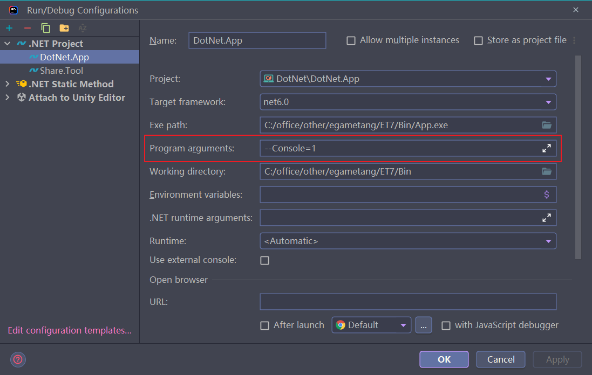
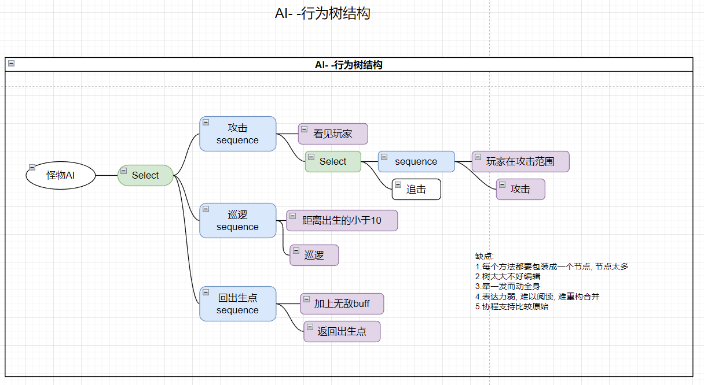
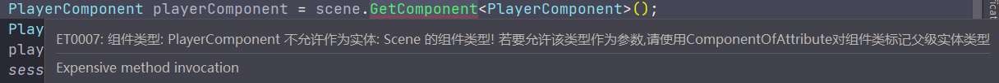
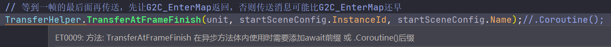

<!-- markdownlint-disable MD033 -->
# 网络游戏架构设计 笔记六

## 机器人与单元测试

* 机器人的作用
  1. 功能开发辅助
  1. 单元测试
  1. 性能压测
  1. 逻辑压测(针对每个系统的压测)
  1. 模拟真实玩家(匹配机器人)

服务端引用客户端代码实现机器人逻辑, 客户端引用服务端代码在 unity 跑服务器逻辑(Client Server)

### 命名空间

三个命名空间: `ET.Client` `ET.Server`, `ET` (针对Share目录前后端共享代码)

### Define.cs 全局宏管理

`Hotfix` 逻辑层没有宏处理, 通过 `Define.cs` 控制全局变量来实现同样的功能

### 工程目录结构

逻辑代码根目录:`Unity\Assets\Scripts\Codes`

* DotNet 服务端
  
  1. App 启动模块
  1. Core 核心代码
  1. Hotfix 逻辑层
  1. Model 数据层
  1. Loader 加载Dll,与初始化
  1. ThirdParty 第三方包 如: protobuf-net , Mongodb, NLog, kcp, Recast 等
* Share
  
  1. ExcelExporter 配置导表工具
  1. Proto2CS 协议生成工具
* Unity 客户端

  1. Core 核心代码
  1. Hotfix 逻辑层
  1. HotfixView 显示层逻辑层
  1. Model 数据层
  1. ModelView 显示层数据层
  1. Loader 加载Dll,与初始化
  1. ThirdParty 第三方包 如: protobuf-net , Mongodb, NLog, kcp, Recast 等

### ET中的测试用例

游戏开发适合: 协议级别的单元测试

ET机器人的实现方式, 使用真实的客户端逻辑登录服务器, 通过使用GM修改机器人账号的数据 如:`set lv 100`

之后再按照对应协议测试相关逻辑

* 技巧
  1. 利用协程 `await`
  2. 利用消息事件回调
  3. 不要用时间卡逻辑 , 用协程 `await`

### Robot 机器人测试(压测)

用于针对整体业务逻辑做测试(压测), 或者匹配机器人等业务

### ConsoleComponent 命令行组件

命令行组件指令:

```c#
public static class ConsoleMode
{
    public const string ReloadDll = "R";
    public const string ReloadConfig = "C";
    public const string ShowMemory = "M";
    public const string Repl = "Repl";
    public const string Debugger = "Debugger";
    public const string CreateRobot = "CreateRobot"; //CreateRobotConsoleHandler
    public const string Robot = "Robot"; //RobotConsoleHandler
}
```

`ConsoleComponent.Start`

```c#
while (true)
{
  ModeContex modeContex = self.GetComponent<ModeContex>();
  //子集命令  如: Robot>
  string line = await Task.Factory.StartNew(() =>
  {
      Console.Write($"{modeContex?.Mode ?? ""}> ");
      return Console.In.ReadLine();//异步等待控制台输入
  }, self.CancellationTokenSource.Token);
  line = line.Trim();
  switch (line)
  {
      case "":
          break;
      case "exit":
          self.RemoveComponent<ModeContex>();
          break;
      default:
      {
          string[] lines = line.Split(" ");
          //解析命令模式
          string mode = modeContex == null? lines[0] : modeContex.Mode;
          if (!self.Handlers.TryGetValue(mode, out IConsoleHandler iConsoleHandler))
          {
              Log.Console($"not found command: {line}");
              break;
          }
          if (modeContex == null)
          {
              modeContex = self.AddComponent<ModeContex>();
              modeContex.Mode = mode;
          }
          await iConsoleHandler.Run(modeContex, line);
          break;
      }
  }
}
```

## Console 启动参数

服务器启动参数添加 : `--Console=1` 添加 `ConsoleComponent` 命令行组件



## RobotCase 测试用例

针对具体功能逻辑做协议测试

### 测试用例启动方式

依然使用启动参数 : `--Console=1`

1. 输入:`Robot`, 进入RobotCase模式
1. `Robot> Run 1`, 执行 1 号测试用例
1. `Robot> RunAll` 将执行所有测试用例

### RobotConsoleHandler

```c#
case "Run":
{
    int caseType = int.Parse(ss[1]);
    RobotLog.Debug($"run case start: {caseType}");
    //通过 EventSystem.Invoke 分发到指定 Case 执行逻辑
    await EventSystem.Instance.Invoke<RobotInvokeArgs, ETTask>(caseType, new RobotInvokeArgs() { Content = content });
    RobotLog.Debug($"run case finish: {caseType}");
    break;
}
case "RunAll":
{
    FieldInfo[] fieldInfos = typeof (RobotCaseType).GetFields();
    foreach (FieldInfo fieldInfo in fieldInfos)
    {
        int caseType = (int)fieldInfo.GetValue(null);
        if (caseType > RobotCaseType.MaxCaseType)
        {
            RobotLog.Debug($"case > {RobotCaseType.MaxCaseType}: {caseType}");
            break;
        }
        RobotLog.Debug($"run case start: {caseType}");        
        await EventSystem.Instance.Invoke<RobotInvokeArgs, ETTask>(caseType, new RobotInvokeArgs() { Content = content});
        RobotLog.Debug($"---------run case finish: {caseType}");
    }
    break;
}
```

### ARobotCase

类似 `ATimer` 定时器, 基于 `EventSystem.Invoke` 关联 `RobotCase` 的逻辑分发并执行

### RobotCase_FirstCase

创建多个(12个) Robot 登录并进入场景, 并发送 `M2C_TestRobotCase` 协议

```c#
protected override async ETTask Run(RobotCase robotCase)
{
    Console.WriteLine($"Start FirstCase...");
    using ListComponent<Scene> robots = ListComponent<Scene>.Create();
    
    // 创建了两个机器人,生命周期是RobotCase,RobotCase_FirstCase.Run执行结束,机器人就会删除
    await robotCase.NewRobot(2, robots);
    using ListComponent<ETTask> robotsTasks = ListComponent<ETTask>.Create();
    robotsTasks.Add(robotCase.NewRobot(10, robots));
    await ETTaskHelper.WaitAll(robotsTasks);
    foreach (Scene robotScene in robots)
    {
        M2C_TestRobotCase response = await robotScene.GetComponent<Client.SessionComponent>().Session.Call(new C2M_TestRobotCase() {N = robotScene.Zone}) as M2C_TestRobotCase;
        if (response.N != robotScene.Zone)
        {
            // 跟预期不一致就抛异常,外层会catch住在控制台上打印
            throw new Exception($"robot case: {RobotCaseType.FirstCase} run fail!");
        }
    }
    Console.WriteLine($"FirstCase Finish.");
}
```

`RobotCase.NewRobot` 内部实现的是创建Client 连接, 登录并进入Map场景

```c#
clientScene = await Client.SceneFactory.CreateClientScene(zone, $"Robot_{zone}");
await Client.LoginHelper.Login(clientScene, zone.ToString(), zone.ToString());
await Client.EnterMapHelper.EnterMapAsync(clientScene);
```

### RobotCase_SecondCase

等待指定消息的返回, 再执行后续操作; 用于两个协议之间不是 RPC 关系串行操作

```c#
[MessageHandler(SceneType.Client)]
public class M2C_TestRobotCaseHandler:AMHandler<M2C_TestRobotCase2>
{
  protected override async ETTask Run(Session session, M2C_TestRobotCase2 message)
  {
    Log.Debug($"Robot SecondCase M2C_TestRobotCase");
    ObjectWait objectWait = session.ClientScene().GetComponent<ObjectWait>();
    //收到推送的 M2C_TestRobotCase2 协议, ObjectWait 通知回调
    objectWait?.Notify(new RobotCase_SecondCaseWait(){Error = WaitTypeError.Success,M2CTestRobotCase = message});
    await ETTask.CompletedTask;
  }
}

[Invoke(RobotCaseType.SecondCase)]
public class RobotCase_SecondCase: ARobotCase
{
  protected override async ETTask Run(RobotCase robotCase)
  {
    Scene      robotScene = await robotCase.NewRobot(1);
    ObjectWait objectWait = robotScene.GetComponent<ObjectWait>();
    robotScene.GetComponent<Client.SessionComponent>().Session.Send(new C2M_TestRobotCase2(){N = robotScene.Zone});
    // 等待 ObjectWait 通知后再执行
    RobotCase_SecondCaseWait robotCaseSecondCaseWait = await objectWait.Wait<RobotCase_SecondCaseWait>();
    if (robotCaseSecondCaseWait.M2CTestRobotCase.N != robotScene.Zone)
    {
      throw new Exception($"robot case:{RobotCaseType.SecondCase} run fail!");
    }
    ClientSceneManagerComponent.Instance.Remove((int)robotScene.Id);//测试完毕回收资源
  }
}
```

* 相关协议

```pb
message C2M_TestRobotCase2 // IActorLocationMessage
{
 int32 RpcId = 1;
 int32 N = 2;
}

message M2C_TestRobotCase2 // IActorMessage
{
 int32 N = 2;
}

message C2M_OfflineUnit // IActorLocationMessage
{
 int32 RpcId = 1;
}
```

### ObjectWait

用于保证代码串行化, 如:需要等待非 RPC 协议调用返回的时候

## 机器人启动方式

创建两个机器人, 在命令行输入指令: `CreateRobot --Num=2`

### CreateRobotConsoleHandler 解析指令参数

解析指令参数并创建对应Robot

服务器启动时已经将 RobotScene 添加到 Root(根Scene) `RootScene SceneFactory.CreateServerScene -> EntitySceneFactory.CreateScene`

```c#
CreateRobotArgs options = null;
Parser.Default.ParseArguments<CreateRobotArgs>(content.Split(' '))
        .WithNotParsed(error => throw new Exception($"CreateRobotArgs error!"))
        .WithParsed(o => { options = o; });
// 获取当前进程的RobotScene
using (ListComponent<StartSceneConfig> thisProcessRobotScenes = ListComponent<StartSceneConfig>.Create())
{   //配置中的 Robot Scene
    List<StartSceneConfig> robotSceneConfigs = StartSceneConfigCategory.Instance.Robots;
    foreach (StartSceneConfig robotSceneConfig in robotSceneConfigs)
    {
        if (robotSceneConfig.Process != Options.Instance.Process)
        {
            continue;
        }
        thisProcessRobotScenes.Add(robotSceneConfig);
    }
    // 创建机器人
    for (int i = 0; i < options.Num; ++i)
    {
        int index = i % thisProcessRobotScenes.Count;
        StartSceneConfig robotSceneConfig = thisProcessRobotScenes[index];
        //服务器启动时已经将 RobotScene 添加到 RootScene SceneFactory.CreateServerScene -> EntitySceneFactory.CreateScene
        Scene robotScene = ServerSceneManagerComponent.Instance.Get(robotSceneConfig.Id);
        RobotManagerComponent robotManagerComponent = robotScene.GetComponent<RobotManagerComponent>();
        //RobotManagerComponent 执行机器人登录, 进入场景逻辑
        Scene robot = await robotManagerComponent.NewRobot(Options.Instance.Process * 10000 + i);
        robot.AddComponent<AIComponent, int>(1);//添加 AI 组件, AI所属ID = 1
        Log.Console($"create robot {robot.Zone}");
        await TimerComponent.Instance.WaitAsync(2000);
    }
}
```

### RobotManagerComponent 创建 Robot ClientScene

发送登录, 进入场景等协议; 实际应用中可以添加GM指令填充机器人属性

ET Demo 这里是将机器人逻辑都放在 `RobotManagerComponent` 里面

如果需要登录大量的 Robot 可以将这部分逻辑移植到独立的 `RobotAgent` 节点中(可以配置部署多个), 从而提高机器人部署数量

```c#
public static async ETTask<Scene> NewRobot(this RobotManagerComponent self, int zone)
{
    Scene clientScene = null;
    clientScene = await Client.SceneFactory.CreateClientScene(zone, "Robot");
    await Client.LoginHelper.Login(clientScene, zone.ToString(), zone.ToString());
    await Client.EnterMapHelper.EnterMapAsync(clientScene);
    Log.Debug($"create robot ok: {zone}");
    return clientScene;
}
```

## AI

用途:

1. 怪物, NPC等行为
2. 飞行道具
3. 机器人
4. 托管(挂机)

AI常用实现方式:

1. 状态机

   缺点: 每两个状态都可能转换, 复杂度是N平方
2. 行为树

   缺点:
      1. 每个方法都要包装成一个节点, 节点太多
      1. 树太大不好编辑
      1. 牵一发而动全身
      1. 表达力弱, 难以阅读, 难重构合并
      1. 协程支持比较原始

   
3. 深度学习

> AI的本质: 根据当前本身的状态, 执行一个行为

### ET中的AI改进 行为机

1. 直接使用代码编写AI
2. 协程化, 每个节点就是一个协程
3. 节点包含条件跟行为

什么是行为机

顾名思义,类比状态机每个节点是一个状态,行为机每个节点是描述一种行为.行为机每个节点之间是互斥的,并且节点相互之间完全不用关心是怎么切换的


### AI 行为机 配置文件


### AIComponent AI组件

```c#
//每秒执行一次 Check()
public class AIComponentAwakeSystem: AwakeSystem<AIComponent, int>
{
    protected override void Awake(AIComponent self, int aiConfigId)
    {
        self.AIConfigId = aiConfigId;
        self.Timer = TimerComponent.Instance.NewRepeatedTimer(1000, TimerInvokeType.AITimer, self);
    }
}
public static void Check(this AIComponent self)
{
    if (self.Parent == null)
    {
        TimerComponent.Instance.Remove(ref self.Timer);
        return;
    }
    //AI所属Id
    var oneAI = AIConfigCategory.Instance.AIConfigs[self.AIConfigId];
    //依次执行AI行为节点 , Dictionary<int, SortedDictionary<int, AIConfig>> AIConfigs 为有序字典
    foreach (AIConfig aiConfig in oneAI.Values)
    {
        AIDispatcherComponent.Instance.AIHandlers.TryGetValue(aiConfig.Name, out AAIHandler aaiHandler);
        if (aaiHandler == null)
        {
            Log.Error($"not found aihandler: {aiConfig.Name}");
            continue;
        }
        // 判断执行条件
        int ret = aaiHandler.Check(self, aiConfig);
        if (ret != 0)//执行下一个AI行为节点
        {
            continue;
        }
        if (self.Current == aiConfig.Id)
        {
            break;
        }
        self.Cancel(); // 取消之前的行为
        ETCancellationToken cancellationToken = new ETCancellationToken();
        self.CancellationToken = cancellationToken;
        self.Current = aiConfig.Id;
        //执行当前行为
        aaiHandler.Execute(self, aiConfig, cancellationToken).Coroutine();
        Log.Debug($"current ai :{self.Current}");
        return;
    }
    
}
```

### AI_XunLuo

执行5秒, 跳转到下一个行为节点

```c#
public override int Check(AIComponent aiComponent, AIConfig aiConfig)
{
    long sec = TimeHelper.ClientNow() / 1000 % 15;
    if (sec >= 10) // 执行5秒
    {
        return 0;
    }
    return 1;
}
```

### AI_Attack

执行10秒, 跳转到下一个行为节点

```c#
public override int Check(AIComponent aiComponent, AIConfig aiConfig)
{
    long sec = TimeHelper.ClientNow() / 1000 % 15;
    if (sec < 10) //执行10秒
    {
        return 0;
    }
    return 1;
}
```

### 定义实现AI逻辑

[参考Book -- 6.2AI框架-行为机.md](https://github.com/egametang/ET/blob/master/Book/6.2AI%E6%A1%86%E6%9E%B6-%E8%A1%8C%E4%B8%BA%E6%9C%BA.md)

[ET AI框架](https://www.yuque.com/et-xd/docs/xv5zng)

a. 巡逻的伪代码:

```csharp
while (true)
{
    pos = 出生点周围找一个点
    bool ret = await MoveToAsync(pos,cancelToken);
    if (!ret) // false表示协程取消, 则需要return,停止整个协程
    {
        return;
    }
    // 移动到了,随机等待2-4秒
    randomTime = RandomHelper.Random(2000, 4000);
    bool ret = await TimeComponent.Instance.Wait(randomTime, cancelToken)
    if (!ret) // false表示协程取消, 则需要return,停止整个协程
    {
        return;
    }
}
```

这样,如果b c条件不满足的话,怪物就永远在巡逻节点协程中,不停的找一个点移动,等待,移动,等待

b. 选择目标追击并且攻击目标节点的伪代码:

```csharp
while (true)
{
    target = SelectTarget()
    while (true)
    {
        while (true)
        {
            // 追击目标
            pos = 计算离目标0.2米的一个点
            // 这里不能以目标作为移动目标,因为怪物要距离玩家稍远一点
            await MoveToAsync(pos, cancelToken);
            if (!ret) // false表示协程取消, 则需要return,停止整个协程
            {
                return;
            }
            // 距离玩家 < 0.5米,表示追到了玩家,就不需要追了
            if (距离玩家<0.5米)
            {
                break;
            }            
        }
        // 追击到了,攻击玩家
        while (true)
        {
            // 
            spellId = SelectSpell();
            if (spellId == 0) // 可能技能在cd,等待500ms再试
            {
                bool ret = await TimeComponent.Instance.Wait(500, cancelToken)
                if (!ret) // false表示协程取消, 则需要return,停止整个协程
                {
                    return;
                }
                continue;
            }
            await CastSpell(target);
            // 攻击完成后停止一段时间
            bool ret = await TimeComponent.Instance.Wait(1000, cancelToken)
            if (!ret) // false表示协程取消, 则需要return,停止整个协程
            {
                return;
            }

            // 距离玩家 > 0.5米, 距离玩家远了,break攻击循环,继续追击
            if (距离玩家<0.5米)
            {
                break;
            }    
        }
    }
    // 这里加个time,防止上面两个while循环没有进入,结果就会导致一直执行 target = 选择一个目标 这句话,会导致死循环
    bool ret = await TimeComponent.Instance.Wait(100, cancelToken)
    if (!ret) // false表示协程取消, 则需要return,停止整个协程
    {
        return;
    }
}
```

c. 返回出生点伪代码:

```csharp
while (true)
{
    // 整个返回过程是无敌的
    using (Buff buff = AddBuff(无敌))
    {
        pos = 找到离出生点10米的点
        bool ret = await MoveToAsync(pos,cancelToken);
        if (!ret) // false表示协程取消, 则需要return,停止整个协程
        {
            return;
        }
        // 移动到了, buff会删除,或者切换成其它状态,协程退出也会删除无敌buff
    }
}
```

## 架构设计

* `C2G_EnterMapHandler` -> Gate节点先创建了一个动态 Map Scene,把Unit从DB中加载放进来,然后传送到真正的Map中,这样 <big>登陆</big> 跟 <big>传送</big> 的逻辑就完全一样了
* `IGetComponent`
  
  ```c#
  // GetComponentSystem有巨大作用,比如每次保存Unit的数据不需要所有组件都保存,只需要保存Unit变化过的组件
  // 是否变化可以通过判断该组件是否GetComponent,Get了就记录该组件
  // 这样可以只保存Unit变化过的组件
  // 再比如传送也可以做此类优化
  public interface IGetComponent
  ```

## 分析器

[分析器文档](https://www.yuque.com/et-xd/docs/izccsn#r9K83)

[分析器介绍](https://www.yuque.com/u28961999/yms0nt)

### ET0001 ChildOf

在ET中使用AddChild、AddChildWithId 方法对父实体添加子实体时,要求父实体必须含有ChildType标签.

约束目的：

1. 帮助开发者快速了解特定实体的子实体类型,提升代码可读性.
2. 约束开发者滥用添加子实体功能,尽量保证一个父实体只拥有一类子实体,提升代码可维护性.

* ET6 在父类上标记

  ```c#
  [ChildType] //这样Session可以添加任意类似的子实体
  public sealed class Session: Entity, IAwake<AService>, IDestroy{}

  [ChildType(typeof(子类型))] //这样Session可以添加任意类似的子实体
  public sealed class Session: Entity, IAwake<AService>, IDestroy{}
  ```

* ET7 在子类上标记

  ```c#
  [ChildOf]
  public class LockInfo: Entity, IAwake<long, CoroutineLock>, IDestroy{}

  [ChildOf(typeof(父类型))]
  public class LockInfo: Entity, IAwake<long, CoroutineLock>, IDestroy{}
  ```

### ET0002 FriendOf

约束目的：
ET基于ECS思想设计,实体的字段成员需要使用public 关键字,这导致实体成员可以被任意访问.

FriendClass标签则相当于ET定义的实体字段访问权限,能够帮助开发者维护不同组件间的字段访问规范.

实现了 `{get,set}` 访问器的字段不受此约束

* ET6 标记方式

  ```c#
  [FriendClass(typeof(OpcodeTypeComponent))]
  public static class OpcodeTypeComponentSystem
  ```

* ET7 标记方式

  ```c#
  [FriendOf(typeof(OpcodeTypeComponent))]
  public static class OpcodeTypeComponentSystem
  ```

### ET0003 EntityClassDeclarationAnalyzer

实体类只能继承自`ET.Entity`, 禁止多层继承.


### ET0004 HotfixProjectFieldDeclarationAnalyzer

Hotfix程序集中不允许声明非Const字段, 需要保持Hotfix的无状态性质


### ET0005 ClassDeclarationInHotfixAnalyzer

限制 `Hotfix` 程序集中只能声明含有 `BaseAttribute` 子类特性的类(包括实体的生命周期类,分发逻辑类)或静态类.

可以理解为只能声明实体的生命周期类，分发逻辑类, 静态辅助类三种。


### ET0006 EntityMethodDeclarationAnalyzer

实体类禁止声明方法


框架内的实体类若需要特殊处理绕过该约束可以添加 `EnableMethod` 标签


### ET0007 ComponentOf

实体类添加或获取组件需要对组件添加ComponentOf标签,表明该组件的父实体类型。



* 指定任意多种父组件类型

  ```c#
  [ComponentOf]
  public class ObjectWait: Entity, IAwake, IDestroy
  ```

* 指定父组件类型

  ```c#
  [ComponentOf(typeof(Scene))]
  public class PlayerComponent : Entity, IAwake, IDestroy
  ```

### ET0008 ET0009 ETTaskAnalyzer

在非异步方法内使用ETTask时，必须添加.Coroutine()后缀。

在异步方法体内使用ETTask时需要添加await前缀 或 .Coroutine()后缀。



### 环形调用 StaticClassCircularDedendencyAnalyzer

两个静态类之间禁止环形依赖

> 就是A类调用了B类的方法，B类里面又调用了A类的方法，这就是循环调用

如果确实需要相互调用, 可以把这两个相关的方法抽出到一个新的类, 来解决循环调用的问题

### UniqueId 唯一Id常量 替换 枚举

唯一Id字段数值区间约束

被该标签标记的类会约束成员的const int 字段在类内部唯一 且在指定的数值区间内

```c#
[UniqueId(100000, 500000)]
public static class ErrorCore
```

### ET0010 EntityDelegateDeclarationAnalyzer

实体类禁止声明实体字段

entity中不允许直接把另外一个entity作为成员

直接引用另外一个entity，有可能引用的entity释放了。成员却没设置成null

用ID的方式建立引用

```c#
// public Cell Cell; //实体类禁止声明实体字段

private long cellInstanceId;
public Cell Cell
{
    get
    {
        return Root.Instance.Get(this.cellInstanceId) as Cell;
    }
    set
    {
        this.cellInstanceId = value.InstanceId;
    }
}
```
