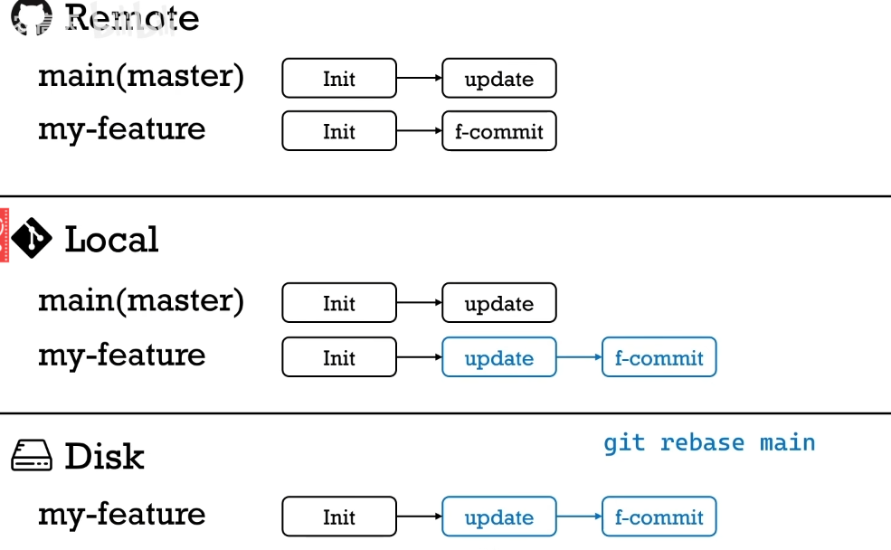
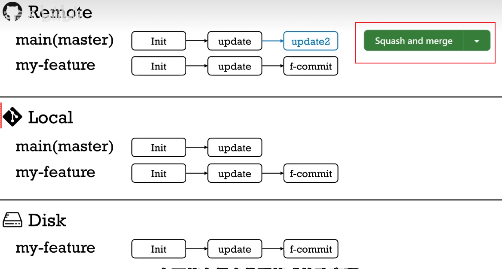

<!-- markdownlint-disable MD033 -->
# github技巧

## 目录

## 搜索技巧

- 找开源项目的一些途径

  - `https://github.com/trending/`
  - `https://github.com/521xueweihan/HelloGitHub`
  - `https://github.com/ruanyf/weekly`
  - `https://www.zhihu.com/column/mm-fe`
  
- 特殊的查找资源小技巧-常用前缀后缀

  - 找百科大全 awesome xxx
  - 找例子 xxx sample
  - 找空项目架子 xxx starter / xxx boilerplate
  - 找教程 xxx tutorial

## git 工作流

- [十分钟学会正确的github工作流](https://www.bilibili.com/video/BV19e4y1q7JJ/?spm_id_from=333.337.search-card.all.click&vd_source=ff8fbad1e1bf469ad221e1b40db87ca5)

  ```sh
  1.git clone xxxx #到本地
  2.git checkout -b xxx-feature #切换至新feature分支
  #相当于复制了remote的仓库到本地的xxx分支上
  3.修改或者添加本地代码（部署在硬盘的源文件上）
  4.git diff #查看自己对代码做出的改变
  5.git add #上传更新后的代码至暂存区
  6.git commit #可以将暂存区里更新后的代码更新到本地git
  7.git push origin xxx-feature #将本地的xxxgit分支上传至github上的git
  ```

  

  如果在写自己的代码过程中发现远端GitHub上代码出现改变）

  ```sh
  1.git checkout main #切换回main分支
  2.git pull origin master(main) #将远端修改过的代码再更新到本地
  3.git checkout xxx-feature #回到feature分支
  4.git rebase main #在feature分支上，先把main移过来，然后根据commit来修改成新的内容
  #（中途可能会出现，rebase conflict -----》手动选择保留哪段代码）
  5.git push -f origin xxx-feature #把rebase后并且更新过的代码再push到远端github上
  #（-f ---》强行）
  6.原项目主人采用pull request 中的 squash and merge 合并所有不同的commit
  ```

  
