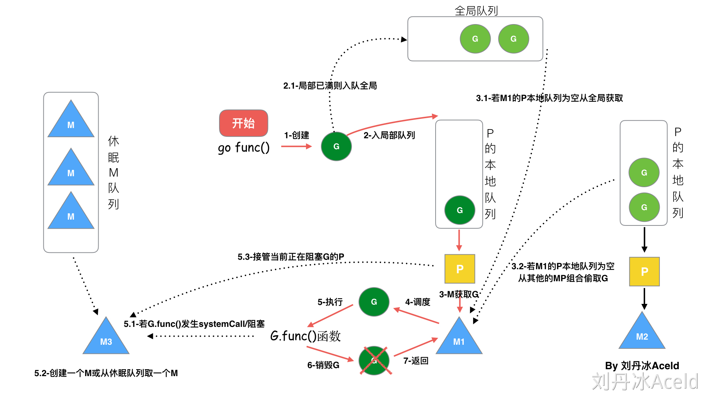
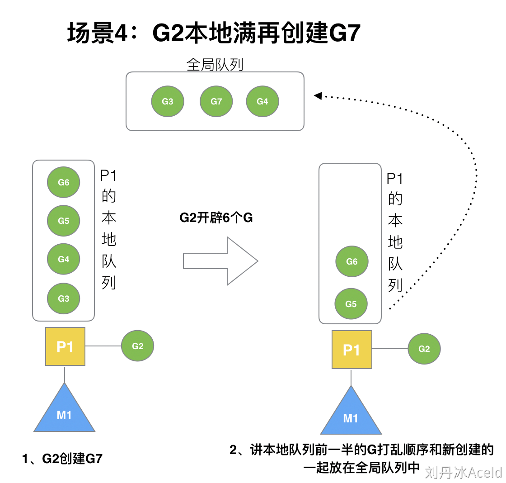
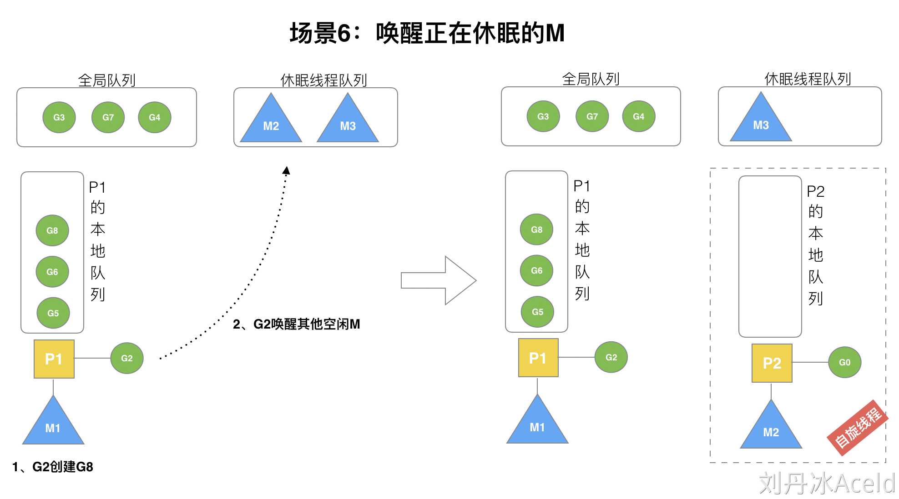
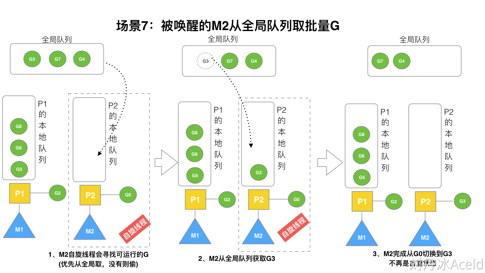
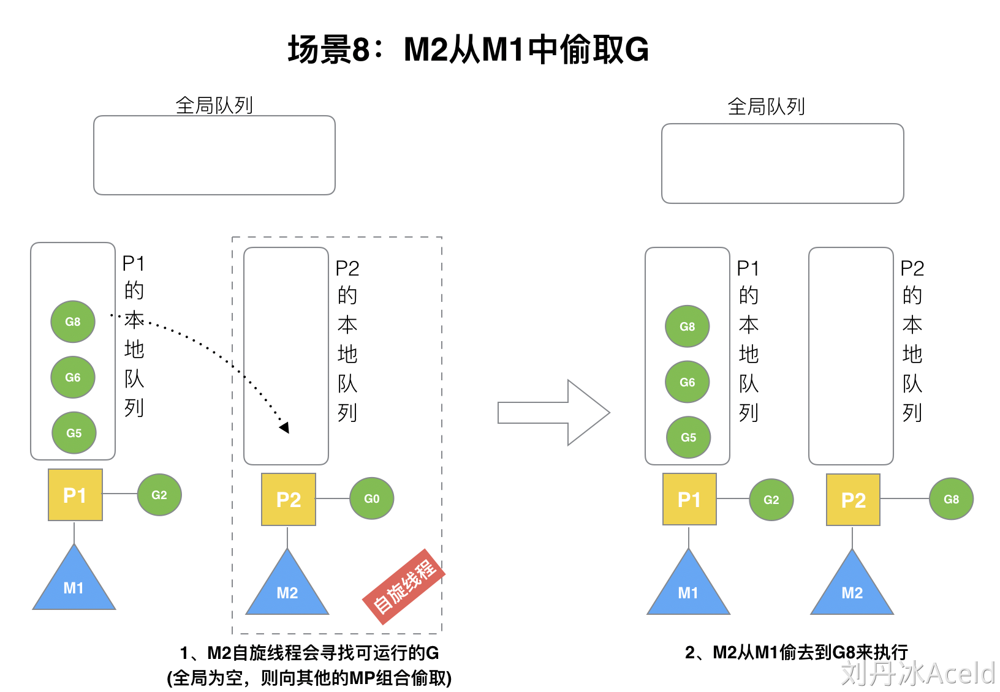
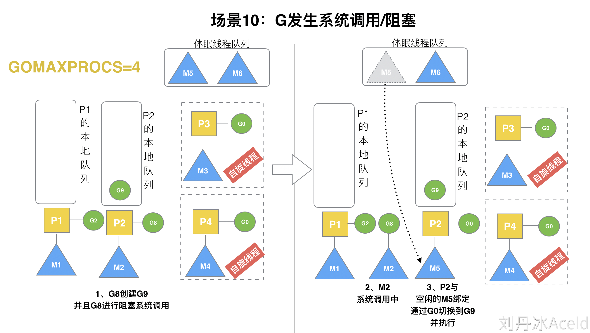
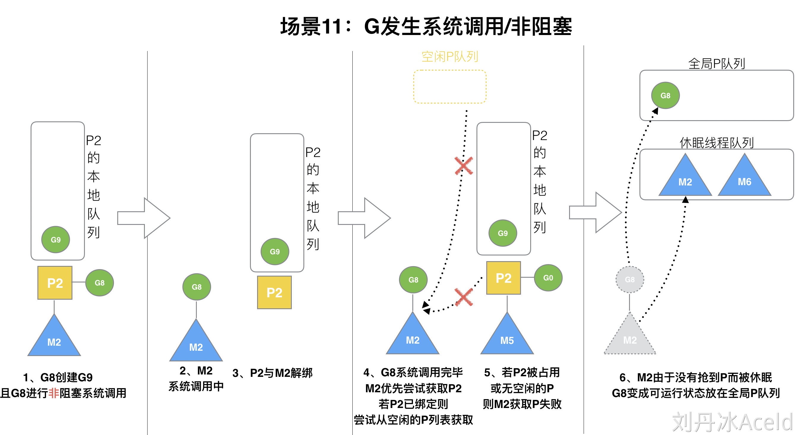

<!-- markdownlint-disable MD033 -->
# GMP协程调度器

参考:[Golang的协程调度器原理及GMP设计思想](https://www.yuque.com/aceld/golang/srxd6d)

## 目录

- [GMP协程调度器](#gmp协程调度器)
  - [目录](#目录)
    - [GMP模型](#gmp模型)
      - [P和M的数量](#p和m的数量)
    - [调度器的设计策略](#调度器的设计策略)
    - [go func() 调度流程](#go-func-调度流程)
    - [调度器的生命周期](#调度器的生命周期)
    - [Go调度器GMP调度场景过程分析](#go调度器gmp调度场景过程分析)
      - [就近优先原则](#就近优先原则)
      - [P本地队列已满在创建G](#p本地队列已满在创建g)
      - [在创建G时，运行的G会尝试唤醒其他空闲的P和M组合去执行](#在创建g时运行的g会尝试唤醒其他空闲的p和m组合去执行)
      - [自旋P尝试从全局队列中获取一批G放到P的本地队列中](#自旋p尝试从全局队列中获取一批g放到p的本地队列中)
      - [自旋P尝试从其他P的队列中盗取任务](#自旋p尝试从其他p的队列中盗取任务)
      - [自旋线程的最大限制](#自旋线程的最大限制)
      - [发生阻塞操作的P解绑后的状态](#发生阻塞操作的p解绑后的状态)
      - [执行完阻塞操作的M与G的后续调度](#执行完阻塞操作的m与g的后续调度)

### GMP模型

- `G:gorutine` 协程
- `P:processor` 处理器
- `M:thread` 线程

> Processor 它包含了运行goroutine的资源, 如果想运行goroutine, 必须先获得一个Processor, P中包含了可运行的G队列


1. **全局队列(Global Queue)** : 存放等待运行的G
2. **P的本地队列**: 存放的也是等待运行的G,数量有限,不超过256个.新建G时,优先存放在P本地队列,如果满了会放入全局队列(会把一半的G移动到全局队列)
3. **P列表**: P都在程序启动时创建,并保存在数组中,最多有 `GOMAXPROCS` 个(可配置)
4. **M**: 线程将和P做绑定,从P获取任务G,并执行.当P队列为空,会尝试从**全局队列**拿一批G放到P的本地队列,或从其他P的本地队列**偷**一半放到**自己的P队列中**

#### P和M的数量

- P的数量:
  - 环境变量`$GOMAXPROCS`
  - 在程序中通过`runtime.GOMAXPROCS(n)`设置
- M的数量:
  - 如果程序试图使用超过该限制的线程数，就会导致程序崩溃。 `runtime/debug.SetMaxThreads` 返回之前的设置，初始设置为10000个线程
  - 有一个M阻塞, 就会有一个P创建或者切换另一个M

> M与P的数量没有绝对关系，一个M阻塞，P就会去创建或者切换另一个M，所以，即使P的默认数量是1，也有可能会创建很多个M出来

### 调度器的设计策略

- 复用线程
  - work stealing (工作窃取)机制

    当本线程P队列为空,尝试从全局或者其他P偷取G,而不是消耗线程
  - hand off

    当本线程因为G进行**阻塞操作**, 线程释放与P的绑定关系,把P转移给其他空闲的线程执行
- 利用并行 `GOMAXPROCS` 设置P的数量量，最多有 `GOMAXPROCS` 个线程分布在多个CPU上同时运行
- 抢占 在Go
中，一个goroutine最多占⽤用CPU 10ms(时间片调度机制)，防⽌止其他goroutine被饿死
- 全局队列 当P的本地队列为空时，优先从全局队列获取，如果全局队列为空时则通过`work stealing`机制从其他P的本地队列偷取G

### go func() 调度流程



- 当M执行的G发生 syscall或者阻塞操作时,M会阻塞(上图步骤5)
  - M1 与 P1 将立即解绑
  - P1将会判断
    - 如果P1本地队列有G / 全局队列有G 或 有空闲的M(空闲线程),P1会里面唤醒一个M(如图中M3)和它绑定(可能变成*自旋状态*):

      `5-1,5-2,5-3`所描述的内容
    - 否则P1会加入到空闲P列表中
  - M1阻塞任务结束
    - 优先获取P1,
    - 若P1已经和其他线程绑定,则尝试从空闲P列表中获取P
    - 若P1被占用,空闲P列表为空,M1获取P失败
      - M1会被休眠
      - M1相关的G会被放入到全局队列

> 自旋线程（P本地队列中没有G但为运行状态的线程，不断寻找G）

### 调度器的生命周期

- M0

  M0是启动后的编号为0的主线程,这个M对应的实例会在全局变量 `runtime.m0` 中, 不需要在 `heap` 上分配,

  M0负责执行初始化操作和启动第一个 `G` , 之后M0就和其他的M一样了
- G0

  G0是每次启动一个M都会创建的 `gourtine`, `G0` 仅负责调度工作, `G0` 不指向任何可执行的函数,

  每个M都会有一个自己的 `G0` , 在调度或系统调用是会使用 `G0` 的栈空间, 全局变量的 `G0` 就是 M0 的 `G0` 

### Go调度器GMP调度场景过程分析

#### 就近优先原则


- P拥有G1，M1获取P后开始运行G1，G1使用go func()创建了G2，为了局部性G2优先加入到P1的本地队列
- G1运行完成后(函数：`goexit`)，M上运行的`goroutine`切换为`G0`，`G0`负责调度时协程的切换（函数：`schedule`）。从P的本地队列取`G2`，从`G0`切换到`G2`，并开始运行`G2`(函数：`execute`)。实现了线程M1的复用。

#### P本地队列已满在创建G



- P1本地队列已满,再创建 `G7`, 此时会将P1本地队列的前一半的G打乱顺序和新创建的 `G7` 一起放到全局队列中

#### 在创建G时，运行的G会尝试唤醒其他空闲的P和M组合去执行



- 假定G2唤醒了M2，M2绑定了P2，并运行G0，但P2本地队列没有G，M2此时为自旋线程（没有G但为运行状态的线程，不断寻找G）。

#### 自旋P尝试从全局队列中获取一批G放到P的本地队列中



```go
n =  min(len(GQ) / GOMAXPROCS +  1,  len(GQ) / 2 )
n = min(3/2+1,3/2)
n = 1
```

`len(GQ) // 全局队列长度`

- M2从全局队列取1个G（即G3）移动P2本地队列，然后完成从G0到G3的切换，运行G3

#### 自旋P尝试从其他P的队列中盗取任务



- 全局队列已经没有G，那M2就要执行`work stealing`(偷取)：从其他有G的P哪里偷取一半G过来，放到自己的P本地队列。P2从P1的本地队列尾部取一半的G，本例中一半则只有1个G8，放到P2的本地队列并执行

#### 自旋线程的最大限制


- **自旋**本质是在运行，线程在运行却没有执行G，就变成了浪费CPU.  为什么不销毁现场，来节约CPU资源。因为创建和销毁CPU也会浪费时间，我们希望当有新 `goroutine` 创建时，立刻能有M运行它，如果销毁再新建就增加了时延，降低了效率。
- 系统中最多有 `GOMAXPROCS` 个自旋的线程(当前例子中的 `GOMAXPROCS=4`，所以一共4个P)，多余的没事做线程会让他们休眠

#### 发生阻塞操作的P解绑后的状态



- M2和P2立即解绑，P2会执⾏以下判断：如果P2本地队列列有G、全局队列有G 或有空闲的M，P2都会⽴⻢唤醒1个M和它绑定，

  否则P2会**加入到空闲P列表**，等待M来获取可⽤的P。

  本场景中，P2本地队列列有G9，可以和其他空闲的线程M5绑定。

#### 执行完阻塞操作的M与G的后续调度



- 阻塞操作时M2和P2解绑，但M2会记住P2.
- 当G8和M2退出系统调用时，会尝试获取P2，如果无法获取，则获取空闲的P
- 如果依然没有，G8会被记为可运行状态，并加入到全局队列,M2因为没有P的绑定而变成休眠状态(**长时间休眠等待GC回收销毁**)