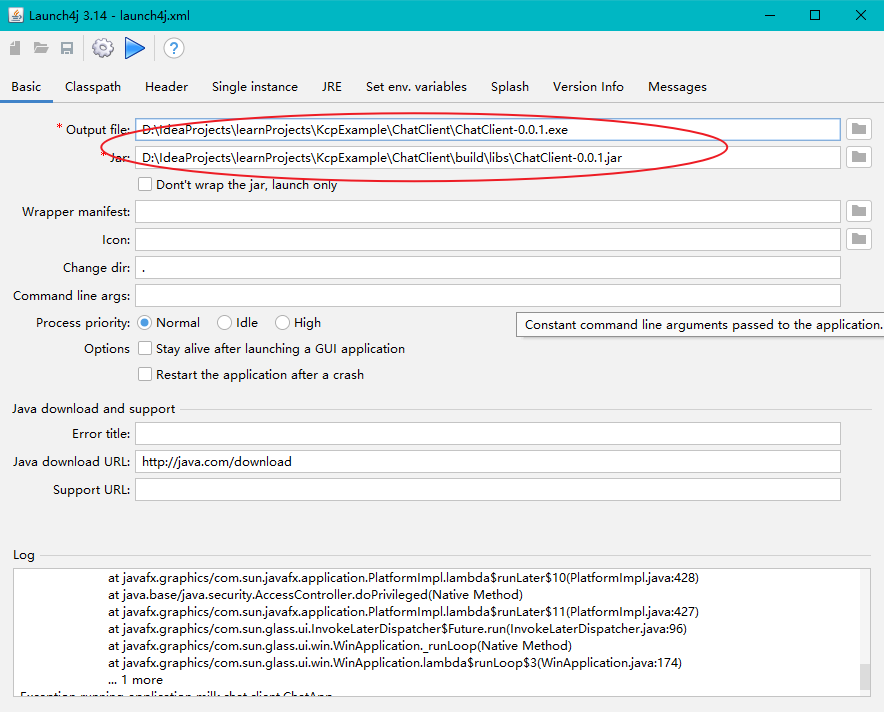
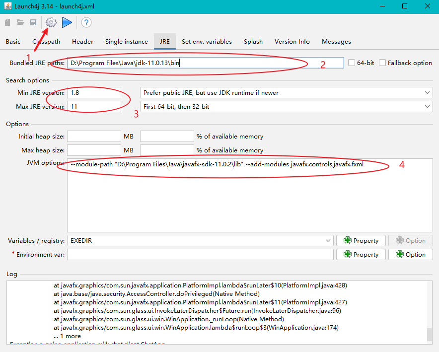

javafx开发笔记
---
1. [中文官网](https://openjfx.cn/)
    
    [JavaFX jdk11以后的下载地址](https://openjfx.cn/dl/)

    [JavaFX 8 教程 （中文）](http://code.makery.ch/library/javafx-8-tutorial/zh-cn/)

    [javafx and intellij 英文官方文档](https://openjfx.io/openjfx-docs/)
1. [主题 themes](https://www.delftstack.com/howto/java/java-fx-themes/)

    * [jmetro](https://pixelduke.com/java-javafx-theme-jmetro/)
1. [javaFx 组件库](https://github.com/sshahine/JFoenix)
1. view与controller关联

    * 指定 fxml与控制器(controller class) 建立关联
      ```xml
      fx:controller="milk.chat.client.LoginController"
      ```
1. 使用 [launch4j](http://launch4j.sourceforge.net/) 将 javaFX程序打包 exe
    * 操作方式:
        1. 配置输入jar和输出exe文件路径
        
                        
        1. 相关参数设置 分别对应如下:
            1. 设置`launch4j`配置文件路径
            1. 配置JDK路径
            1. 配置JRE版本信息
            1. 配置JVM启动参数 内容为:
                
                `--module-path "D:\Program Files\Java\javafx-sdk-11.0.2\lib" --add-modules javafx.controls,javafx.fxml`

            