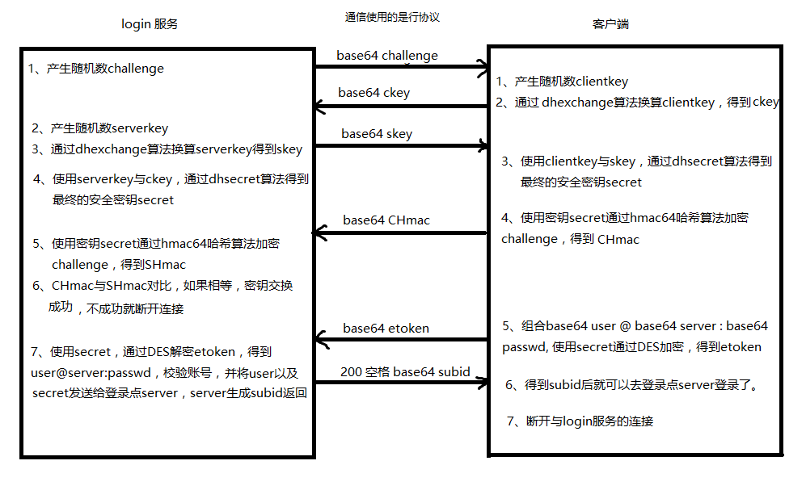

loginserver登录服务
---
## 加密算法
### DHexchange密钥交换算法
* [密钥交换算法即DH算法：Diffie-Hellman算法](https://www.liaoxuefeng.com/wiki/1252599548343744/1304227905273889)
* crypt 加密和交换密钥 API
    ```lua
    package.cpath = "luaclib/?.so"
    local crypt = require "client.crypt"
    --如果在skynet中使用直接 local crypt = require "skynet.crypt"
    ​
    --dhexchange转换8字节的key
    crypt.dhexchange(key)
    ​
    --通过key1与key2得到密钥
    crypt.dhsecret(key1, key2)
    ```
* `64-testdhexchange.lua`
    ```lua
    package.cpath = "luaclib/?.so"
    local crypt =require "client.crypt"

    local clientkey = '11111111'
    print('clientkey:',clientkey) --密钥明文
    local ckey = crypt.dhexchange(clientkey) --加密密钥
    print('ckey:\t',crypt.hexencode(ckey)) --密钥加密后打印

    local serverkey = '22222222'
    print('serverkey:',serverkey)
    local skey = crypt.dhexchange(serverkey) --加密密钥
    print('skey:\t',crypt.hexencode(skey)) --打印加密密钥

    local csecret = crypt.dhsecret(skey,clientkey) --交换密钥; 加密key1,非加密key2 
    print('use skey clientkey dhsecret:',crypt.hexencode(csecret)) --打印交换密钥

    local ssecret = crypt.dhsecret(ckey,serverkey)
    print('use ckey serverkey dhsecret:',crypt.hexencode(ssecret))

    ssecret = crypt.dhsecret(ckey,skey) --错误使用方式
    print('use ckey serverkey dhsecret:',crypt.hexencode(ssecret))
    ```
    控制台输出:

    ```sh
    $ ./3rd/lua/lua ../study-skynet/64-testdhexchange.lua #注意这里当前目录为 ./skynet 目录下
    clientkey:      11111111
    ckey:           d58a469cfded705e
    serverkey:      22222222
    skey:           b36021d9c4c51b0c
    use skey clientkey dhsecret:    956912b688b33b42
    use ckey serverkey dhsecret:    956912b688b33b42
    use ckey serverkey dhsecret:    c719e55f0a34dce8 #无效加密
    ```
### crypt 其它API
* 随机数
  ```lua
  --产生一个8字节的随机数，一般作为对称加密算法的随机密钥
  crypt.randomkey()
  ```
* hmac64哈希算法
  ```lua
  --HMAC64运算利用哈希算法，以一个密钥secret和一个消息challenge为输入，生成一个消息摘要hmac作为输出。
  local hmac = crypt.hmac64(challenge, secret)
  ```
* base64编解码
  ```lua
  --编码
  crypt.base64encode(str)
  ​
  --解码
  crypt.base64decode(str)
  ```
* DES加解密
  ```lua
  --用key加密plaintext得到密文，key必须是8字节
  crypt.desencode(key, plaintext)
  --用key解密ciphertext得到明文，key必须是8字节
  crypt.desdecode(key, ciphertext)
  ```
* hashkey 算法
  ```lua
  --云风自实现的hash算法，只能哈希小于8字节的数据，返回8字节数据的hash
  crypt.hashkey(str)
  ```
* `65-testclientcrypt.lua`
  ```lua
  package.cpath = "luaclib/?.so"
  local crypt = require "client.crypt"
  --如果在skynet中使用直接 local crypt = require "skynet.crypt"

  local challenge = crypt.randomkey() --随机产生challenge
  print('challenge:',crypt.hexencode(challenge))

  local clientkey = crypt.randomkey() --随机产生clientkey
  print('clientkey:',crypt.hexencode(clientkey))
  local ckey = crypt.dhexchange(clientkey) --得到ckey
  print('ckey:\t',crypt.hexencode(ckey))
  print('ckey base64:\t',crypt.base64encode(ckey)) --ckey base64编码

  local serverkey = crypt.randomkey() --随机生成serverkey
  print('serverkey:',crypt.hexencode(serverkey))
  local skey = crypt.dhexchange(serverkey) --得到skey
  print('skey:\t',crypt.hexencode(skey))
  print('skey base64:\t',crypt.base64encode(skey)) --skey base64编码

  local ssecret = crypt.dhsecret(ckey,serverkey) --交换密钥
  local csecret = crypt.dhsecret(skey,clientkey)
  print('ssecret:\t',crypt.hexencode(ssecret))
  print('csecret:\t',crypt.hexencode(csecret))

  local SHmac = crypt.hmac64(challenge,ssecret) --hmac64哈希加密challenge
  local CHmac = crypt.hmac64(challenge,csecret)
  print('SHmac:\t',crypt.hexencode(SHmac))
  print('CHmac:\t',crypt.hexencode(CHmac))

  print('SHmac base64:\t',crypt.base64encode(SHmac))
  print('CHmac base64:\t',crypt.base64encode(CHmac))

  local etoken = crypt.desencode(csecret,"user@server:passwd") --etoken DES加密
  local etokenBase64 = crypt.base64encode(etoken) --etoken base64编码
  print('etoken base64:\t',etokenBase64)

  local etokenDeBase64 = crypt.base64decode(etokenBase64) --etoken base64解码
  print('etoken base64 decode:\t',etokenDeBase64)
  local cetoken = crypt.desdecode(ssecret,etokenDeBase64) --etoken DES解密
  print('cetoken:\t',cetoken)
  ```
## Loginserver原理
