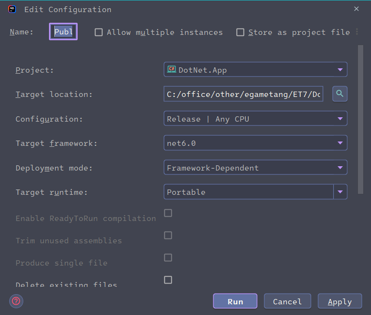

<!-- markdownlint-disable MD033 -->
<!-- markdownlint-disable MD024 -->
# ET_字母哥_3期教程笔记

## 服务端应用程序的发布

* 发布指令: `dotnet publish -r linux-x64 --no-self-contained --no-dependencies -c Release`

  将 `linux-x64` 替换成 `win-x64` 即可发布windows 应用程序
* `Rdier` 打包发布
  
  

  

## ET框架多进程部署

### 相关配置

* `StartMachineConfig` 机器内网/外网地址/守护进程端口(多机器配置)
* `StartProcessConfig` 进程ID配置/部署机器包含的进程配置
  
  需要添加 :
  |程序名|
  |-|
  |AppName|
  |string|

* `StartSceneConfig` Gate/Map 等场景配置对应进程配置
* `StartZoneConfig` 区服ID/数据库配置

### 监听进程

 Watcher 监控本机其他进程是否奔溃报错邮件/重启等操作

### 正式部署时关闭输出流(Console)日志选项

关闭对命令行的日志输出 `NLog.config`:

`<logger ruleName="ErrorConsole" name="Server" minlevel="Warn" maxlevel="Error" writeTo="ErrorConsole" enabled="false"/>`

## 热重载

* 重载Hotfix代码;添加启动参数:`--Console=1`, 使用 R 指令
* 重载配置表;添加启动参数:`--Console=1`, 使用 C 配置表名: `C UnitConfig`

### ET7 C2R_ReLoadDllHandler  Hotfix 代码

```c#
xxx Run()
{
  await Game.WaitFrameFinish(); //加上这一行,确保 Hotfix 层的热更逻辑能正确执行
  CodeLoader.Instance.LoadHotfix();                    
  EventSystem.Instance.Load();
}
```

### ReloadConfigConsoleHandler 热重载配置表

配置表数据直接热重载无需调用 `await Game.WaitFrameFinish();`

直接使用`ConfigComponent.Instance.Load();` 即可重载所有配置数据

## Robot

### 测试用例

用于测试网络消息

ET6 需要独立启动Robot进程,启动参数: `--Process=2 --Console=1`

ET7 可以在同一个进程中启动Robot,启动参数: `--Console=1`

命令行

```sh
> Robot 
> Run 1 #测试单个用例
> RunAll #测试全部用例
```

* `RobotConsoleHandler` 解析机器人启动命令

### 机器人

* `CreateRobotConsoleHandler`

启动机器人逻辑,命令行

```sh
> CreateRobot --Num 10
> CreateRobot --Num=10
```

* AI 配置 `AIConfig`
  
  1. `AIComponent` AI组件
  1. `AI_XunLuo` 寻路
  1. `AI_Attack` 攻击

## 性能调试

关注指标:

  1. CPU
  1. 内存
  1. IO(文件/网络/DB)

### Stopwatch 统计执行时间

```c#
Stopwatch stopWatch = new Stopwatch();
stopWatch.Start();
Thread.Sleep(10000);
stopWatch.Stop();

TimeSpan ts = stopWatch.Elapsed;

// Format and display the TimeSpan value.
string elapsedTime = String.Format("{0:00}:{1:00}:{2:00}.{3:00}",
    ts.Hours, ts.Minutes, ts.Seconds,
    ts.Milliseconds / 10);
Console.WriteLine("RunTime " + elapsedTime);//输出执行时间
```

### 相关工具

* JetBrains dotTrace
  
  [dotTrace 激活/使用教程](https://www.cnblogs.com/chonglu/p/17013652.html)
* JetBrains dotMemory

### dotnet CLI 工具适合生产环境使用

* `dotnet-counters`

  1. `dotnet-counters ps` 打印相关的 dotnet 进程信息
  1. `dotnet-counters monitor` 监视器

      以 3 秒的刷新间隔监视 System.Runtime 中的所有计数器:

      `dotnet-counters monitor --process-id xxx  --refresh-interval 3 --counters System.Runtime`

      [打印输出示例](https://learn.microsoft.com/zh-cn/dotnet/core/diagnostics/dotnet-counters#examples-1)
* [`dotnet-dump` 内存dump](https://learn.microsoft.com/zh-cn/dotnet/core/diagnostics/dotnet-dump)

    1. 获取转存文件 `dotnet-dump collect -p <PID> -o <output_dump_path>`
    1. 分析转存文件 `dotnet-dump analyze <dump_path>`
    1. 可用 `JetBrains dotMemory` 对文件进行分析
    1. [如何在.NET程序崩溃时自动创建Dump](https://www.cnblogs.com/InCerry/p/how_to_automic_create_dump_when_app_crash.html)

        [在发生故障时收集转储](https://learn.microsoft.com/zh-cn/dotnet/core/diagnostics/collect-dumps-crash)
* [`dotnet-gcdump` 针对GC 进行dump](https://learn.microsoft.com/zh-cn/dotnet/core/diagnostics/dotnet-gcdump)

  [dotnet-gcdump 配合Perfview的使用](https://youtu.be/FchQ2GUx5lY)

  [PerfView github](https://github.com/microsoft/perfview)
* [`dotnet-trace` 性能分析实用工具](https://learn.microsoft.com/zh-cn/dotnet/core/diagnostics/dotnet-trace)
  
  1. 可用 `JetBrains dotTrace` 对文件进行分析