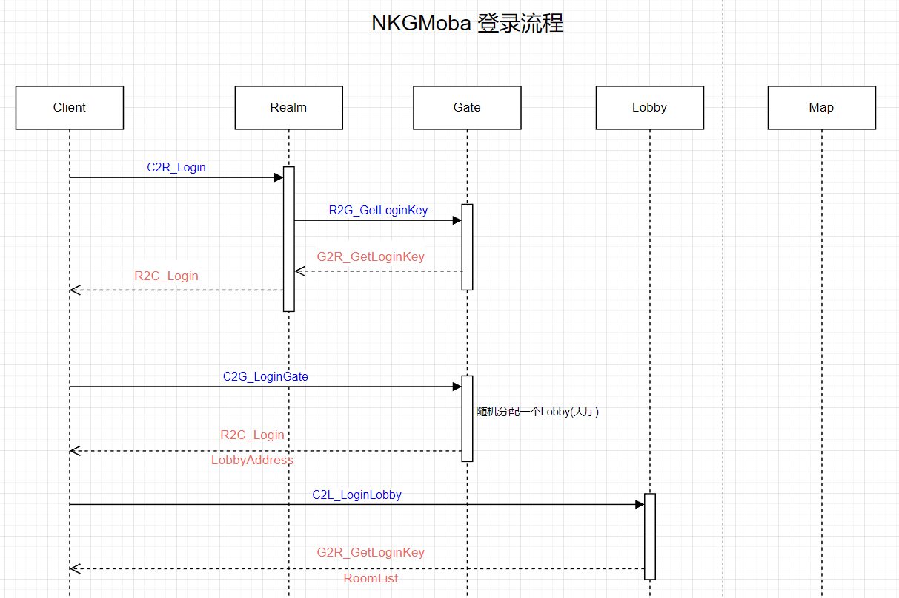
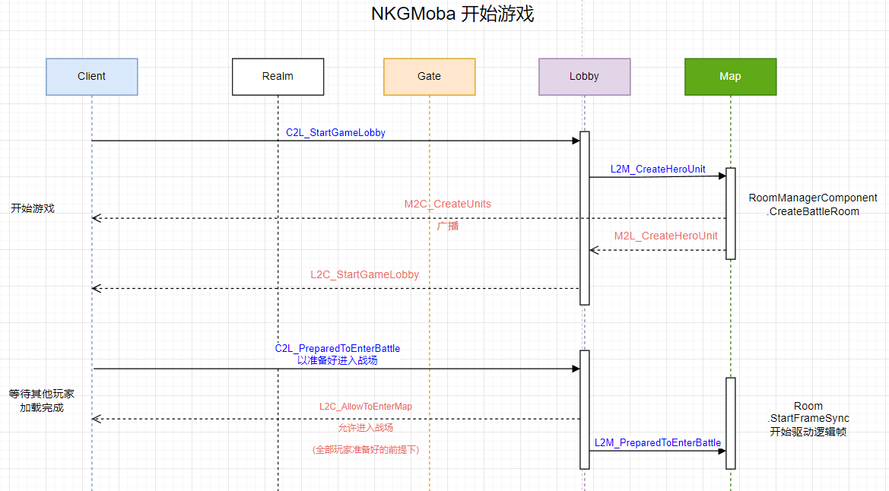

<!-- markdownlint-disable MD033 -->
# MKGMoba源码解析

## 登录流程



## 创建房间流程


## 开始游戏流程



* 根据配置表创建Unit, 并初始化技能行为树(QWER)等

  `L2M_CreateHeroUnit` -> `L2M_CreateHeroUnitHandler` -> `UnitFactory.CreateHeroUnit`

## 帧驱动

### FixedUpdate 注册更新回调

`FixedUpdate` 来自Xenko的固定时间间隔刷新器; 基于真实时间间隔执行

* `Program.Main`

  ```c#
  m_FixedUpdate = new FixedUpdate() {UpdateCallback = Game.FixedUpdate};
  ```

* `LSF_ComponentUtilities.StartFrameSync`

  ```c#
  public static void StartFrameSync(this LSF_Component self)
  {
      self.StartSync = true;
      self.FixedUpdate = new FixedUpdate() {UpdateCallback = self.LSF_TickNormally};
  }
  ```

### FixedUpdate Tick 驱动

* 固定间隔的目标FPS 常量

  ```c#
  // 固定间隔的目标FPS
  public const int FixedUpdateTargetFPS = 30;
  public const float FixedUpdateTargetDTTime_Float = 1f / FixedUpdateTargetFPS;// 0.033333335F
  public const long FixedUpdateTargetDTTime_Long = (long) (FixedUpdateTargetDTTime_Float * 1000);//33L
  ```

* `Program.Main`

  ```c#
  while (true)
  {
      Thread.Sleep(1);
      m_FixedUpdate.Tick();
      Game.Update();
      Game.LateUpdate();
      Game.FrameFinish();
  }
  ```

* `LockStepStateFrameSyncComponentUpdateSystem.Update`

  ```c#
  if (!self.StartSync)
  {
      return;
  }
  // 将FixedUpdate Tick放在此处，这样可以防止框架层FixedUpdate帧率小于帧同步FixedUpdate帧率而导致的一些问题
  self.FixedUpdate.Tick();
  ```

## 服务端 LSF_Component 数据结构

### Cmds 整局游戏的帧指令记录

```c#
// 整局游戏的Cmd记录，用于断线重连, 录像和观战系统
public Dictionary<uint, Queue<ALSF_Cmd>> WholeCmds = new Dictionary<uint, Queue<ALSF_Cmd>>(8192);
```

### Handle 将要处理的帧指令列表

```c#
public SortedDictionary<uint, Queue<ALSF_Cmd>> FrameCmdsToHandle = new SortedDictionary<uint, Queue<ALSF_Cmd>>();
```

### Send 将要发送的命令列表

```c#
public Dictionary<uint, Queue<ALSF_Cmd>> FrameCmdsToSend = new Dictionary<uint, Queue<ALSF_Cmd>>(64);
```

### 当前帧数

```c#
public uint CurrentFrame;
```

## 服务端 LSF_ComponentUtilities

### LSF_TickNormally

`FixedUpdate.Tick` -> `FixedUpdate.TickInternal` -> `FixedUpdate.UpdateAndProfile` -> `FixedUpdate.Update`

-> `LSF_ComponentUtilities.LSF_TickNormally`

```c#
private static void LSF_TickNormally(this LSF_Component self)
{
  //使用 Stopwatch 类来确定应用程序的执行时间
  Stopwatch stopwatch = new Stopwatch();
  stopwatch.Start();
  self.CurrentFrame++;//增加服务端帧数
  //驱动帧消息处理器
  if (self.FrameCmdsToHandle.TryGetValue(self.CurrentFrame, out var currentFrameCmdToHandle))
  {
      foreach (var cmd in currentFrameCmdToHandle)
      {
          //Log.Info($"------------处理第{self.CurrentFrame}帧指令");
          LSF_CmdDispatcherComponent.Instance.Handle(self.GetParent<Room>(), cmd);
      }
  }
  //移除执行完成的帧消息
  self.FrameCmdsToHandle.Remove(self.CurrentFrame);
  // 执行本帧本应该执行的的Tick
  self.LSF_TickManually();  
  // 发送本帧收集的指令
  self.SendCurrentFrameMessage();
  // 停止 Stopwatch 秒表
  stopwatch.Stop();
}
```

### LSF_TickManually

正式的帧同步Tick，所有的战斗逻辑都从这里出发，会自增CurrentFrame [驱动TickHandler](#tickhandler)

Tick核心, 主要分为3部分:

  1. TickStart 可以用于一些帧前的数据准备工作
  2. Tick 为正式Tick逻辑
  3. TickEnd 用于数据清理以及脏数据的搜集工作

```c#
// LSFTick Room，tick room的相关组件, 然后由Room去Tick其子组件，即此处是战斗的Tick起点
self.GetParent<Room>().GetComponent<LSF_TickComponent>()
    ?.TickStart(self.CurrentFrame, GlobalDefine.FixedUpdateTargetDTTime_Long);    
// 正常Tick
self.GetParent<Room>().GetComponent<LSF_TickComponent>()
    ?.Tick(self.CurrentFrame, GlobalDefine.FixedUpdateTargetDTTime_Long);    
// 所有Tick结束后，一些数据收集工作，比如收集快照信息（对于服务端来说，每个玩家都要记录，而对于客户端来说，只需要记录本地玩家即可，因为只有本地玩家进行了预测）
self.GetParent<Room>().GetComponent<LSF_TickComponent>()
    ?.TickEnd(self.CurrentFrame, GlobalDefine.FixedUpdateTargetDTTime_Long);
```

### 添加待处理的帧数据

添加协议消息发送过来的操作帧数据

`C2M_FrameCmdHandler` -> `LSF_ComponentUtilities.AddCmdToHandleQueue`

```c#
// 注意这里的帧数是消息中的帧数
// 特殊的，对于服务器来说，哪一帧收到客户端指令就会当成客户端在哪一帧的输入(累加一个缓冲帧时长)
public static void AddCmdToHandleQueue(this LSF_Component self, ALSF_Cmd cmdToHandle)
{
    uint correntFrame = cmdToHandle.Frame;
    if (self.FrameCmdsToHandle.TryGetValue(correntFrame, out var queue))
    {
        queue.Enqueue(cmdToHandle);
    }
    else
    {
        Queue<ALSF_Cmd> newQueue = new Queue<ALSF_Cmd>();
        newQueue.Enqueue(cmdToHandle);
        self.FrameCmdsToHandle[correntFrame] = newQueue;
    }
}
```

### 添加待发送的帧数据

将指令加入待发送列表，将在本帧末尾进行发送

`LSF_ComponentUtilities.AddCmdToSendQueue<T>`

```c#
//客户端用户输入有他的特殊性，往往会在Update里收集输入，在FixedUpdate里进行指令发送，所以要放到下一帧
uint correctFrame = self.CurrentFrame + 1;
cmdToSend.Frame = correctFrame;
C2M_FrameCmd c2MFrameCmd = new C2M_FrameCmd() {CmdContent = cmdToSend};
```

## ALSF_Cmd 帧指令数据

* `LSF_ChangeBBValueCmd`
* `LSF_CommonAttackCmd`
* `LSF_CreateColliderCmd`
* `LSF_CreateSpilingCmd`
* `LSF_MoveCmd`
* `LSF_PlaySkillInputCmd`
* `LSF_SyncAttributeCmd`
* `LSF_SyncBuffCmd`
* `LSF_SyncFSMStateCmd`

## Cmd_Handler 帧消息处理器

`ALockStepStateFrameSyncMessageHandler`

* `LSF_ChangeBBValueHandler` 改变行为树
* `LSF_CommonAttackHandler` 普通攻击
* `LSF_CreateColliderHandler` 创建碰撞
* `LSF_CreateSpilingHandler` 创建召唤物
* `LSF_MoveCmdHandler` 移动
* `LSF_PlayerSkillInputHandler` 技能输入
* `LSF_SyncAttributeHandler` 属性同步
* `LSF_SyncBuffHandler` buff同步

## TickHandler Tick核心

`ILSF_TickHandler`

[源自正式的帧同步Tick的调用](#lsf_tickmanually)

* `LSF_TickComponentUtilities.TickStart` -> `LSF_TickDispatcherUtilities.HandleLSF_TickStart` -> `ILSF_TickHandler.LSF_TickStart`
* `LSF_TickComponentUtilities.Tick` -> `LSF_TickDispatcherUtilities.HandleLSF_Tick` -> `ILSF_TickHandler.LSF_Tick`
* `LSF_TickComponentUtilities.TickEnd` -> `LSF_TickDispatcherUtilities.HandleLSF_TickEnd` -> `ILSF_TickHandler.LSF_TickEnd`
* `deltaTime` 每帧可执行的时间: 33毫秒

  ```c#
  /// 当前帧Tick开始，可用于做数据准备工作
  void LSF_TickStart(Entity entity, uint frame, long deltaTime);
  /// 正常Tick
  void LSF_Tick(Entity entity, uint currentFrame, long deltaTime);
  /// 当前帧所有Tick都结束了，可用于做数据收集工作
  void LSF_TickEnd(Entity entity, uint frame, long deltaTime);

  #if !SERVER
  /// 检测结果一致性
  bool LSF_CheckConsistency(Entity entity, uint frame, ALSF_Cmd stateToCompare);
  /// 视图层Tick
  void LSF_ViewTick(Entity entity, long deltaTime);
  /// 回滚
  void LSF_RollBackTick(Entity entity, uint frame, ALSF_Cmd stateToCompare);
  #endif
  ```

### ALSF_TickHandler

* `ALSF_TickHandler` 实现 `ILSF_TickHandler` 接口
* `LSF_TickDispatcherComponent` TickHandler 分发组件 Awake 注册 `LSF_TickableAttribute`
* `LSF_TickableAttribute` 标签用于标记 `ALSF_TickHandler` 的子类, 比如:

  ```c#
  [LSF_Tickable(EntityType = typeof(MoveComponent))]
  public class MoveComponentTicker : ALSF_TickHandler<MoveComponent>
  ```

### 一致性(脏数据)检测

只有数据脏了才进行发送

`ALSF_TickHandler<T>.OnLSF_CheckConsistency`

实现了一致性检测的 `Ticker` 组件:

* `BuffManagerComponentTicker`
* `CommonAttackComponentTicker`
* `MoveComponentTicker`
* `NP_RuntimeTreeManagerTicker`
* `NumericComponentTicker`
* `UnitComponentTicker`
* `UnitTicker`

### 回滚

`ALSF_TickHandler<T>.OnLSF_RollBackTick`

实现回滚的 `Ticker` 组件

* `MoveComponentTicker`
  
  > 目前只有移动组件有具体的回滚实现, 这刚好印证了:<big> `只预测播放技能动画，没有伤害判定`</big>
* `UnitComponentTicker`
* `UnitTicker`

## DeltaData 脏数据

[DeltaData是服务器上每帧的脏数据](https://www.lfzxb.top/nkgmoba-framestepstate-architecture-battle-design/#deltadata)

脏数据根据其产生的原因与作用归为两类: `CommonDeltaData` 和 `SkillSystemDeltaData`

1. 常规数据 LSF_SyncAttributeCmd
1. buff数据 LSF_SyncBuffCmd
1. 移动数据 LSF_MoveCmd
1. 行为树黑板数据 LSF_ChangeBBValueCmd

## CommonDeltaData

例如对象的Transform，血量，蓝量，速度等常规属性

### 常规数据

`NumericComponentTicker` Tick这一帧的数值变化, 并下发脏数据 `LSF_SyncAttributeCmd`

* `NumericComponent`

  ```c#
  #if SERVER 
  /// 每帧Attribute的结果 <currentFrame,numericType,value>
  public Dictionary<uint, Dictionary<int, float>> AttributeReusltFrameSnap =
      new Dictionary<uint, Dictionary<int, float>>();
  /// 每帧变化量 <currentFrame,numericType,value>
  public Dictionary<uint, Dictionary<int, float>> AttributeChangeFrameSnap =
      new Dictionary<uint, Dictionary<int, float>>();  
  #endif
  ```

### [移动数据](https://www.lfzxb.top/nkgmoba-fromstatetoframestepstate-record/#%E7%A7%BB%E5%8A%A8%E6%A8%A1%E5%9D%97)

`MoveComponentTicker`  驱动移动组件, 下发脏数据 `LSF_MoveCmd`

对于移动模块来说指令主要包含两个主要信息:

1. 开始寻路
2. 每帧Transform信息同步

[预测](https://www.lfzxb.top/nkgmoba-fromstatetoframestepstate-record/#%E9%A2%84%E6%B5%8B): 本地跑一个寻路库的话完全可以本地立即进行寻路而不用等服务器回包

[回滚](https://www.lfzxb.top/nkgmoba-fromstatetoframestepstate-record/#%E5%9B%9E%E6%BB%9A): 移动的回滚条件检测主要是检测某一帧位置与朝向是否与服务器一致
  
## SkillSystemDeltaData

技能系统产生的脏数据, 由三部分组成:

1. NPBehave：技能行为树
2. Slate：技能Timeline
3. Buff：Buff系统

### [行为树](https://www.lfzxb.top/nkgmoba-fromstatetoframestepstate-record/#%E5%9F%BA%E4%BA%8E%E4%BA%8B%E4%BB%B6%E9%A9%B1%E5%8A%A8%E7%9A%84%E8%A1%8C%E4%B8%BA%E6%A0%91)

[NPBehave行为树架构](https://www.lfzxb.top/the-architecture-of-npbehave/)

[NPBahave是GitHub上开源的一个行为树](https://github.com/meniku/NPBehave/blob/master/README_CH.md)

* `LSF_PlaySkillInputCmd` 技能按键操作

* `NP_RuntimeTreeManagerTicker` 行为树Ticker `LSF_ChangeBBValueCmd`

  `NP_RuntimeTreeBBSnap` 黑板数据快照

  `Blackboard` 黑板信息

  `ANP_BBValue` 黑板键值对(抽象类) `NP_BBValueBase` 基类

  `NP_RuntimeTree.Start` 开始运行行为树

  `Node` 行为树节点

`SkillCanvasManagerComponent` 技能行为树管理器

`NP_CreateColliderAction` 碰撞体检测

### Buff

`BuffManagerComponentTicker` buff管理器ticker, 并下发脏数据 `LSF_SyncBuffCmd`

`BuffSnapInfo` buff快照信息

`BuffSnapInfoCollection` 单帧内变化的Buff信息容器

`DataModifierComponent` buff数值变化

`BuffWorkTypes` Buff的奏效的表现

* Buff操作类型

  ```c#
  public enum BuffOperationType
  {
      NONE,
      ADD,
      REMOVE,
      CHANGE
  }
  ```

<!-- ### DataModifierComponent -->

## 物理碰撞

### B2S_CollisionListenerComponent

由 `B2S_CollisionListenerComponentTicker` Ticker 驱动

## 客户端的Tick频率

客户端一定是领先于服务器的，因为我们发送的网络包会在半个RTT+一个缓存帧时长才会到达服务端

所以如果服务端当前是95帧，RTT是8帧，缓冲帧时长为1帧，那么客户端就会运行在第100帧，这样才能保证客户端第100帧的输入在服务端接收输入并开始模拟时也是第100帧。所以会有下面这个平衡公式

`客户端发包帧数 = 服务器当前帧数 + 半个RTT + 服务端一个缓存帧`

客户端会根据RTT值的变化来调整领先于服务端的帧数, 固定一秒30帧,每帧时长为 33 毫秒

如果落后与服务端帧率, 会追帧，追到目标帧, 下面就是和客户端帧率调账相关的代码

### LSF_TickNormally (Client)

`FrameCmdsToHandle` 将要处理的命令列表,默认升序排序(由小及大)

### ClientHandleExceptionNet

当前客户端帧数大于服务端帧数，两种情况:  
  
  1. 正常情况，客户端为了保证自己的消息在合适的时间点抵达服务端需要领先于服务器
  2. 非正常情况，客户端由于网络延迟或者断开导致没有收到服务端的帧指令，导致ServerCurrentFrame长时间没有更新，再次收到服务端回包的时候发现是很久之前包了，也就会导致CurrentAheadOfFrame变大，当达到一个阈值的时候将会进行断线重连

### RTTChanged_ChangeFixedUpdateFPS

* 根据Ping值的改变来改变Tick频率 `LSF_Component.TargetAheadOfFrame`
* 将RTT时间转换成帧数 `TimeAndFrameConverter.Frame_Long2Frame`
* 暂定客户端最多只能超前服务端10帧(大于这个阈值将进行重连) : `LSF_Component.AheadOfFrameMax` -> `public const int AheadOfFrameMax = 10;`
