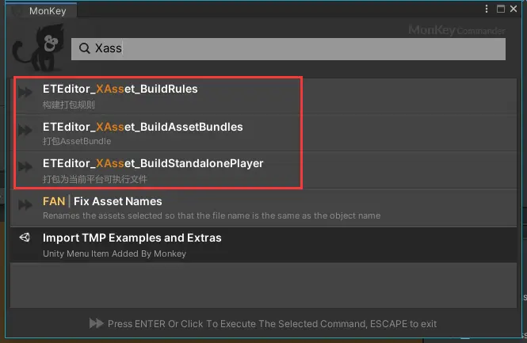

<!-- markdownlint-disable MD033 -->
# 烟雨 MKGMoba 状态帧同步教程笔记

## 相关技术文章阅读笔记

### [守望先锋 架构设计和网络同步](https://www.lfzxb.top/ow-gdc-gameplay-architecture-and-netcode/)

### [基于状态帧的战斗，技能编辑器与录像回放系统设计](https://www.lfzxb.top/nkgmoba-framestepstate-architecture-battle-design/)

帧同步真正的价值在于其 “帧” 的概念，有了帧的概念，就可以去预测，去回滚，去做录像，去做观战

而状态帧方案就可以让我们在不受限于帧同步条条框框的基础上拥有帧同步的开发体验与项目效果，

其相对于帧同步来说，最为困难的部分就是 `根据服务端传来的帧数据进行重新模拟+回滚`，

这要求状态和逻辑分离的非常纯粹，也就是说对于客户端，接收任意帧内相同的输入必须能回滚到与服务端那一帧一样的数据和状态。

[状态同步总架构:](https://www.processon.com/view/link/616eb1397d9c0870404e77eb)

预测回滚是帧同步亘古不变的核心，预测即直接进行Tick，然后记录自身的状态数据，即快照数据

回滚则是对比服务器与客户端同一帧快照是否一致，不一致则进行回滚

* 把状态数据分为两类，一类是直接，一类是间接

  1. 直接数据 -- 是因为他们比较简单（例如MoveComponent只有位置，朝向和速度这几个变量，是恒定不变的）可以直接将他们的所有数据都当作脏数据进行处理
  2. 间接数据 -- 是因为他们比较复杂，而且数据结构往往是一直在变化的，直接全量发送浪费带宽，所以需要自己处理他们的变化了的数据作为脏数据

      比如行为树里的黑板数据，因为数据量往往会比较大，所以如果涉及到了新增/删除/修改黑板键值，那么脏数据只会发来这个新增/删除/修改的黑板键值

### [将状态同步切换为状态帧同步所做的改动](https://www.lfzxb.top/nkgmoba-fromstatetoframestepstate-record/)
  
目前业界主流有两种做法:

* 使命召唤：客户端落后于服务器，服务器收到客户端消息时根据帧号回滚到那一帧进行模拟，并将得出的结果返回客户端
* 守望先锋：客户端领先于服务器，服务器收到客户端消息以当前服务器所在帧为准，统一进行模拟
  
  [客户端Tick流程:](https://www.processon.com/view/link/618f9e5f1efad41bf2c68e67)

  

  上图橙色框中的Tick核心, 主要分为3部分:

  1. TickStart 可以用于一些帧前的数据准备工作
  2. Tick 为正式Tick逻辑
  3. TickEnd 用于数据清理以及脏数据的搜集工作

  [服务端Tick流程:](https://www.processon.com/view/link/618f9e73f346fb6e389da1ee)

  
* [技能系统与网络同步](https://www.lfzxb.top/nkgmoba-skillandnetwork/)

* [预测有度 -- 只预测播放技能动画，没有伤害判定](https://www.lfzxb.top/nkgmoba-fromstatetoframestepstate-record/#%E9%A2%84%E6%B5%8B%E8%BF%98%E6%98%AF%E4%B8%8D%E9%A2%84%E6%B5%8B%E4%B8%8D%E4%BB%85%E4%BB%85%E6%98%AF%E4%B8%AA%E6%8A%80%E6%9C%AF%E9%97%AE%E9%A2%98%E8%BF%98%E6%98%AF%E4%B8%AA%E8%AE%BE%E8%AE%A1%E9%97%AE%E9%A2%98)

## NKGMoba 运行工程

* [运行视频教程](https://www.bilibili.com/video/BV1FY411Q7uD/?spm_id_from=333.999.0.0&vd_source=ff8fbad1e1bf469ad221e1b40db87ca5)
* [wiki -- 运行指南](https://gitee.com/NKG_admin/NKGMobaBasedOnET/wikis)
* 使用xAsset构建AB包
  
  

  打包后的执行文件目录: `.\Release\Windows_EXE`

* [Clumsy -- 弱网络模拟工具](https://www.lfzxb.top/clumsy-guide/)
