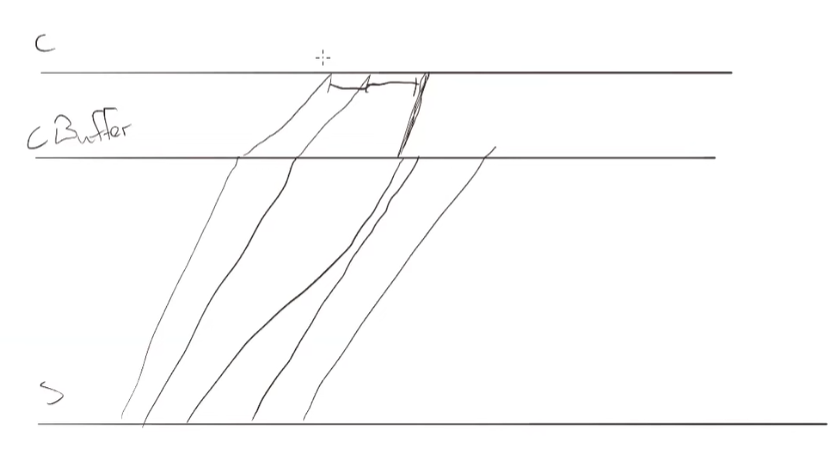

<!-- markdownlint-disable MD033 -->
# Unity3D Multiplayer 开发

## 目录

- [Unity3D Multiplayer 开发](#unity3d-multiplayer-开发)
  - [目录](#目录)
  - [教程](#教程)
  - [插件](#插件)
  - [开发技巧](#开发技巧)

## 教程

- [Netcode - unity 新网络库](https://docs-multiplayer.unity3d.com/netcode/current/about/)
  - Netcode for GameObjects（简称Netcode或NGO）是一个为Unity构建的高级网络库
  - [基于新的网络包开发Unity 多人游戏 - By Code Monkey](https://www.youtube.com/watch?v=3yuBOB3VrCk&t=2268s&ab_channel=CodeMonkey)
  - [boss room - unity 官方多人游戏解决方案](https://www.youtube.com/watch?v=4Mf81GdEDU8&list=PLS6sInD7ThM2_N9a1kN2oM4zZ-U-NtT2E&index=1&ab_channel=DapperDino)
  - [boss room 开发者答疑解惑 - b站视频](https://www.bilibili.com/video/BV1ru4y1F7wE/?spm_id_from=333.999.0.0)
  - [使用 NGO (Netcode for GameObjects) 开发多人联机卡丁车游戏](https://www.youtube.com/playlist?list=PLnJJ5frTPwRN79MQt13JVCjZ9WVPKUjO3)
    - [github 代码](https://github.com/adammyhre/Unity-Multiplayer-Kart)
- [mirror 第三方网络库](https://mirror-networking.gitbook.io/docs)
  - [unity + mirror 第三方网络库制作多人游戏](https://www.youtube.com/watch?v=8VVgIjWBXks&ab_channel=Shrine)
  - [unity + mirror 教程2](https://www.youtube.com/watch?v=yD4cJx-bpVQ&list=PLxadUPU23Hsmcy-YeZWCykywonNti3Yoj&ab_channel=HomeSliceGameDev)
- [FishNet - unity 第三方网络库](https://github.com/FirstGearGames/FishNet)
  - [客户端预测回滚 - 无法停止奔跑的马 b站视频](https://www.bilibili.com/video/BV19o4y1W72r/?spm_id_from=333.788&vd_source=ff8fbad1e1bf469ad221e1b40db87ca5)
  - [Fishnet 显示带宽组件](https://www.bilibili.com/video/BV1C24y1s7bv/?spm_id_from=333.999.0.0&vd_source=ff8fbad1e1bf469ad221e1b40db87ca5)
- [Piptide -- 适用于多人游戏的轻量级 C# 网络解决方案](https://github.com/RiptideNetworking/Riptide)

## 插件

- [ParrelSync - unity编辑器多开插件,无需构建](https://github.com/VeriorPies/ParrelSync)
- [游戏控制台 - 需要20刀](https://assetstore.unity.com/packages/tools/utilities/quantum-console-211046?aid=1101l96nj&pubref=ngo&utm_campaign=unity_affiliate&utm_medium=affiliate&utm_source=partnerize-linkmaker)
- [角色控制器](https://assetstore.unity.com/packages/essentials/starter-assets-thirdperson-updates-in-new-charactercontroller-pa-196526?aid=1101l96nj&pubref=ngo&utm_campaign=unity_affiliate&utm_medium=affiliate&utm_source=partnerize-linkmaker)

## 开发技巧

- 通过前摇动画掩盖 `延迟`
  - 如移动,会有一个小跳的前摇动画, 服务端确认后, 返回包才会移动
  - 普通平A, 也会有一个小跳的前摇的动画, 服务端确认后, 返回包才会攻击
  - 举盾技能, 会有一个抬手的前摇动画, 服务端确认后, 返回包才会拥有盾牌buff
  - 射箭(移动比较慢,射程远), 会有一个拉弓的前摇动画, 服务端确认后, 返回包才会射出箭, 而且这个箭是一个实体对象(服务端和客户端都有)
  - 法师小火球(移动比较快,射程近,动画特效时间短), 前摇动画, 服务端确认后, 返回包, 客户端播放动画特效(不会有实体对象,进行两端的同步)
- 视觉效果图(VFX Graph)
- update 渲染帧, tick 逻辑帧
- 客户端预测与回滚
  - 外插值, 内插值
- [延时补偿](https://www.bilibili.com/video/BV1484y1T7TU/?spm_id_from=333.999.0.0&vd_source=ff8fbad1e1bf469ad221e1b40db87ca5)

  比如位置同步中: 服务端基于 client 提交的 tick 得出需要补偿(加速)的位置

  当其他 client 得到广播的位置信息时, 也会基于同步信息中的 tick 数据得出需要补偿的位置
- 在服务端权威模式中, 客户端通过缓存的方式解决网络抖动, 牺牲了一点实时性, 可以使表现更自然

  
  
- [NGO 处理延迟的技巧](https://docs-multiplayer.unity3d.com/netcode/current/learn/dealing-with-latency/)
  - [官方网络模拟器工具, 模拟断连,丢包等情况](https://docs-multiplayer.unity3d.com/tools/current/tools-network-simulator/)
- [多人游戏开发技巧-客户端预测协调-实体插值-延迟补偿](https://www.gabrielgambetta.com/client-server-game-architecture.html)