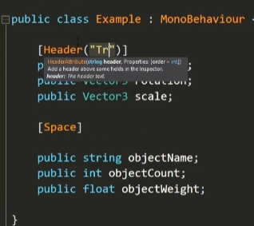
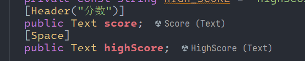
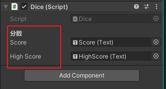
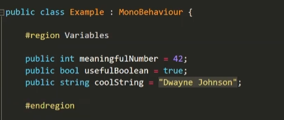
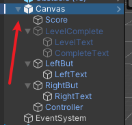
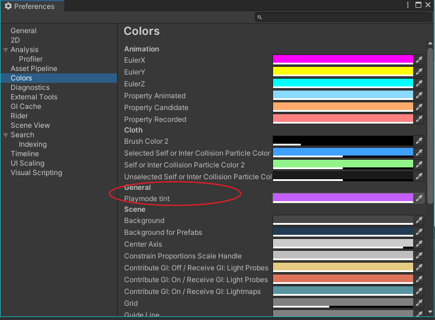
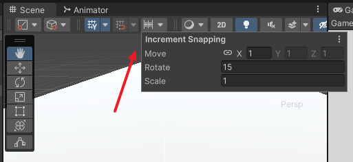
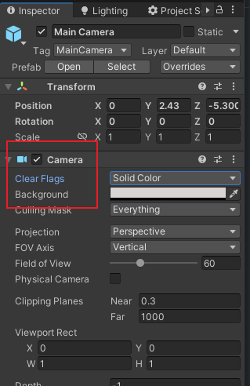
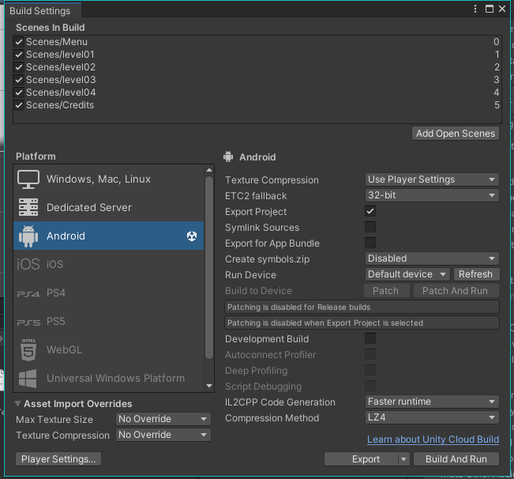
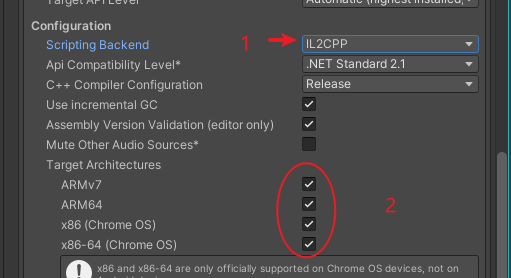

<!-- markdownlint-disable MD033 -->
# Unity开发技巧

## 目录

- [Unity开发技巧](#unity开发技巧)
  - [目录](#目录)
  - [Unity编辑器使用技巧](#unity编辑器使用技巧)
  - [Unity 打包 Android](#unity-打包-android)
    - [Unity导出 Android 工程避坑指南](#unity导出-android-工程避坑指南)

## Unity编辑器使用技巧

- [10大开发秘诀-2017](https://www.youtube.com/watch?v=JDVuTBHnGWw&list=PLPV2KyIb3jR5QFsefuO2RlAgWEz6EvVi6&index=13&ab_channel=Brackeys)

  - [b站中配版-10大开发秘诀-2017](https://www.bilibili.com/video/BV19T421C7yu/?vd_source=ff8fbad1e1bf469ad221e1b40db87ca5)
  - [b站中配 Brackeys的前10个Unity技巧#2 - Brackeys](https://www.bilibili.com/video/BV1Aw4m1C77e/?spm_id_from=333.788&vd_source=ff8fbad1e1bf469ad221e1b40db87ca5)

  1. Shift + 空格 全屏Tab
  2. 工具栏属性增强/提示

      - 提示:`[Tooltip("xxx")]`

          

      - 属性头说明 以及间隔属性距离: `[Header("xxx")],[Space],`

          

          

      - 隐藏属性: `[HideInInspector]`

      - 范围取值: `[Range(.1f,2f)]`

          ```c#
          [Range(.1f,2f)]
          public float pitch = 1f;
          ```

      - 检查器中显示私有变量: `[SerializeField]`

          ```c#
          [SerializeField]
          private int testTmp = 1;
          ```

  3. 代码区域

      

  4. 展开与折叠子对象: Alt + 鼠标左键

      

  5. Play模式下编辑器着色

      Preference 首选项中设置

      

  6. 吸附到网格: Ctrl + 鼠标移动即可

      Move 中设置移动单位

      

  7. 对齐到视角

      在Scene视图中找到合适的镜头位置, 然后选中 `MainCamera`对象, 按下快捷键 : Ctrl + Shift + f

  8. 基于镜头设置天空背景色

      

## Unity 打包 Android

### Unity导出 Android 工程避坑指南

- unity 2021版导出 Android 工程注意事项:

  

  设置: Project Settings -> Player -> Settings for Android -> Other Settings -> Configuration

  

- 导出 Android 工程 Gradle wrapper 修改为腾讯源:

  ```groovy
    #distributionUrl=https\://services.gradle.org/distributions/gradle-6.1.1-bin.zip
    distributionUrl=https\://mirrors.cloud.tencent.com/gradle/gradle-6.1.1-bin.zip
  ```

- 参考:[Android Studio 打包APK（详细版)](https://blog.csdn.net/qq_38436214/article/details/112288954)
