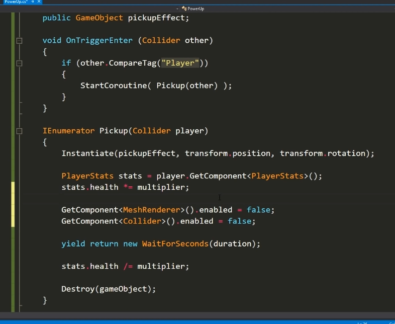

<!-- markdownlint-disable MD033 -->
# Unity编程技巧

## 目录

- [Unity编程技巧](#unity编程技巧)
  - [目录](#目录)
  - [第一部分:](#第一部分)
    - [镜头的平滑移动](#镜头的平滑移动)
    - [拾取道具,强化玩家属性,协程的使用](#拾取道具强化玩家属性协程的使用)

## 第一部分:

### 镜头的平滑移动

- [油管教程](https://www.youtube.com/watch?v=MFQhpwc6cKE&list=PLPV2KyIb3jR5QFsefuO2RlAgWEz6EvVi6&index=16&ab_channel=Brackeys)
- [github](https://github.com/Brackeys/Smooth-Camera-Follow/tree/master)

    ```c#
    public class CameraFollow : MonoBehaviour {
    
    	public Transform target;

    	public float smoothSpeed = 0.125f;
    	public Vector3 offset;

    	void FixedUpdate ()
    	{
    		Vector3 desiredPosition = target.position + offset;
    		Vector3 smoothedPosition = Vector3.Lerp(transform.position, desiredPosition, smoothSpeed);
    		transform.position = smoothedPosition;

    		transform.LookAt(target);
    	}

    }
    ```

### 拾取道具,强化玩家属性,协程的使用

- [油管视频](https://www.youtube.com/watch?v=CLSiRf_OrBk&list=PLPV2KyIb3jR5QFsefuO2RlAgWEz6EvVi6&index=19&ab_channel=Brackeys)

    