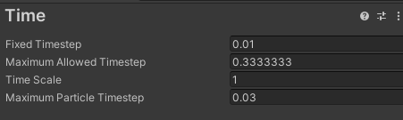

<!-- markdownlint-disable MD033 -->
# Unity编程笔记

## 目录

- [Unity编程笔记](#unity编程笔记)
  - [目录](#目录)
  - [基础内容](#基础内容)
    - [MonoBehaviour生命周期](#monobehaviour生命周期)
    - [FixedUpdate 与 Update](#fixedupdate-与-update)

## 基础内容

### MonoBehaviour生命周期

- 就常用的函数来说顺序是这样的：

  `Awake > OnEnable > Start > FixedUpdate > Update > LateUpdate > OnWillRenderObject > OnGUI`

  

### FixedUpdate 与 Update

- 设置 Fixed Timestep

  menu: Edit > Project Settings, then the Time

  
- FixedUpdate 

  每帧运行一次。 FixUpdate 每帧可以运行一次、零次或多次，具体取决于时间设置中设置的每秒物理帧数以及帧速率的快/慢。

  正是由于这个原因，在施加力、扭矩或其他物理相关函数时应该使用FixedUpdate - 因为您知道它将与物理引擎本身完全同步执行
- Update 

  而 Update() 可能会与物理引擎不同步，更快或更慢，具体取决于图形在任何给定时间对渲染引擎施加的负载量，如果用于物理，则会给出相应的变化物理效果！