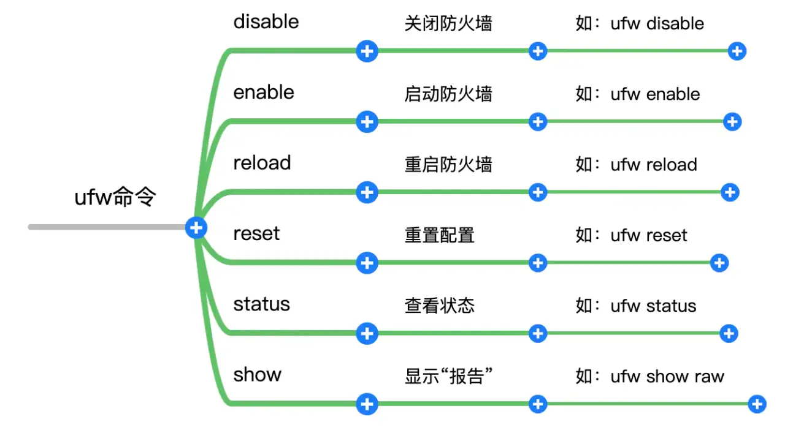

<!-- markdownlint-disable MD033 -->
# Ubuntu 安装与配置

* [Ubuntu -- 官网镜像下载](https://cn.ubuntu.com/server)
* [Ubuntu Server 20.04.1 LTS安装配置图解教程](https://www.osyunwei.com/archives/10727.html)
* [ubuntu 22.04国内镜像 -- 中科大](https://www.myfreax.com/ubuntu-22-04geng-gai-jing-xiang-ruan-jian-yuan/#--3)
  
   ```sh
   sudo bash -c "cat << EOF > /etc/apt/sources.list && apt update 
   deb https://mirrors.ustc.edu.cn/ubuntu/ jammy main restricted universe multiverse
   deb-src https://mirrors.ustc.edu.cn/ubuntu/ jammy main restricted universe multiverse
   deb https://mirrors.ustc.edu.cn/ubuntu/ jammy-updates main restricted universe multiverse
   deb-src https://mirrors.ustc.edu.cn/ubuntu/ jammy-updates main restricted universe multiverse
   deb https://mirrors.ustc.edu.cn/ubuntu/ jammy-backports main restricted universe multiverse
   deb-src https://mirrors.ustc.edu.cn/ubuntu/ jammy-backports main restricted universe multiverse
   deb https://mirrors.ustc.edu.cn/ubuntu/ jammy-security main restricted universe multiverse
   deb-src https://mirrors.ustc.edu.cn/ubuntu/ jammy-security main restricted universe multiverse
   deb https://mirrors.ustc.edu.cn/ubuntu/ jammy-proposed main restricted universe multiverse
   deb-src https://mirrors.ustc.edu.cn/ubuntu/ jammy-proposed main restricted universe multiverse
   EOF"
   ```

* [Ubuntu Desktop 安装](https://zhuanlan.zhihu.com/p/141033713)

## 系统相关设置

* [开启Ubuntu桌面版的SSH服务](https://blog.csdn.net/starshinning975/article/details/103272306)

  ```sh
  sudo apt-get install openssh-server #安装命令
  sudo service ssh status #查看ssh服务状态
  sudo service ssh restart #ssh服务重启命令
  ```

### Root 账号权限获取

* [Ubuntu 系统如何使用 root 用户登录实例](https://blog.csdn.net/thebestleo/article/details/123451471)
* [Ubuntu以root账号登录桌面](https://zhuanlan.zhihu.com/p/355555221)
* ubuntu添加用户到root组

  ```sh
  #以root身份登录，然后输入
  usermod -g root xxx #执行完后　xxx 即归属于root组了，可以再输入
  id username #查看输出验证一下
  ```

* 修改文件夹用户所有权
  
  ```sh
  chown -R username foldername
  ```

### [配置静态ip](https://www.cnblogs.com/liujiaxin2018/p/16287463.html)

### [忘记Root密码](https://blog.csdn.net/ezconn/article/details/89328024)

### UFW 防火墙



* 显示防火墙和端口的侦听状态

  `ufw status`

  `ufw status verbose` 显示详细防火墙状态

  `ufw status numbered` 显示防火墙状态的编号列表
* `allow` 允许传入
   1. 要将防火墙配置为允许传入SSH连接，可以使用以下命令：

      `ufw allow ssh`

      这将创建防火墙规则-允许端口22上的所有连接，这是SSH守护程序默认监听的端口，类似的快捷指令还有 

      `ufw allow http`

      `ufw allow https`
   1. 指定端口

      `ufw allow 22`
   1. 基于TCP或UDP协议来过滤数据包

      ```sh
      ufw allow 80/tcp
      ufw allow 21/udp
      ```

* `deny` 禁止, 拒绝指定端口任何传入和传出的流量
  
    ```sh
    ufw deny 80
    ufw deny 21
    ```

* `delete` 删除规则
  
  ```sh
  ufw delete allow http
  ufw delete deny 21

  ufw delete 2 #也可以按编号删除规则, 先使用 ufw status numbered 查看规则编号
  ```

* 示例:
  
  ```sh
  sudo ufw allow 80 #允许外部访问80端口
  sudo ufw delete allow 80 #禁止外部访问80 端口
  sudo ufw allow from 192.168.1.1 #允许此IP访问所有的本机端口
  sudo ufw deny smtp #禁止外部访问smtp服务，#以服务名代表端口，可以使用less /etc/services列出所有服务信息, 其中包括该服务使用了哪个端口和哪种协议
  sudo ufw delete allow smtp #删除上面建立的某条规则，或者sudo ufw delete allow 80/tcp，如果出现无法删除，可以用序号：sudo ufw status numbered，然后通过序号删除sudo ufw delete 1
  sudo ufw deny proto tcp from 10.0.0.0/8 to 192.168.0.1 port 22 #要拒绝所有的TCP流量从10.0.0.0/8 到192.168.0.1地址的22端口
  #可以允许所有RFC1918网络（局域网/无线局域网的）访问这个主机（/8,/16,/12是一种网络分级）：
  sudo ufw allow from 10.0.0.0/8
  sudo ufw allow from 172.16.0.0/12
  sudo ufw allow from 192.168.0.0/16
  ```
