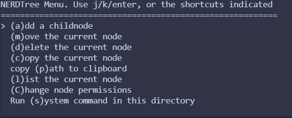

<!-- markdownlint-disable MD033 -->
# Vim插件

## 目录

- [Vim插件](#vim插件)
  - [目录](#目录)
  - [vim-plug](#vim-plug)
    - [插件推荐/查找](#插件推荐查找)
    - [安装 vim-startify 插件](#安装-vim-startify-插件)
    - [NERDTree 文件树](#nerdtree-文件树)
    - [Ctrlp 文件搜索插件](#ctrlp-文件搜索插件)
    - [easymotion 快速跳转](#easymotion-快速跳转)
    - [vim-surroud 快速编辑括号等内容](#vim-surroud-快速编辑括号等内容)
    - [fzf 强大的模糊搜索插件](#fzf-强大的模糊搜索插件)
    - [far 模糊替换](#far-模糊替换)
    - [tagbar 代码大纲](#tagbar-代码大纲)
    - [interestingwords 高亮单词](#interestingwords-高亮单词)
    - [代码补全](#代码补全)
  - [vim-go](#vim-go)
  - [安装 Catppuccin 主题](#安装-catppuccin-主题)
    - [vim 升级到 9.0](#vim-升级到-90)
    - [错误-E319:Sorry](#错误-e319sorry)
    - [错误 E185](#错误-e185)
  - [SpaceVim](#spacevim)
    - [进入配置文件](#进入配置文件)

## vim-plug

- vim-plug 是一个 vim 的插件管理器
- [安装 vim-plug 插件](https://github.com/junegunn/vim-plug)
  - unix 系统

    ```sh
    curl -fLo ~/.vim/autoload/plug.vim --create-dirs \
    https://raw.githubusercontent.com/junegunn/vim-plug/master/plug.vim

    #国内镜像加速
    curl -fLo ~/.vim/autoload/plug.vim --create-dirs     https://raw.staticdn.net/junegunn/vim-plug/master/plug.vim
    ```

### 插件推荐/查找

- [vim插件排名/推荐](https://vimawesome.com)
  - [修改启动界面](https://github.com/mhinz/vim-startify)
  - [状态栏美化](https://github.com/vim-airline/vim-airline)
  - [增加代码缩进线条](https://github.com/yggdroot/indentline)

### 安装 vim-startify 插件

- 修改 ~/.vimrc 文件 增加插件

  ```vim
  " 插件设置，这里使用了 
  vim-plug
  ca11 plug#begin('～/.vim/plugged')
  Plug 'mhinz/vim-startify'
  call plug#end()
  ```

- 重启 vim 生效 / `:source ~/.vimrc`
- vim 下输入 `:PlugInstall` 安装插件

### NERDTree 文件树

- [nerdtree-github](https://github.com/preservim/nerdtree)

  `Plug 'preservim/nerdtree'`
- 快捷键映射配置

  ```vim
  nnoremap <leader>n :NERDTreeFocus<CR>
  nnoremap <C-n> :NERDTree<CR>
  nnoremap <C-t> :NERDTreeToggle<CR>
  nnoremap <C-f> :NERDTreeFind<CR>
  ```

- NERDTree 命令模式

  按 `m` 键，进入 NERDTree 的命令模式, 可以新建/删除/复制/移动文件等操作

  

### Ctrlp 文件搜索插件

- [ctrlp-github](https://github.com/ctrlpvim/ctrlp.vim)

  `Plug 'ctrlpvim/ctrlp.vim'`
- 快捷键映射配置

  ```vim
  let g:ctrlp_map = '<c-p>'
  let g:ctrlp_cmd = 'CtrlP'
  ```

### easymotion 快速跳转

- [easymotion-github](https://github.com/easymotion/vim-easymotion)

  `Plug 'easymotion/vim-easymotion'`
- 快捷键映射配置

### vim-surroud 快速编辑括号等内容

- [vim-surround-github](https://github.com/tpope/vim-surround)

  `Plug 'tpope/vim-surround'`
- 快捷键
  - ys 添加括号 `ys iw (`
  - cs 替换单引号为双引号 `cs '"`
  - ds 删除双引号 `ds "`

### fzf 强大的模糊搜索插件

- [fzf vim-github](https://github.com/junegunn/fzf.vim)

  ```vim
  Plug 'junegunn/fzf', { 'do': { -> fzf#install() } }
  Plug 'junegunn/fzf.vim'
  ```

  - [安装失败的处理](https://blog.csdn.net/AI_Fanatic/article/details/104923610)
    - 手动安装 `fzf`

      ```sh
      cd ~/.vim/plugged/fzf
      sudo ./install
      ```

  - 需要安装 Ag

    `sudo  apt-get install silversearcher-ag`

- 快捷键
  - `:Files [PATH]` 模糊搜索目录
  - `:Ag [PATTERN]` 模糊搜索字符串
  - `Ctrl+J` `Ctrl+J` 移动光标
  
### far 模糊替换

- [far-github](https://github.com/brooth/far.vim)

  `Plug 'brooth/far.vim'`
- 使用方式

  ```sh
  :Far foo bar **/*.py #搜索可替换的文件
  :Fardo #执行替换操作
  ```

### tagbar 代码大纲

- [tagbar-github](https://github.com/preservim/tagbar)

### interestingwords 高亮单词

### 代码补全

- deoplete.nvim
- coc.nvim

## vim-go

- [vim-go教程](https://github.com/fatih/vim-go/wiki/Tutorial)

- vim-Plug 安装

  ```vim
  call plug#begin()
  Plug 'fatih/vim-go', { 'do': ':GoInstallBinaries' }
  call plug#end()
  ```

- 一些指令
  - 运行当前文件 `:GoRun %`
  - 构建工程 `:GoBuild`
  - 格式化 `:GoFmt`
  - 重命名变量 `:GoRename`
- 快捷键
  - 代码补全 `Ctrl+x Ctrl+o`
  - 跳转
    - 使用 `ctrl-]` 或 `gd` 跳转到本地或全局定义
    - 使用 `ctrl-t` 跳回到上一个位置

## 安装 Catppuccin 主题

- [安装 Catppuccin 主题](https://github.com/catppuccin/vim)
- vim-plug:

  `Plug 'catppuccin/nvim', { 'as': 'catppuccin' }` -> `:PlugInstall`
- 要求: vim >= 9 使用 lua >= 5.1 编译

### vim 升级到 9.0

- [如何在基于 Ubuntu 的 Linux 发行版上安装最新的 Vim 9.0](https://www.51cto.com/article/715747.html)

  ```sh
  sudo add-apt-repository ppa:jonathonf/vim
  sudo apt update
  sudo apt install vim
  vim --version
  ```

### 错误-E319:Sorry

- 检查 `vim-gui-common` 是否安装: `# dpkg -l | grep -i vim`
- 从存储库安装 `vim-gui-common` 和 `vim-runtime` 包
  
  ```sh
  sudo apt install vim-gui-common 
  sudo apt install vim-runtime
  ```

### 错误 E185

- 错误描述:`E185: Cannot find color scheme solarized`
- 将插件加载配置在最前面

  ```vim
  " 插件设置，这里使用了vim-plug
  call plug#begin('~/ . vim/plugged')

  Plug 'mhinz/vim-startify'
  Plug 'catppuccin/nvim', { 'as': 'catppuccin' }
  call plug#end()
  ```

## SpaceVim

- [SpaceVim](https://spacevim.org/cn/)
  - [SpaceVim 使用文档](https://spacevim.org/cn/documentation/)
- [gvim-download](https://www.vim.org/download.php)

### 进入配置文件

`SPC f v`
