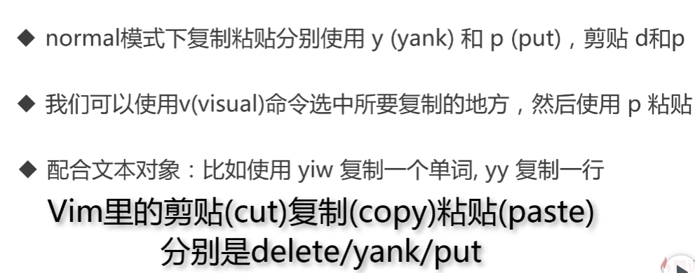
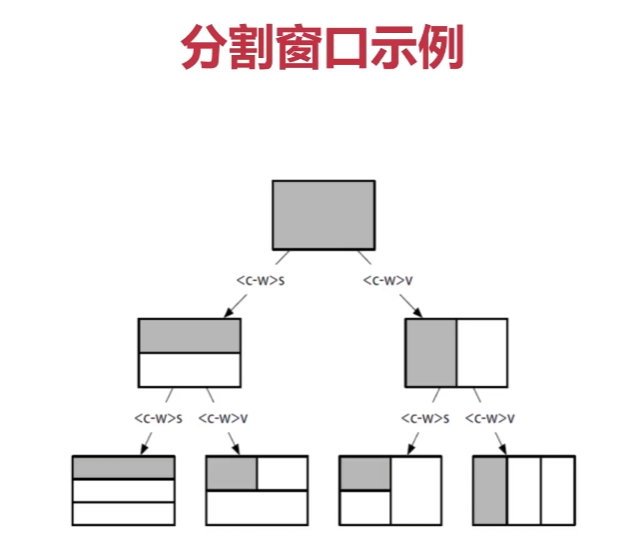
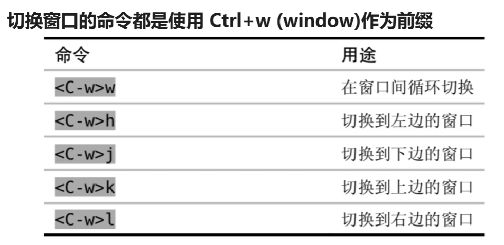
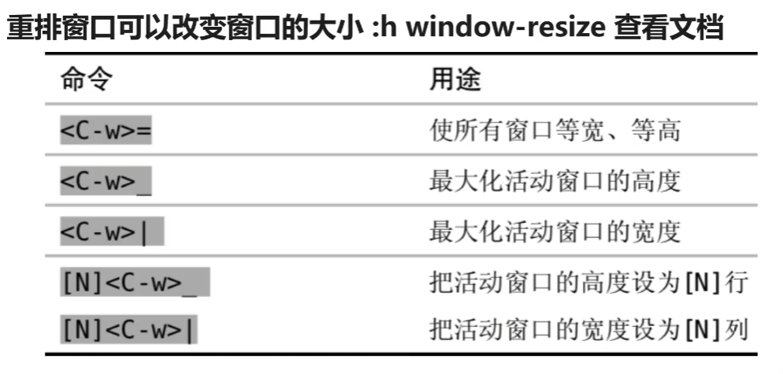
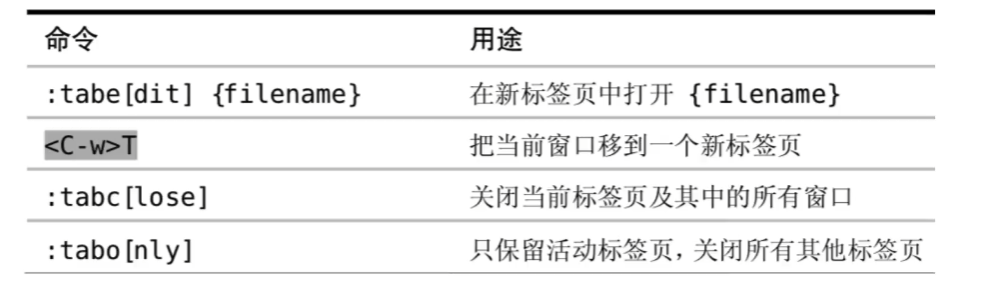
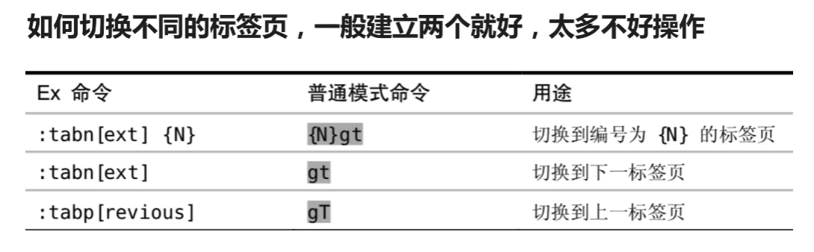

<!-- markdownlint-disable MD033 -->
# Vim 编辑器

## 目录

- [Vim 编辑器](#vim-编辑器)
  - [目录](#目录)
  - [基础操作](#基础操作)
    - [增加文本](#增加文本)
    - [撤销](#撤销)
    - [删除](#删除)
    - [修改](#修改)
    - [查询操作](#查询操作)
    - [搜索替换](#搜索替换)
    - [移动](#移动)
    - [跳转](#跳转)
    - [翻页 滚屏](#翻页-滚屏)
    - [保存 退出](#保存-退出)
    - [Vim 打开多个文件](#vim-打开多个文件)
  - [Vim 的模式](#vim-的模式)
    - [普通模式 normal](#普通模式-normal)
    - [插入模式 insert](#插入模式-insert)
    - [命令模式 command](#命令模式-command)
    - [可视化模式 visual](#可视化模式-visual)
  - [复制粘贴](#复制粘贴)
    - [寄存器 register](#寄存器-register)
    - [复制到系统剪贴板](#复制到系统剪贴板)
  - [多文件操作](#多文件操作)
    - [Buffer](#buffer)
    - [Window](#window)
    - [Tab](#tab)
  - [文本对象](#文本对象)
  - [vim 宏录制](#vim-宏录制)
    - [宏录制](#宏录制)
  - [vim 补全](#vim-补全)
    - [常用三种补全](#常用三种补全)
  - [配色方案](#配色方案)
  - [vim 配置文件](#vim-配置文件)
    - [vim 映射](#vim-映射)

## 基础操作


### 增加文本

```vim
a/A(append) 在光标后插入/A 行后插入
i/I(insert) 在光标前插入/I 行首插入
o/O(open a line) 插入新行 /O 当前行上一行插入新行
```

### 撤销

`u` undo 撤销

`ctrl+r` redo 恢复/反撤销

### 删除

```vim
d(delete)
dw (delet word)
dd(删除一行)
x(删除一个字符)
diw(delete inner word)
daw(delete around word)
```

- d 和 x 删除操作

  Vim 在 normal 模式下使用 `x` 快速删除一个字符
  
  使用 `d` (delete) 配合文本对象快速删除一个单词 
  
  `dw` (delete word) 快速删除一个单词, 实际是 `daw`

  `daw` (delete around word) 快速删除一个单词, 包含后面的空格

  `diw` (delete inner word) 快速删除一个单词, 不包含后面的空格
  
  `d` 和 `x` 都可以搭配数字来执行多次 : 
  
  `4x` 删除 4 个字符; `2dd` 删除 2 行; `d2w` 删除 2 个单词

  `dd` 删除当前行

  `dt"` 删除到双引号(会保留双引号)

### 修改

```vim
c(change)
ciw(change inner word)
ct)修改到右括号
```

- 修改操作

  常用有三个， r (replace) ， c (change) ， s(substitute)

  normal 模式下使用 `r` 可以替换一个字符。 `s` 替换并进入插入模式
  
  使用 `c` 配合文本对象，我们可以快速进行修改

  `cw` (change word) 快速修改一个单词, 实际是 `ciw`

  `caw` (change around word) 快速修改一个单词, 包含后面的空格

  `ciw` (change inner word) 快速修改一个单词, 不包含后面的空格

### 查询操作

```vim
使用fs查找当前行
第一个出现的s,
使用;查找下一个

基于单词
w(word)
b(back word)
```

- 使用 `/` 或者 `?` 进行前向或者反向搜索
- 使用 `n` / `N` 跳转到下一个或者上一个匹配
- 使用 `*` 或者 `#` 进行当前单词的前向和后向匹配
- `:set hls` 高亮搜索结果
- `:set incserarch` 开启增量搜索

### 搜索替换

substitute 命令允许我们查找井且替换掉文本，井且支持正则式

- :[range]s[ubstitute]/{pattern}/{string}/[flags]
- range 表示范围比如:10,20 表示 10 - 20 行，％ 表示全部
- pattern 是要替换的模式， string 是替换后文本
- Flags 有几个常用的标志令
  - g(global) 表示全局范围内执行
    - `:1,10 s/self/this/g` 表示 1-10 行 中的所有 self 替换为 this
  - c(confirm) 表示确认，可以确认或者拒绝修改令(每次操作都需要确认)
  - n(number)报告匹配到的次数而不替换，可以用来查询匹配次数
    - `:% s/{pattern}//n` 替换的字符串填空即可

### 移动

```vim
进入18行 
:18或18G

行移动
0行首
$行尾

gg移动到文件开头
GG移动到文件结尾

ctrl+o返回到之前位置
```

光标移动

```vim
- h j k l (单个字符的移动)
- Ctrl + d, Ctrl + u (跳转 1/2 个屏幕)
- { } (进行段落的跳转)
- f (跳转到接下来出现的某个字符)
- 0 (挑战到行首)
- $ (跳转到行尾)
- ^(跳转到当前行的第一个字符)
- % (跳到相匹配的括号)
```

### 跳转

- 发现自己正在处理一个大文件？或者也许处理多个缓冲区？ Vim 可以轻松导航以前的位置：

  - `Ctrl + o` 导航到跳转列表中的上一个位置（将 o 视为旧位置）
  - `Ctrl + i` 导航到跳转列表中的下一个位置（ i 和 o 通常彼此相邻）
  - `g;` 转到上一个更改位置
  - `g,` 转到较新的更改位置
  - `gi` 将光标置于上次插入模式下的同一位置
  - 使用 `:jumps` 查看跳转列表。

### 翻页 滚屏

- 翻页
  - `ctrl+f` (forward) 下翻
  - `ctrl+u` (upward) 上翻
  - `ctrl+b` (upward) 上翻
- 滚屏
  - `ctrl+e` 下滚
  - `ctrl+y` 上滚

### 保存 退出

- 命令模式
  - `:w` 保存
  - `:q!` 退出不保存
  - `:wq` 保存并退出
- 普通模式
  - `ZZ` 保存并退出
  - `ZQ` 退出不保存

### Vim 打开多个文件

`vim a.txt b.txt c.txt -O`

## Vim 的模式

### 普通模式 normal

- 使用 `Ctrl + c` 代替 Esc (但是可能会中断某些插件)
  
  推荐使用 `ctrl+[`
- `gi` 快速跳转到最后一次编辑的地方并进入插入模式
- 单词间的光标移动

  w/ W 移到下一个 word/WORD 开头
  
  e/ E 下一个 word/WORD 尾
  
  b/ B 回到上一个 word/WO RD 开头，可以理解为 backword

  > word 指的是以非空白符分割的单词, WORD 指的是以空格分割的单词
- 行间搜索移动

  使用 `f{char}` 可以移动到 char 字符上， `t` 移动到 char 的前一个字符
  
  如果第一次没搜到，可以用分号 `;` 继续搜该行下一个 / 逗号 `,` 上一个
  
  大写的 `F` 表示反过来搜前面的字符
- 垂直移动

  使用括号`(`/`)`在句子间移动，你可以用 `:help (`来查看帮助
  
  使用`{`/`}`在段落之间移动
- 页面移动

  `gg/G` 移动到文件开头和结尾，你可以使用 ctrl+0 快速返回
  
  `H/M/L` 跳转到屏幕的开头( Head )，中间 (Middle) 和结尾 (Lower)

  `Ctrl+u`. `ctrl+f`. 上下翻页． (upword/forward). 
  
  `zz` 把屏幕置为中间

### 插入模式 insert

- 删除操作 (linux 终端模式也可以操作)

  ```vim
  ctrl + h 删除上一个字符

  ctrl + w 删除上一个单词

  ctrl + u 删除当前行
  ```

- linux 终端模式移动光标

  ```sh
  ctrl + a 当前行开始位置
  ctrl + e 当前行结束位置
  ctrl + b 先前移动一个字符
  ctrl + f 后面移动一个字符
  ```

### 命令模式 command

`:` 进入命令模式

```vim
:w 保存
:q 退出
:q! 强制退出
:vs (vertical split) 垂直分屏
:sp (split) 水平分屏
:% s/foo/bar/g 全局替换 -> %(代表整个文件) s(字符串) foo/bar/(foo 替换成 bar) g (g代表全局)
:set nu 显示行号
```

### 可视化模式 visual

`v` 进入visual模式

`V` 进入visual行模式,并选中整行

`ctrl+v` 进入visual块模式 (列选择模式)

`vi"` 选中双引号内的文本

`va"` 选中包括双引号的文本

## 复制粘贴

- 复制 y(yank)
- 粘贴 p(paste)



- 粘贴缩进代码错乱,可以通过下面的指令来解决
  - `:set paste` 进入粘贴模式
  - `:set nopaste` 退出粘贴模式

### 寄存器 register

- 使用 `:reg` 查看所有寄存器

  `:reg a` 查看寄存器 a 的内容
- `"{register}` 创角寄存器, 不指定默认使用无名寄存器
- `"ayiw` 复制一个单词到寄存器 a 中
- `"bdd` 删除当前行的内容到寄存器 b 中

### 复制到系统剪贴板

- 可视模式 `"+y` 复制到系统剪贴板
- 普通模式 `"+p` 粘贴系统剪贴板
- 普通模式直接 `p` 即可
- 编辑模式下 `ctrl+r` `+` 粘贴系统剪贴板内容

需要在 vim 配置文件添加 `set clipboard=unnamed`

## 多文件操作

### Buffer

- 使用 `:ls` 会列举当前缓冲区，然后使用 `:b n` 跳转到第 n 个缓冲区
- `e file-name` 打开新的文件
- `:bpre` `:bnext` `:bfirst` `:blast`
- 或者用`:b buffer-name` 加上 tab 补全来跳转

### Window

- 一个缓冲区可以分割成多个窗口，每个窗口也可以打开不同缓冲区
- `Ctrl+w +s` 水平分割， `Ctrl+w + v` 垂直分割。或者 `:sp` 和 `:vs`

  `:vs file-name` 或者 `:sp file-name`

  
- 切换窗口

  
- 重拍窗口

  

### Tab

- Vim 的 Tab 和其他编辑器不太一样，可以想象成 Linux 的虚拟桌面
- 比如一个 Tab 全用来编辑 Python 文件，一个 Tab 全是 HTML 文件
- 相比窗口， Tab 一般用的比较少， Tab 太多管理起来也比较麻烦
- Tab 命令

  

- Tab 切换

  

## 文本对象

- [number] < command> [text object]
- number 表示次数
- command 是命令,d(elete), c(hange), y(yank) v(visual)
- text object 是要操作的文本对象，比如单词 w ，句子 s ，段落 p
- 快速选中段落中的内容
  - `vi"` 快速选中双引号内的文本
  
    `proxy:= NewProxy("kShopping") //前提是光标在双引号中`
  - `viw` 选中一个单词
  - `vi(` 选中一个括号内的文本

    `proxy:= NewProxy(kShopping) //前提是光标在括号中`
  - `vi{` 选中一个段落

    前提是光标在 `{}` 中
  - `di` `ci` 同上
  - inner word 不包含后面的空格; around word 包含后面的空格

## vim 宏录制

- 宏可以看成是一系列命令的集合
- 我们可以使用宏〖录制〗一系列操作，然后用于〖回放〗
- 宏可以非常方便地把一系列命令用在多行文本上

### 宏录制

- vim 使用 q 来录制，同时也是 q 结束录制
- **录制** 使用 `q{register}` 选择要保存的寄存器把录制的命令保存其中
  - `qa` (a 是宏的名称)
  - `q` 退出录制
  - `qa` 开始录制宏; `0i"` 行首插入双引号;`esc` 退出插入模式; `$a"` 行尾插入双引号; `esc` 退出插入模式; `q` 结束录制
- **回放** 使用 `@{register}` 回放寄存器中保存的一系列命令
  - `@a` 回放 a 寄存器中的命令
  - 命令行 回放宏 `:'<,'>normal @a`

## vim 补全

### 常用三种补全

- 使用 `ctrl+n`(向下选择) 和 `ctrl+p` (向上选择) 来补全
- 使用 `ctrl+x` + `ctrl+f` 补全文件名
- 使用 `ctrl+×` `ctrl+o` 补全代码，需要开启文件类型检查，安装插件

## 配色方案

- 使用 `:colorscheme` 显示当前的主题配色，默认是 default
- 用 `:colorscheme <ctrl+d>` 可以显示所有的配色
- 有中意的配色后，用 `:colorscheme 配色名` 就可以修改配色
  - `:colorscheme evening`

## vim 配置文件

- vim 配置文件是 `~/.vimrc`
  - 我们可以把常用的设置写到 .vimrc 里避免每次打开 vim 重新设置

### vim 映射

- normal 模式下 使用 `map` 就可以实现映射
  - 比如 `:map - ×`然后按 `-` 就会删除字符
  - `:map <space> viw` 空格就可以选中单词
  - `:map <c-d> dd` 这样`ctrl+d` 就可以删除当前行
- unmap 解除映射
  - map 解除映射 `:unmap <space>`
- nmap / vmap /imap
  - 分别代表 normal 模式 / visual 模式 / insert 模式下的映射
  - `:vmap \ U` 在 visual 模式下选中的文本使用 `\` 转换大写(u小写)
  - `:imap <c-d> <ESC>ddi` 在 insert 模式下按 ctrl+d 可以删除当前行

> *map 系列命令有递归映射的问题, 任何时候都应该用 noremap 来代替

- 非递归映射 noremap
  - `nnoremap/vnoremap/inoremap`
